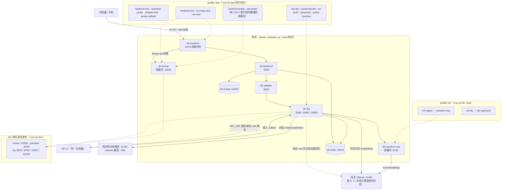
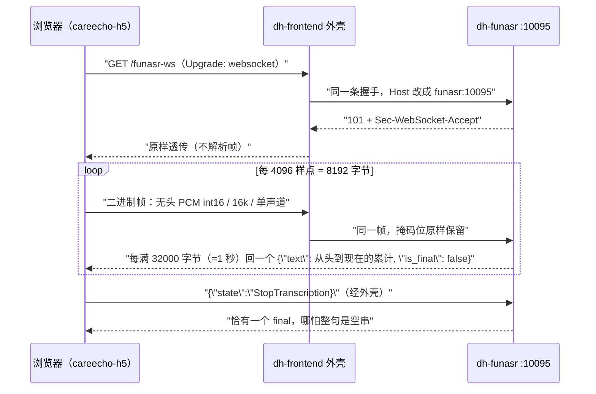

# containerd —— DigitalHuman 容器集成层

这一层把散在几个仓库里的东西拢到一个 `docker compose` 里跑起来，**不改动 `fay` /
`service` / `ue` / `frontend` 任何一个仓库的代码**：四个目录的 `git status` 始终干净、
`main`（前端是 `master`）始终 == `origin/main`（`./run.sh audit` 会把这件事打成输出，
而不是留成一句承诺）。

> **2026-09-21 撤掉了 `origin_fay` 参照实例。** 它曾经是「上游直出的第二个 Fay」，用来回答
> 「fork 相对上游改了什么」。fork 换成 `chuan918/Fay` 之后它成了上游的**直接后代**、Python
> 源码逐字节相同，这个对照就不再有内容 —— 两份镜像的唯一差别只剩 config，而 config 差异
> 早就是 `overlay/` 里可读的文件。于是那个服务、它的镜像、`overlay/origin_fay/`、
> `probe-origin-fay` 测试组一起删了；上游本身改为**只当 `fay` 里的一个 remote** 留着
> （见下「跟上上游」）。下文凡是以 `origin-fay` 为主语的实测数字都按原样保留 ——
> 那是它还在的时候量的，属于历史。

```
containerd/
├── README.md                   本文：怎么配、怎么起、边界在哪
├── AGENTS.md                   ★ 分工的另一半：决策为什么这么做、每次失败怎么排出来的、
│                               这台机器的私有环境前提。想部署不必读，想改配置/判据/补丁必须先读
├── docker-compose.yml          常驻 8 个服务：mysql / redis / fay / yueshen-rag
│                               / adapter / backend / frontend / funasr；另有 profiles:["test"]
│                               的 fay-lite（测试用轻模型 Fay）+ 15 个一次性测试件，其中
│                               kb-ingest（外部语料入库）与 kb-fay（业务侧那一问的知识库判据，
│                               见下）同时挂在 profiles:["kb"] 上
├── docker-compose.dev.yml      ★ dev 档位叠加层：放开应用面端口 + DEBUG=true + FAY_URL
│                               （只在 ./run.sh dev 时被叠上，见「dev / prod 档位」）
├── run.sh                      up · dev · build · test · smoke · audit · upstream · logs
│                               · kbslice · kb · kbq · env · asr-seed · ps · down · reset
├── .env.example                全部旋钮的完整清单（注释掉的行 = 不设）；run.sh 首次执行会逐字
│                               复制成 .env 并填随机密钥（DH_ENV 也在里面），见「配置这一层」
├── tools/env_map.py            `./run.sh env` 的实现：扫两份 compose，打印每行 .env 的去向
│                               与三份账的对账（哪些键没人读、哪些键没写、模板漏了谁）
├── images/
│   ├── fay.Dockerfile          Fay 镜像（唯一一份 Fay 源码 ../fay；原先靠 ARG FAY_SRC
│   │                           多构建一个上游参照镜像，那三个 ARG 随实例一起删了）
│   ├── yueshen_rag.Dockerfile  唯一带 chromadb 的 MCP 服务器，单独镜像（不并进 Fay，见「yueshen 知识库」）
│   ├── service.Dockerfile      原样 COPY service/，依赖读它自己的 pyproject.toml
│   ├── frontend.Dockerfile     两阶段：node 里 npm ci + vite build 出 dist-h5，
│   │                           产物拷进 python-slim 与外壳一起跑（见「CareEcho H5 前端」）
│   └── funasr.Dockerfile       torch(cpu) + funasr，运行时代码是本层的 asr/server.py（见「FunASR」）
├── overlay/                    ★ 覆盖层：不改源码的配置手段
│   ├── {fay,fay-lite}/system.conf      仓库里不存在，容器里必须有（见下）
│   ├── {fay,fay-lite}/{config,mcp_servers,mcp_prestart_tools}.json.example
│   │                               跟踪的是**模板**：这三份是可写挂载的源，Fay 会整份回写，
│   │                               所以实值不入库，本地那份由 tools/gen_overlay.py 首跑复制
│   │                               （config.json 关本地播放与直播间；麦克风这份按现状开着）
│   │                               mcp_servers.json 把 id=4 yueshen 从 stdio 换成 sse 指向容器，每实例一份
│   ├── 依赖清单只有一份：
│   │   overlay/fay/requirements-docker.txt     fay 与 fay-lite 同一镜像、同一份清单
│   └── {service,yueshen_rag,funasr}/requirements-docker.txt  其余镜像各自的依赖清单（冲突处理见下）
├── patches/                    ★ 补丁层：构建期 patch -p1 盖到镜像里的 /app
├── seed/                       ★ 种子层：service 的参考语料不在仓库里，这里给一份能自测的
│                               ├── kb_corpus/  外部科普语料的切片产物（`tools/slice_kb_corpus.py`
│                               │               生成，bind-mount 进 yueshen-rag；不进 git，见「外部语料」）
├── probes/                     测试件本体：fay_probe.py · adapter_test.py · ue_audit.py
│                               · ws_timing_test.py（探针自己的收工时机自测）
│                               · backend_probe.py（后端活体探针：路由/迁移/schema/鉴权/写路径/调度器）
│                               · yueshen_probe.py（chromadb 那条链路：嵌入出口/清单/入库/检索/stats 一致性）
│                               · kb_ingest.py（外部语料入库 + 12 问真实问法抽测，`./run.sh kb`）
│                               · kb_fay_probe.py（业务侧：从 /api/send 问一句，判那一行的
│                               │               注入块与正文，`./run.sh kbq`）
│                               · frontend_test.py（前端外壳契约：假后端 + 19 条判据 + 负面自检）
│                               · frontend_probe.py（真栈：从外壳那一口穿到 backend→adapter→Fay→对话端点）
│                               · ws_relay_test.py（外壳的 WS 转发契约：手造掩码帧 + 假上游）
│                               · wsutil.py（RFC 6455 握手与帧的最小构造器，上面那组与 asr_* 共用）
│                               · asr_test.py（FunASR 协议自测：假模型、不加载 torch）
│                               · asr_probe.py（真模型链路：把仓库里的真语音按浏览器节奏推进去）
├── tools/                      reset_test_db.py（跑 pytest 前重建测试库）· tts_negative_control.py
│                               · gen_keys.py（.env.example → .env，只填三个随机密钥）
│                               · gen_overlay.py（overlay 的 .json.example → 本地那份，只补缺失的）
│                               · make_yueshen_corpus.py（构建期造 yueshen 语料，见「yueshen 知识库」）
│                               · slice_kb_corpus.py（把项目方给的 .docx 按原序摊平成可检索的切片）
│                               · check_mermaid.py（两份 README 里 mermaid 块的离线结构自查，见「服务拓扑」末）
├── adapter/server.py           自己写的第一份代码：后端 /api/chat ↔ Fay /api/send+get-msg
├── frontend/carecho_web.py     自己写的第二份代码：CareEcho H5 的同源外壳（静态 + /api + WS 转发）
├── asr/server.py               自己写的第三份代码：FunASR 流式识别服务（H5 麦克风的真后端）
├── sql/init/00-create-database.sql
└── _audit/                     ue-audit 的 JSON 报告落这里（README 的数字对着它复核）
```

## 这两份文档的分工

本文只留**照着能敲的东西**：拓扑、配置口径、档位、判据清单。另外三类内容整体挪到了
**[`AGENTS.md`](AGENTS.md)**（2026-09-23 挪完之后 1228 行），因为它们对部署没用、对改动却是必须的：

| 那里放了什么 | 对应小节 |
|---|---|
| 一次决策的来龙去脉（为什么长成这样、被什么否证过） | 「这一条命令是被一次真事逼出来的」、「真实瓶颈是显存，不是代码」、「远程音频那两个缺陷：`patches/fay/0004` 的来历」、「依赖层为什么不能直接用 `fay/requirements.txt`」、「pip 缓存挂载只给还在改 requirements 的那一层」、「知识库那三个旋钮」、「决策面谈 `:5001`」、「优雅停止」 |
| 每一轮完整实测的原始记录 | run #27 ~ run #32 各节（含每组判据的通过数与耗时） |
| 单次故障的排查过程（现象 → 排除 → 定位） | 「`:10002` 上的空回复」、「外部 TTS 出口不通和容器 audio 推送坏了是两件事」、「密钥不给全，产物里连 ID 都会消失」、「13 条判据全绿的那晚，手机仍一个字都识别不出来：426」、「Fay 会调工具这句话，探针只敢证到中间那一档」 |
| 判据为什么会假红、以及怎么证明它不只会绿 | 「测试库跨轮存活」、「只在午夜红的上游用例」、「后端活体探针的七次变异验证」、「探针的收工时机与收尾文案」 |
| 这台机器的私有环境（上面所有数字的前提） | 「与既有宿主服务的隔离」，含宿主机 git 配置里的遗留凭据 |

那条挪走的「配置这一层」事故复盘也在那儿 —— 所以 `./run.sh env` 这条命令为什么存在、
它防的是哪一种错，写在 `AGENTS.md`「这一条命令是被一次真事逼出来的」一节。

## 服务拓扑



`-.-` 是「按档位/按测试才发生」的关系，实线是常驻路径。所有端口的 `host_ip` 都跟 `BIND_ADDR`
走：prod 是 `127.0.0.1` 八条、dev 是 `0.0.0.0` 十四条，`mysql` / `redis` **不再有例外**
（口径与代价见「dev / prod 档位与跨机流量」）。

改这两张图（还有根 README 那一张）之后跑一句 `python3 tools/check_mermaid.py ../README.md
README.md`，它离线扫所有 ```` ```mermaid ```` 块并给出结论。为什么要有这么个东西：mermaid
标签里的 `()` 不加引号会把解析器直接搞坏，而外部渲染器（kroki 之类）一旦开始回
`400/500/000`，你分不清是图写坏了还是它自己不舒服 —— 这种检查必须能在断网时给出结论。
它只做结构自查（引号成对、括号平衡、`subgraph`/`loop` 与 `end` 数量对得上、裸括号、边标签
竖线数），不宣称能代替渲染。

## 快速开始

```bash
cd containerd      # 本目录（仓库里唯一有可执行入口的地方）
./run.sh up        # 构建 + 起栈（首次约 3~6 分钟，pip 走阿里云镜像、npm 走 npmmirror）
./run.sh dev       # 同一套东西，但叠上 docker-compose.dev.yml：应用面端口放开、DEBUG=true
./run.sh smoke     # 端到端：后端 → adapter → Fay → 对话端点 → 落库
./run.sh test      # 十四组测试件：backend-test · backend-probe · adapter-test · probe-selftest
                   #            · frontend-test · ws-relay-test · asr-test · probe-fay-lite
                   #            · ue-audit · fay-probe · probe-yueshen · frontend-probe
                   #            · asr-probe · kb-ingest
./run.sh test fay-probe   # 只跑其中一组（改探针时不用等全套）
./run.sh test kb-fay      # 第十四组之外还能点名的第十五组：它一组要发两整轮问答，所以不在
                   #        常态清单里，日常入口是下面的 ./run.sh kbq（见「业务侧」那一节）
./run.sh audit     # 核账：四个上游仓库是否仍然零改动、与上游不分叉（非零退出即可当断言）
./run.sh upstream  # 跟上上游：fetch xszyou/Fay，报落后几条，并把每份 fay 补丁对 upstream/main 干跑预检
./run.sh kbslice   # 把 uploads/ 里那包 .docx 切片到 seed/kb_corpus/（换语料时才需要跑）
./run.sh kb        # 切片入库 + 12 问真实问法抽测（要求每问在 top3 命中自己的出处）
./run.sh kbq       # 从业务口问一句，判那一问的原始回帧里知识库有没有被注入、有没有被用上
                   # 换问法：./run.sh kbq <问题> [期望词]（不给期望词则「含词」那两条记 SKIP）
./run.sh asr-seed  # 本机若已有别处下好的 FunASR 模型缓存卷，拷进本栈的卷（省 1.3GB 下载）
./run.sh logs fay  # 单独看某个服务（fay/backend/adapter/frontend/funasr/mysql/redis）
./run.sh env       # .env → 容器的映射与对账：哪一行进了哪个容器、哪个键没写所以走默认值、
                   #   哪一行写了但没有任何服务读（改了不生效）。见「配置这一层」一节
```

入口：

| 地址 | 是什么 |
|---|---|
| `http://127.0.0.1:5173/` | CareEcho H5 前端（伙伴方仓库构建产物 + 本层的外壳，见「CareEcho H5 前端」一节） |
| `http://127.0.0.1:5000/` | Fay 的 Web 管理台 |
| `http://127.0.0.1:8000/docs` | 后端 OpenAPI（`/openapi.json` 实测 64 个 path / 81 个 operation）；健康检查在 `/api/v1/health` |
| `ws://127.0.0.1:10002` | 数字人 WS（`Topic:"human"` 协议，留给未来前端；`:10012` 曾是指向上游那份的映射，随参照实例一起撤了） |
| `ws://127.0.0.1:10003` | Fay 浏览器面板 WS（同上，`:10013` 已撤） |
| `http://127.0.0.1:8010/api/chat` | adapter，给后端用的同步问答口 |
| `ws://127.0.0.1:5173/funasr-ws` | H5 麦克风那条：页面同源的 WS，由外壳按常量表转发进 `dh-funasr`（生产唯一的入口） |
| `ws://127.0.0.1:10095/` | **dev 档位才有**（`./run.sh dev`）—— FunASR 直口，给探针和手工调试用；prod 不发布 |
| `http://127.0.0.1:8766/` | **dev 档位才有** —— yueshen-rag 的 chromadb HTTP 口；prod 只在 compose 内网 |

Fay 自己的 HTTP 面（`gui/flask_server.py`）：问答是异步的
`POST /api/send` + `POST /api/get-msg`；另有一组管理口
（`/api/get-member-list`、`/api/get-system-status` …）和一对 **OpenAI 兼容 façade**
`GET /v1/models` / `POST /v1/chat/completions`（:746 / :775）。façade 是"如果不想写
adapter"的备选路线，但后端 `fay_gateway.py` 期待的是 `/api/chat`，所以本栈仍走 adapter。
就绪探针用 `GET /api/get-system-status` —— **别用 `/panel/page1`，这个路由返回 404**
（面板是 10003 上的 WS，不是 HTTP 页面路径）。

但这条探针只证明 **flask 活着**，不证明 **Fay 能对话**：`main.py` 先起 HTTP 服务，
之后还要预热 embedding、才 `创建代理实例`。中间那段窗口里 `POST /api/send` 会**在 0.01s 内
抛 500**（不是超时），也就是"端口就绪 ≠ 可以问话"。实测：2026-09-21 22:18 那次
`docker compose restart fay` 之后 `:5000` 立刻可问，紧跟着那一问就是 502；到第 10s
同样的 `/api/send` 返回 `{"result":"successful"}`。所以 `./run.sh smoke` 在 restart 之后
等的不是端口，而是 `fay_booter.py:478`（`start()` 最后一行）那句「服务启动完成!」
（`run.sh` 的 `wait_fay_agent`，`--since` 取容器本次启动时刻，不会把上一辈子的同一句读成"好了"）。
compose 的健康判据没跟着改成这条：它在容器里跑，读不到自己的日志流，而那段时间里
`/api/get-system-status` 本来就答得上 —— 于是 `healthy` 的含义是"HTTP 面可用"，
不含"能对话"。真要在产品里避开这个窗口（embedding 要换入时它会拉长到分钟级），
得在 adapter 侧对 500 做一次重试，本轮没做。

容器内实测已监听的端口：5000 / 10002 / 10003 / 10001(远程音频 TCP) / 9001(音频桥)
/ 5010(MCP 管理) / 8765(MCP SSE)。**5001(genagents 决策面谈) 不在常态清单里 —— 它是按需拉起的**：
`POST :5000/api/start-genagents` 才起、`POST :5001/api/shutdown` 就关，
这条起落两向 run #24 起已是探针里的判据（见 `AGENTS.md`「决策面谈 `:5001`」一节）。
compose 只把前三个
（5000 / 10002 / 10003）发布到宿主机，其余留在容器网络里。

默认只绑 `127.0.0.1`。要给别的机器（手机、跑 UE 的那台 Windows）连，用的是
**`./run.sh dev`**，不是手改 `BIND_ADDR` —— 后者在 prod 档位下会被直接拒掉，
理由见下一节。

## 配置这一层：`.env` 里哪一行真的进得了容器

容器里的环境变量只有两处来源：compose 各服务 `environment:` 里手写的键，和
`--env-file .env` 提供的那些 `${VAR}` 插值。**这两处对不上的时候 docker 不报错** ——
`.env` 里多出来的键没人读，改了等于没改，而屏幕上什么都不会发生。这类事靠人记住
50 个 `${VAR}` 各自被谁读是靠不住的，所以写成了一条命令：

```
./run.sh env        # 三栏：每行落到哪个容器 / compose 会读但 .env 没写的键 / 没有任何服务读的键
```

第一栏顺手解决另一个坑：`.env` 里的键名与容器里的键名**经常不一样**，肉眼对不出来 ——
`MYSQL_ROOT_PASSWORD` 进后端三兄弟时改叫 `MYSQL_PASSWORD`，`YUESHEN_EMBED_MODEL` 进
Fay 时改叫 `FAY_EMBEDDING_MODEL`（一组键喂两侧是故意的，见 compose 的 `x-llm-endpoint`），
`REDIS_PASSWORD` 则分别以命令行参数和嵌在 `REDIS_URL` 里两种形态出现。这些都在第一栏标出来。

第二栏是"想改但找不到那一行"的出口：compose 读了它、`.env` 没写，于是走 `${VAR:-默认}`
里那个默认值 —— 要改就得**新增**一行，而不是去改一个名字看着像、其实没接上的键。

### 于是定了三条纪律

1. `.env.example` 是**所有可调旋钮的完整清单**：compose 引用的每个 `${VAR}` 在模板里都有一行
   （没写的那 14 个是这次补的：`ADAPTER_SETTLE_SECONDS`、`FUNASR_MODEL` 那四条模型钉版本、
   `JSON_DATA_DIR`、`MYSQL_TEST_DB`、`YUESHEN_EMBED_TIMEOUT`、`YUESHEN_RAG_PORT`、
   lite 那三条、以及刚才那两个模型名）。`./run.sh env` 的第三栏就是这条规矩的自检。
2. **注释掉 = 不写进 `.env`**。`tools/gen_keys.py` 是逐字复制模板再填三个随机密钥的，
   所以"活跃"的那 27 个键就是新克隆的默认行为，其余全按注释态给（注释里写的值就是
   compose 的 `:-` 默认值，照它改不会错）。键名行**不带行尾注释**：dotenv 对内联 `#` 的处理
   按版本有差异，写在上一行才安全。
3. 每一行标 `# ↳` 说明它落在哪个容器：`↳ dh-fay` / `↳ 不进容器`（只被 `ports:`、`extra_hosts:`
   用的那九条端口键和 `BIND_ADDR`）/ `↳ run.sh`（`DH_ENV`、`OLLAMA_PORT`）。
   端口那几条尤其值得标出来 —— 它们看起来像"容器的配置"，其实改的是宿主发布，
   容器内部永远听自己的 8080/8000/5000。

### 同一条规矩也管 overlay 那三份 json（2026-09-23）

`config.json` / `mcp_servers.json` / `mcp_prestart_tools.json` 是**可写** bind-mount 的源文件，
Fay 运行期整份重写回来。三种噪声都是实测的，没有一种是人写的：

| 文件 | 谁写的 | 这轮量到的样子 |
|---|---|---|
| `mcp_servers.json` | `faymcp/mcp_service.py:132` 每次连接/断开刷新 `connection_time` | 重启一次就变 `17:44:24`，六个字段里三条跟着动 |
| `config.json` | 控制台一保存，`json.dump` 默认 `ensure_ascii=True` | 全部中文变 `\u5eb7\u517b\u966a\u4f34` 这种转义，diff 一片红 |
| `mcp_prestart_tools.json` | `prestart_registry.py:61-69` 的 `json.dump` 不补行尾 | 唯一的改动是 `\ No newline at end of file` |

它们从容器化那次提交起就在跟踪里（历史版本里现在就躺着 `"connection_time": "2026-09-21 12:10:55"`），
后果不是泄露什么，而是**每轮提交都得人肉判断一遍这行是谁写的**。所以按 `.env` 那条同款规矩拆开：

```
overlay/{fay,fay-lite}/*.json.example     跟踪：人写的基线（UTF-8 原字、带换行）
overlay/{fay,fay-lite}/*.json             忽略：本地实值，run.sh 首跑由 tools/gen_overlay.py 复制
```

生成只在目标缺失时发生，存在就一个字不动 —— 已经调好的设定不会因为又跑了一次 `up` 被抹掉；
反过来改了模板要 `python3 tools/gen_overlay.py --force` 才落到本地。挂载路径本身没变，
所以 compose 那十一条 volume 一行没动。

这次顺手把 `record.enabled` 定成 `true`（本地麦克风采集开着）。容器里没有音频输入设备，
代价是启动日志多一行、然后照常就绪，实测：

```
[系统] 打开麦克风时出错: No Default Input Device Available
[系统] 服务启动完成!
```

验证是按"会不会再脏"来做的：`docker compose restart fay` + 一整轮 `./run.sh kbq`
（**9/10 + 1 SKIP**，跳的还是那条正文复现原词的软证据）之后，生成那三份拿到了新时间戳，
三份 `.example` 的 md5 一字未变；再把六份本地文件全删掉、只跑 `./run.sh env` 就都回来了。

**一个坑记在这里**：bind-mount 在容器创建时就把 inode 钉住了。`git mv` 把文件改名之后，
还在跑的旧容器会把它那份内存里的状态写回**改名后的那个 inode** —— 也就是写进模板。
这轮真踩到一次（模板被回成了改动前的时间戳，只能再 `git show HEAD:` 覆盖回去）。
所以：改过任何一条挂载指向的文件，必须先 `up -d --force-recreate` 再谈内容对不对。

## dev / prod 档位与跨机流量

档位只有一个变量：`.env` 里的 `DH_ENV`（缺省 `prod`）。它只决定两件事：

1. `run.sh` 里那串 `$COMPOSE` 叠不叠 `docker-compose.dev.yml`
   （所有子命令都用同一个变量，所以各处不用改）；
2. `dev` 下 `BIND_ADDR` 落到 **`0.0.0.0`** —— 本机每个地址都收，换网卡或加一条 tailscale
   都不必重起（2026-09-22 改的口径；原先是绑"探测出来的局域网地址"，另配一个
   `DH_EXTRA_BIND` 显式第二口，那是绕路，见下面「dev 追加什么」）。
   局域网地址仍然要探测，但它只喂两处**给人看**的值：banner 里那几条
   `http://<地址>:端口` 的链接（绑 0.0.0.0 时不能把 `http://0.0.0.0:5173` 交给用户），
   和 Fay 的 `FAY_URL`（音频地址必须是对端真能取到的那个 IP，写 0.0.0.0 等于把 UE 引向它自己）。

### prod 的硬闸

```
$ DH_ENV=prod BIND_ADDR=0.0.0.0 ./run.sh up
[run] DH_ENV=prod 不接受 BIND_ADDR=0.0.0.0 —— 那会把管理台、无鉴权接口与数据库发布到外部。
      要给别的机器连就用 ./run.sh dev（那个档位按设计就是绑 0.0.0.0 全开）。
$ echo $?
1
```

不做「提醒之后继续」而直接退出，是因为这类暴露最常见的成因就是有人临时改过一次 `.env`
然后忘了改回来 —— 而 `:5000` 一离开 loopback，同时出去的是 **Fay 的 Web 管理台**和它的
**无鉴权 OpenAI 兼容 façade**（`POST /v1/chat/completions`，见 `fay/gui/flask_server.py:775`），
而自从管理口也跟随 `BIND_ADDR`，这条闸现在还是 `13306` / `16379` 不出本机的**唯一**保证。
闸在 `use_profile` 里，跑在任何 docker 命令之前。

### dev 追加什么

`docker-compose.dev.yml` 追加的是 prod 根本不发布的内部口：`fay` 的 5010 / 8765 / 10001
+ 音频桥 `${FAY_BRIDGE_PORT:-10199}:9001`、`yueshen-rag` 8766、`funasr` 10095，
并给后端 `DEBUG: "true"`、给 Fay `FAY_URL: http://${DH_LAN_IP}:5000`。
地址不在这份文件里决定 —— 应用面那几条（`frontend` 5173、`backend` 8000、`adapter` 8010、
`fay` 5000/10002/10003）写在基础文件里、由 `BIND_ADDR` 定地址，这份文件只是把同一批
端口**连清单一起重写一遍**（为什么必须整份重写见下面第二条合并语义），于是 dev 与 prod
差的只是"多了几条"和"绑在哪"。

- **`mysql` / `redis` 与应用口一样吃 `BIND_ADDR`**，dev 下 `13306` / `16379` 也对同网段开放。
  这是明确定的口径，不是漏了例外（原先这两条在基础文件里写死 `127.0.0.1`，2026-09-22 撤掉）。
  收紧的手段是**档位**而不是给两个服务开特例：prod 的 `BIND_ADDR` 被 `run.sh` 钉在 loopback，
  改成别的地址直接拒（上面那条闸），所以"数据库不出本机"在 prod 下照样成立 ——
  实现从"这一行写死"换成了"这一档压根不给外部地址"。dev 期间的代价照实写：
  同网段的任何机器都敲得到 13306，能不能进去只看 `MYSQL_ROOT_PASSWORD` 一道口令。
  这一条里留下的教训是**合并语义**：覆盖层换个 `host_ip` 是**多加一条**而不是改掉那条，
  所以端口地址只能在它所在的那一份文件里改 —— 这也是这两条今天写在基础文件、
  而不在 dev 文件里的原因（dev 文件里根本没有它们）。

  两档的渲染结果（`docker compose ... config`：prod 那列不导出 `BIND_ADDR`、由 `.env` 给
  `127.0.0.1`；dev 那列就是 `run.sh` 在 dev 下导出的 `0.0.0.0`。它测的是 compose 的合并语义，
  与栈起没起无关 —— 起来之后的 `docker ps` / `ss -ltn` 各看过一次，就在下面那段）：

  | 服务 | prod（基础文件） | dev（叠 `docker-compose.dev.yml`） |
  |---|---|---|
  | `frontend` / `backend` / `adapter` | `127.0.0.1:5173/8000/8010`（各一条） | 同端口，地址换成 `0.0.0.0` |
  | `fay` | 5000 / 10002 / 10003 | 追加 5010 / 8765 / 10001 / `10199->9001` |
  | `funasr` | **`(no published ports)`** | `0.0.0.0:10095` |
  | `yueshen-rag` | **`(no published ports)`** | `0.0.0.0:8766` |
  | `mysql` / `redis` | `127.0.0.1:13306` / `127.0.0.1:16379` | `0.0.0.0:13306` / `0.0.0.0:16379` |

  值得看的是两件事：dev 每个服务仍然**只有一条**（没有因为 `host_ip` 变了就多出一条
  loopback，这正是"每个被碰的服务重写完整 `ports:` 清单"买来的结果），以及整张表里
  **地址只有一个来源** —— 14 条端口没有一条把 `host_ip` 写死，所以 `BIND_ADDR` 就是唯一的
  开关，prod 那道闸也就真的管得住包括数据库在内的每一个口。
- **`DEBUG` 不是 `DH_ENV` 的隐式含义，而是 dev 显式写出来的一个值**，因为后端只在
  `DEBUG=true` 时挂载 `POST /api/v1/auth/dev-login`，而 H5 前端**根本没有登录这一步**
  （身份由外壳替设备铸）。`DEBUG=false` 起 dev 档位的现象是：页面打得开、每一发问答都 502，
  气泡上写着「后端 POST /auth/dev-login → HTTP 404」。这条耦合现在由
  `probes/frontend_test.py` 判据 18 钉着，不用靠人记得这段文字。
- 每个被 dev 碰到的服务都**重写完整的 `ports:` 清单**，这样「同标识覆盖」和「异标识追加」
  两种合并语义下结果一样 —— 不必去猜 compose 实现到底按哪种处理。
- **dev 没有"只开某一个地址"这一档**：`BIND_ADDR` 在 dev 下就是 `0.0.0.0`，本机每张网卡
  （局域网、tailscale、以后新插的）一起收；换网卡、加一条 VPN 都不必重起，也不必知道
  本机现在有哪些地址。这里曾经有过一套 `DH_EXTRA_BIND` + `docker-compose.dev.extra.yml`
  的"第二个绑定口"（2026-09-22 撤掉）：那份文件与 `docker-compose.dev.yml` 同形、只差一个
  `host_ip`，六个服务的端口清单要人肉跟着另一份改，而它买到的只是"少开一张网卡"——
  在一个按设计就全开的档位里没有价值。**要收紧就回 prod，中间态不做。**
  剩下的唯一一条地址纪律是：**prod 不接受外部 `BIND_ADDR`**（上面那个硬闸），
  所以"全开"这个姿态在仓库里只能由 `./run.sh dev` 触发，改一行 `.env` 改不出来。

### 跨机：UE 在另一台电脑上

真正影响正确性的只有两件：**进得来** 和 **取到可达的音频地址**。

- 进得来 → dev 档位绑 `0.0.0.0`，本机哪个地址都收，UE 里填 `ws://<本机任一地址>:10002`
  就行（以前这里是"把 `BIND_ADDR` 换成局域网地址"，2026-09-22 起 dev 不再需要挑地址）。
- 音频地址 → Fay 回给 UE 的音频 URL 是拼 `fay_url` 得来的，而 `overlay/fay/system.conf:58`
  钉的是 `http://127.0.0.1:5000` —— 换台机器 UE 就取不到文件。
  `patches/fay/0007-fay-url-env-overridable-CRLF-source.patch` 把这一行放开成
  `fay_url = os.environ.get('FAY_URL') or fay_url`（源文件是 CRLF，补丁按现有那批的写法逐行 `\r\n`）。
  实测两向都对：不设 `FAY_URL` 时容器里读回 `http://127.0.0.1:5000`（完全等于上游原行为），
  设了就等于设的值 —— 所以这个补丁对没跨机需求的人是隐形的。
  复核命令：`docker exec dh-fay python -c "from utils import config_util as c;c.load_config();print(c.fay_url)"`。
- 名字 → `docker-compose.yml` 的 `x-host-gateway` 锚点里一并给出
  `extra_hosts: dh-host:${DH_LAN_IP:-127.0.0.1}` 与 `ue-host:${UE_LAN_IP:-127.0.0.1}`。
  注意这两条写在**容器内**的 `/etc/hosts`，所以它们服务的是栈内将来需要外拨 UE 的地方，
  **管不到 UE 那台 Windows 机器自己的解析**：那边想用 `ws://dh-host:10002` 这种写法，
  得自己在 `C:\Windows\System32\drivers\etc\hosts` 加一行 `<本机 LAN IP>  dh-host`；
  嫌麻烦就填 IP，效果一样。**这组映射只是便利**，不是任何判据的前提。

`./run.sh dev` 起来后会把这三行直接打印出来（含本机实际 LAN 地址与容器里生效的 `fay_url`），
免得每次都回来查文档。

上面那张表是**渲染出来的**（compose 会怎么写）。两档真正跑起来之后各看过一次，数字对得上，
而且 prod 那一列有个容易看错的细节：

```
prod（./run.sh up，不导出 BIND_ADDR，由 .env 给 127.0.0.1）
                     127.0.0.1:5173 8000 8010 5000 10002 10003 13306 16379 —— 共 8 条，全在 loopback
                     10095 / 8766 / 5010 / 10001 / 10199 一条都没有（`docker ps` 里它们只是
                     `8765/tcp` 这种"未发布"形态）
dev （./run.sh dev，run.sh 把 BIND_ADDR 导成 0.0.0.0）
                     上面那 8 条一条不少、地址全换成 0.0.0.0（**含 13306 / 16379**），
                     再加 10095 / 8766 / 5010 / 8765 / 10001 / 10199 —— 共 14 条。
                     `docker ps` 与 `ss -ltn` 两侧都真看过：14 条清一色 `0.0.0.0`，
                     13306 / 16379 在 `ss -ltn` 里也是 `0.0.0.0:`；从本机 tailscale 地址
                     和从 127.0.0.1 各打一次 `:5173/api/health` 都是 200 —— 绑 0.0.0.0
                     覆盖回环，所以探针那批按 127.0.0.1 连的判据一条都不受影响。
                     从宿主真打 ws://192.168.x.x:10095/ 与经外壳的 ws://192.168.x.x:5173/funasr-ws
                     各识别出同一句 final（1.5s / 1.2s，见「FunASR：麦克风这条链」末）
```

宿主上另有一个 `127.0.0.1:8765` 在听，那是**别人的进程**（`docker ps` 里没有任何容器发布 8765），
所以核对 prod 姿态要按"我们发布的端口"数，别把宿主机上恰好占着的同号端口算成自己的泄漏面 ——
反过来说，dev 档位选 10199 而不是 9001 给音频桥，也是同一种"先看宿主占了什么"的动作。

### 一条与档位有关的产品边界

`getUserMedia`（也就是 H5 那个麦克风按钮）只在 **https 或 localhost** 算安全上下文。
从手机用 `http://192.168.x.x:5173` 打开页面时，文字问答照常、**语音一定点不动** ——
浏览器的规则，不是本栈的缺陷。要么走 https（伙伴方那个小程序壳还额外要求备案域名），
要么用 `adb reverse` / USB 调试把 5173 转成 localhost。

## AI 端点落在哪里：对话与嵌入是两台服务

`overlay/fay/system.conf` 那份示例值把小模型、大模型、embedding 三组配置全指向
`http://host.docker.internal:11434/v1`（compose 里 `extra_hosts: host-gateway`）：
不填任何云端 API key，也不依赖那个已经不可达的远程配置中心。**那是仓库里的默认，不是本机
现在的样子** —— 本机把对话与嵌入拆成了两台服务，而这两件事各自独立可换：

| | 本机现在的落点 | 什么都不设时（= system.conf 的示例值） |
|---|---|---|
| 对话（小模型 + 大模型） | `.env` 里 `FAY_GPT_BASE_URL` / `FAY_BIG_MODEL_BASE_URL` 指栈外的本地推理服务（`http://<本机地址>:11432/v1`），模型 `gemma-4-26b-a4b-nvfp4`（26B MoE，nvfp4 量化） | 宿主 ollama `qwen3.5:9b` |
| 嵌入（仿生记忆 + 知识库） | 宿主 ollama `qwen3-embedding:0.6b`（`:11434/v1`，`YUESHEN_EMBED_*`） | 同一个 |
| 测试用的轻实例 `fay-lite` | 宿主 ollama `qwen2.5:1.5b` —— **刻意不跟主实例共用端点**，理由写在 `docker-compose.yml` 的 `x-llm-endpoint-lite` 那段 | 同一个 |

三条纪律：

- **端点与模型名都是 `.env` 里的事**，compose 靠锚点 `x-llm-endpoint` 透传；机制在
  `patches/fay/0009`（端点与密钥）与 `patches/fay/0006`（模型名）。被跟踪的 `system.conf`
  只留示例值，否则那几行机器拓扑就进了 git 历史。**只设端点不设模型名是不够的** ——
  对端可能不校验 `model` 字段照答，那时你以为换了模型、其实发的还是 `qwen3.5:9b`
  （踩过一次，见 `AGENTS.md`「这一条命令是被一次真事逼出来的」）。
- 换完 `docker compose restart fay` 就生效，不用重新 build；两条都留空 = 逐字回落 system.conf。
- 后端侧不接 LLM：`app/services/tier_engine_service.py:94` 的分级分类是读库里的规则表做的，
  纯 SQL，所以整条链路上只有 Fay 一个对话消费者（yueshen-rag 只消费嵌入）。

显存这一层要写清楚，因为它是这台机器所有耗时数字的前提：**这张 16GB 卡从来不是全给本栈的**。
2026-09-23 实测那台对话服务自己就占 `10742 MiB`，ollama 只剩下半截，所以嵌入模型每次都要
换入（实测 72.9s，`EMBEDDING_TIMEOUT` / `YUESHEN_EMBED_TIMEOUT` 都是按这个最坏值给的）。
「慢在哪、就绪怎么判、探针因此分成三态」的完整推演在 `AGENTS.md`「真实瓶颈是显存」一节。

`yueshen-rag` 的嵌入模型（`YUESHEN_EMBED_MODEL`）**故意指向上表那一个 `qwen3-embedding:0.6b`**，
不是第二个嵌入器：这台机器一次只装得下一个 ollama 模型，多一个型号就多一次换入换出。
一组键同时喂 Fay 的仿生记忆（`FAY_EMBEDDING_*`）与知识库检索，就是为了两边的向量不可能
出自不同的模型或端点 —— 分叉的症状是「检索永远命中不到刚灌进去的内容」，且不报错。

## 不改上游代码的三种手段

**1) 覆盖层（bind mount，改配置）** —— 镜像里是上游代码的一份 COPY，需要不同的地方
用 bind mount 精确盖住单个文件：

```yaml
volumes:
  - ./overlay/fay/system.conf:/app/system.conf:ro   # 仓库里根本没有这个文件
  - ./overlay/fay/config.json:/app/config.json      # 可写：Fay 会回写配置
```

改 `overlay/` 下的文件 → `docker compose restart fay`，**不需要重新 build**。
只有当上游源码本身更新（`git pull`）时才需要 `./run.sh build`。

可写挂载的三份（`config.json` / `mcp_servers.json` / `mcp_prestart_tools.json`）跑完任何
一轮测试在 `git status` 里都是脏的，**但"提交前 checkout 回去"这条默认不适用于它们**：
先读 diff 的语义，再决定留还是撤。三种脏是三件事 —— `mcp_servers.json` 只有
`connection_time` 在漂（纯时间戳，checkout 掉没问题）；`mcp_prestart_tools.json` 只少一个行尾
换行（Fay 的 `json.dump` 不写，而注册内容必须与摘注册之前那份一致 —— 这一份正是 `./run.sh kbq`
第 7 条判据回读过的东西，撤掉它等于抹掉判据留下的证据）；`config.json` 里转义噪声与**真状态**
混在同一份文件（`\uXXXX` 那套与一句"运行期把 `record.enabled` 翻成了 true"看上去都是脏，
只有后者撤了会改行为）。成因与实测见 `AGENTS.md` 里 run #28 那节末段那条 2026-09-23 修正。

必须提供 `system.conf` 的原因：上游从 v4.8.1 起就没提交过 `system.conf`（只留
`system.conf.bak` 模板），fork 的 `ce900d8` 又把它加进了 `.gitignore`，而上游默认启动流程走的远程配置中心
`http://1.12.69.110:5500` 现已不可达 —— 所以本地既没有配置文件、也拿不到远程配置，
Fay 原本处于无法启动的状态。另外 `CMD` 里刻意**不传 `-config_center`**：
`utils/config_util.py:336` 见到该参数就强制走远程，会绕过本地文件。

**2) 补丁层（build 时 `patch -p1`，改代码）** —— `containerd/patches/<repo>/*.patch`
在 `COPY <repo>/ /app/` 之后打一次，仓库工作树始终零改动：

```dockerfile
COPY containerd/patches/service/ /tmp/patches/
RUN for p in /tmp/patches/*.patch; do patch -p1 -d /app --silent < "$p"; done
```

补丁用 `diff -ruN a b` 生成（`--- a/... +++ b/...`），所以 `-p1` 正好落到 `/app`。
目前 13 份：fay 9 + service 2 + yueshen_rag 2。

> **2026-09-21 基线变更**：Fay 侧仍是 6 份，但这 6 份的内容整套换掉了 —— `fay/` 子模块的远端从
> `chuan114514/-Helpful-Listener-Fay-AI-`（把源码整份导入、与上游无共同历史，导入点 `45b44e9`）
> 换成 `chuan918/Fay`（`f702528`，上游 `xszyou/Fay` v4.8.1 的直接后代，只多 `.gitignore` /
> `config.json` / `explain.md` 三处非代码改动）。旧基线上那 5 份 `patches/fay/*` 对新树
> **一份都贴不上去**（源码不同，且新树这些文件是 CRLF），全部作废；现在这套 fay 补丁直接取
> 自原来 `patches/origin_fay/` 那 5 份（它们本来就是照 v4.8.1 的字节写的）再加一份 0006。
> 于是 **fay 与 origin_fay 共用同一套补丁和同一份依赖清单**（两个镜像的 Python 源码逐字节相同，
> `patches/origin_fay/` 与 `overlay/origin_fay/requirements-docker.txt` 已删）。
> 下文 Fay 侧标了 `run #N` 或日期的实测数字，凡是在**旧 fork 那份代码**上量的都按原样保留、
> 不重新解释（它们记录的是当时那个镜像的行为，不再描述现在的 `dh-fay`）；在 `origin-fay` 上
> 量的那批本来就打在 v4.8.1 上，换基线后仍然是现状。两实例的对照从此量的不再是「fork 改了
> 什么代码」，而是同一份代码在两份 config 下的差别 —— 想恢复代码档的对照，得回到 `45b44e9`。
> **同一天稍后又把 origin_fay 参照实例整个撤了**（服务、镜像、`overlay/origin_fay/`、
> `probe-origin-fay` 组），上游从此只以 `fay` 仓库里的 `upstream` remote 形式存在，合并不再
> 需要一个并排跑的实例 —— 见下面「跟上上游」。

| 补丁 | 治什么 |
|---|---|
| `patches/service/0001-admin-consultation-events-via-chat-flow.patch` | 上游 `tests/test_admin_ops.py::test_admin_consultation_events` 调 `POST /elder/consultation/classify` 后期望在后台看到留痕，但该端点是**无状态判定**（`app/schemas/consultation.py` 里 `consultation_event_id` 的注释写明"聊天接口中返回"；`log_consultation_event` 只被 `chat_service.py:80` 调用）。补丁把它改走真正产生留痕的聊天链路，语义不变、断言变对 |
| `patches/service/0002-medication-missed-scan-clock-frozen.patch` | 上游 `tests/test_medication_reminder.py::test_medication_missed_scan` 用 `now - 2h` 造"过去的提醒时刻"，但 `notification_service.slot_local_datetime` 把 `"HH:MM"` 钉到今天、`run_medication_missed_scan` 又跳过相对 `local_now + grace` 仍在未来的时刻 —— 容器本地钟走到 00:00~01:59 时该用例必红（run #25 在 02:0x 撞上）。补丁只在用例里 `monkeypatch` 冻结扫描钟 `_local_now` 到今天 12:00，语义与真实挂钟解耦，`TZ=Asia/Dhaka` 下打完 `1 passed`、原始文件同一 TZ `1 failed`（打法与"不用等午夜"的复现验证见 `AGENTS.md`「只在午夜红的上游用例」）|
| `patches/fay/0001-llm-timeouts-env-configurable.patch` | `llm/execution_manager.py` 里写死的 LLM 请求超时/重试开成环境变量，默认值与上游一致（不设变量 = 原行为）。超时链那一节的前提就是这条 |
| `patches/fay/0002-embedding-timeouts-env-configurable-CRLF-source.patch` | 同一件事的 embedding 半边（上游把 LLM 与 embedding 拆在不同文件，所以是两份补丁）：`api_embedding_service.py` 写死 60s + 2 次重试，本机显存不够时一发 embedding 就超 60s，三轮重试能把问答预算整个吃光。开成 `EMBEDDING_TIMEOUT` / `EMBEDDING_MAX_RETRIES`。源文件是 **CRLF**，补丁必须按字节生成 |
| `patches/fay/0003-stream-reply-idle-timeout-env-configurable-CRLF-source.patch` | `gui/flask_server.py` 里 `_STREAM_READ_IDLE_TIMEOUT = 180` 开成 `STREAM_REPLY_IDLE_TIMEOUT`，让它能排到 LLM 超时之后（否则「模型正在慢慢想」被判成「Fay 卡住」，`/v1/chat/completions` 返回空 content）。同样是 CRLF 源 |
| `patches/fay/0004-remote-audio-listener-thread-race-CRLF-source.patch` | `fay_booter.py` 的远程音频监听线程：`__init__` 先 `thread.start()` 后赋 `deviceConnector`，而 `run()` 第一句就读它。`xszyou/Fay@74b49ae` 把 `except: pass`（1 秒后重试、能自愈）改成「记日志 + `__running=False`」，这个竞态于是变成「监听线程一上线就退」+「关掉刚 accept 的 socket」，客户端表现为 connect 之后立刻 ConnectionReset。补丁把赋值挪到 start 之前，见「远程音频输入」一节 |
| `patches/fay/0005-graceful-stop-no-longer-reports-as-crash-CRLF-source.patch` | `docker stop` 一个健康的 Fay 容器会拿到 **exit=1** —— 一次正常的停止被记成崩溃，`restart: on-failure` 下还会把该停的实例重新拉起。`stopAll()` 串行 join 吃光 5 秒清理预算后走 `os._exit(1)`，改成 `os._exit(0)`。见 `AGENTS.md`「优雅停止」一节 |
| `patches/fay/0006-model-engine-env-overridable-CRLF-source.patch` | `utils/config_util.py` 读完配置后允许 `FAY_GPT_MODEL_ENGINE` / `FAY_BIG_MODEL_ENGINE` 覆盖模型名，给 `fay-lite` 留一条换轻模型的路（不必为它单独写一份只读 system.conf）。不设变量时与上游一字不差 |
| `patches/fay/0007-fay-url-env-overridable-CRLF-source.patch` | 同一份 `config_util.py` 里把 `fay_url` 开成 `FAY_URL`。它是 Fay 回给数字人的那段音频的 URL 前缀：system.conf 钉死 `http://127.0.0.1:5000` 时，跑在**另一台机器**上的 UE 会按这个地址去取自己的 `127.0.0.1`，永远取不到 wav；而上游那段"为空则自动探测本机 IP"在容器里探到的是容器地址，同样不对。见「跨机流量」|
| `patches/fay/0008-stream-end-sentinel-CRLF-source.patch` | 给每轮回答在 `T_Msg.content` 末尾落一个 `<dh-end>` 结束哨兵。**没有它容器外面就没有可靠的"说完了"信号**：`_<isend>` 标记在 `core/stream_manager.py:332-335` 进 Interact 之前就被 replace 掉了、`content_db.add_content` 也不存标记，而单模型模式下工具循环是同步跑的，`/api/execution-status` 全程 idle。于是 adapter 只能靠静默判定收尾 —— 两阶段协议的占位句写完之后正好静默 3~30s（工具在执行），2 秒阈值必然在那里截断，用户拿到的是"占位句 + 半句"。哨兵恒写，认不认由 adapter 侧决定（见 `adapter/server.py` 的 `END_SENTINEL`）|
| `patches/fay/0009-llm-endpoint-env-overridable-CRLF-source.patch` | 把 LLM 与 embedding 的**端点和密钥**（`FAY_GPT_BASE_URL` / `FAY_GPT_API_KEY` / `FAY_BIG_MODEL_BASE_URL` / `FAY_BIG_MODEL_API_KEY` / `FAY_EMBEDDING_*`）开成环境变量，补上 0006 只开了模型名的那半边。理由不是"方便"而是**归属**：`overlay/fay/system.conf` 被 git 跟踪，只能留"在这台机器上跑得起来"的示例值，而"对话模型由哪个服务回答（宿主 ollama，还是另一台/另一个端口上带得动 26B 的推理服务）"是按机器变的事 —— 写进它就是把它钉进历史。embedding 那三条单独开、不蹭 LLM 那组，是因为上游在 `embedding_base_url` 留空时**直接复用 `gpt_base_url`**：换掉 LLM 的那一刻嵌入请求也跟着搬走，而新机未必装了这个嵌入模型；写进库的坐标与查询用的坐标一分叉，症状就是"检索永远命中不到刚灌进去的内容"，且不报错 |
| `patches/yueshen_rag/0001-sse-transport-env-switch.patch` | 上游 `mcp_servers/yueshen_rag/server.py` 只有 stdio transport，容器里没人在 stdin 那头写、Fay 永远连不上。加一条 `YUESHEN_TRANSPORT=sse` 分支（裸 ASGI `(scope,receive,send)` 可调用对象，形状照已被容器验过的 `fay/faymcp/mcp_server.py:538`），让 Fay 用 `mcp_servers.json` 的 ip 直连 `http://<容器名>:8766/sse`；默认仍 stdio，不设变量行为一字不变（见「yueshen 知识库」一节）|
| `patches/yueshen_rag/0002-embedding-timeout-env.patch` | 上游把 embedding 请求超时写死 30s（`_call_api timeout=30`）。本机显存只够一个模型，ollama 换入嵌入模型实测 72.9s，30s 撞上的表现是 `requests.ReadTimeout` 被 `upsert_chunks` 的 except 吞掉、静默跳过该 chunk，ingest 返回 `success:true / inserted:0`。开成 `YUESHEN_EMBED_TIMEOUT`，默认仍 30 |

改了补丁之后怎么保证测的是新补丁？`compose up -d` 只看镜像**存不存在**，不看它是不是
比补丁新 —— 直接 `./run.sh test` 会静默用上一次构建的镜像，这种绿什么都没测。但反过来
无条件 `compose build` 也不行：这台机器的 BuildKit 缓存已顶到 GC 上限（45GB，只剩 13 条
活跃），buildkit 会把不常用的层淘汰，于是 `build` 经常把 `pip install` 当冷缓存重跑 ——
实测 2026-09-20 15:55 那次就纯属淘汰，构建输入一个都没改。所以 `run.sh test` 在起服务
之前做一次**按输入时间判断**的重建：拿每个可构建服务的镜像 `Created` 时间，去
`find <Dockerfile> <patches/…> <overlay/**/requirements*.txt> -newermt`，有更新的文件才建，
建失败（补丁贴不上去时 `patch` 非零退出）就地停下、绝不退回复用旧镜像。宁可偶尔多建一次
（一次 `touch` 就会触发），也不静默测旧构件。镜像名不写死，由 `image_id_of()` 现查 —— 只跟
`compose images` 拿 `REPOSITORY:TAG`，ID 交给 `docker image inspect` 按 tag 读（**不能**用
`compose images -q`：那张表第一列是 CONTAINER，旧容器还在跑时它报的是容器用的镜像，
run #29 因此把一次真实的 ID 变更印成「没变」）。overlay 那半边只点名 requirements 而不是
整个目录，理由见 `AGENTS.md` 里 run #30 那节：`system.conf`/`config.json`/`mcp_servers.json` 是运行期挂载、
Fay 自己会回写，算进输入等于每轮必空转重建一次。
这道闸量的到底是 mtime，而 mtime 会骗人：只改 `images/service.Dockerfile` 的注释也会触发
重建，可 BuildKit 全量命中缓存、镜像 ID 一字不差，内容其实什么都没变（本机 2026-09-19
之后 `backend` 每轮都在名单上，就是这么来的）。所以建完还要把镜像 ID 重读一遍，三种结果
分开报，免得把"重建过了"说成"测的是新内容"：**ID 变了** = 旧镜像里确实没有当前输入的产物，
这道闸起作用了；**ID 没变** = 只是文件被碰过，这轮测的还是原来那个镜像；**本机原本没镜像** =
现建。点名时打出「比镜像新的输入里最新的一个文件」；只有目录 mtime 变了（增删过条目，
比如删掉一个补丁）而找不到更新的文件，就照实说没有具体文件，不编一个。

**3) 种子层（`seed/`，补参考数据）** —— `service` 的参考语料**不在仓库里**：
`app/core/config.py:58` 的 `json_data_dir` 默认值是开发者本机的
`C:\Users\皎玥\Desktop\database`。缺了它，动作库/计划模板/异常规则/随访标准/分级规则
全为空表，`service` 自带的 pytest 有 6 个用例必挂。`containerd/seed/service_reference_data/`
按 `app/services/json_import_service.py` 的字段契约给出一份最小可用语料（8 动作 /
3 计划 / 5 症状规则 / 4 体征阈值 / 3 随访方案 / 6 分类规则 / 2 终止规则），以只读方式
挂到 `/app/reference_data`，后端启动时跑：

```
alembic upgrade head → scripts.import_reference_json --category all
                     → scripts.seed_crisis_hotlines → uvicorn
```

导入是 upsert，重复启动幂等；两份交叉引用校验（`recommended_action_ids`、
随访/分级规则互引）都报"通过"。生产要换正式语料时，把 `JSON_DATA_DIR`
指到真实目录即可，不必改镜像。

### 跟上上游（origin_fay 撤掉之后怎么合）

上游 `xszyou/Fay` 不再有一份并排跑的参照实例，但它作为 **remote 留在 `fay` 仓库里**，
合并照常可作：

```
fay/.git/config
  [remote "origin"]   url = https://github.com/chuan918/Fay.git     # fork，子模块记录的远端
  [remote "upstream"] url = https://github.com/xszyou/Fay.git       # 上游，只为 fetch + merge
```

两个 URL 都不含凭据（`git remote -v` 里显示成带 token 的形式是宿主机 `~/.gitconfig`
那条全局 `insteadOf` 改写，不是仓库里存的值）。`main` 只 track `origin/main`，
`upstream/main` 永远不 track —— 这样 `./run.sh audit` 的 `0/0` 仍然只回答「fork 有没有偷偷
改代码」，不被上游的领先量污染。

合并前的预检是 `./run.sh upstream`：fetch 一次，报「落后几条 / 领先几条」+ 待合提交，
然后把 `containerd/patches/fay/*.patch` 每份对 **upstream/main 的那几个文件** 跑一遍
`patch -p1 --dry-run --fuzz=0`。为这个判断建一次 worktree 要 checkout 314MB，
所以它改成按补丁头取目标文件、在 `mktemp -d` 里摆一棵只含这几个文件的小树 ——
`--fuzz=0` 是故意的：能靠容差糊过去的补丁在真实合并里通常已经贴错了位置。有贴不上的
就非零退出，可以当 CI 断言。当前状态实测（2026-09-21 23:42）：落后 1 条（`d49f476 修复websocket与uvicorn
版本不兼容问题`）、领先 3 条，**7 份补丁全部可贴**（第 7 份是本轮为跨机加的 `FAY_URL` 覆盖）。
2026-09-22 06:39 复跑同一段循环，**9 份全部可贴**（第 8、9 份是本轮加的结束哨兵与 LLM 端点覆盖）。
这一次 `fetch` 仍然没连上（TLS 断，见下），所以落后/领先两个数还是上一次的，只有补丁判定是实时跑的
—— 而它正是 `behind=0` 时会被 `run.sh` 提前 `exit` 跳过的那一段，所以本轮是照它的逻辑手跑一遍。
顺带一条佐证 —— 上游那条修复加的就是
`uvicorn<0.35`，与 `overlay/fay/requirements-docker.txt` 里那条判断一字不差
（上游 `requirements.txt` 仍然留着裸 `mcp`，所以 `mcp>=1.2,<2` 那根钉还是我们的事）。

这一轮它连着三次在 TLS 层断（`curl 56 … unexpected eof` / `OpenSSL SSL_read: error:0A000126`），
第四次才通 —— 而 `https://api.github.com/repos/xszyou/Fay` 一直是 200，说明断的是
`git upload-pack` 那条长连接，不是仓库没了。**`run.sh upstream` 拉不到就非零退出是对的**：
那口气要是拿去报「落后 N 条」，用的其实是上一次 fetch 留下的旧 ref，看着像实时结论。

真要合就在 `fay` 里 `git -C ../fay merge upstream/main`，然后 `./run.sh build && ./run.sh test`。
补丁贴不上时按上面那段「一个一直咬人的坑：…都是 **CRLF** 行尾」说的字节层规矩重做，
别去改 `fay/` 源码。

## 自己写的第一份代码：adapter

`app/services/fay_gateway.py:38-52` 会 `POST {FAY_HTTP_URL}/api/chat`，但 Fay 的 Flask
没有这个路由 —— 只有异步的 `/api/send`（投递后立即返回 `{"result":"successful"}`，
不含回复文本）和 `/api/get-msg`（按用户名分页拉历史）。适配器补在中间：

1. 先拉一次 `/api/get-msg` 记下该用户当前最大消息 id 作为基线；
2. `POST /api/send`，用户名默认 `elder_<user_id>`（Fay 首次交互会自动建 member，
   `core/fay_core.py:836`，从而复用它的 `isolate_by_user` 记忆隔离）；
3. 轮询到新的 `type='fay'` 行为止。**注意 Fay 的回答会在两个维度上长**：
   一句话新增一行（`core/fay_core.py:1229`），同一流式行还会被反复覆写变长
   （`core/fay_core.py:1336-1339` 把 chunk 累加后 `content_db.update_content`）。
   所以判定"说完了"的条件是**行数与每行字符数都连续 SETTLE 秒没变**，
   只看有没有新行会拿到半截话（这一点最初踩过：回复在"…驱散孤单，"处被截断）；
4. 返回 `{"content": ..., "fay_session_ref": ...}`，正好是 `fay_gateway.py:70-71`
   宽松解析所期待的字段名。

超时链（compose 注入，必须单调递增，改一处就要顺着往上改）：

```
浏览器 axios 30s  <  外壳 CARECHO_UPSTREAM_TIMEOUT 90s  <  Fay 内 LLM 420s
                 ≤  Fay 回复空闲判定 480s  <  adapter 等回话 500s
                 <  后端 HTTP 520s         <  ./run.sh smoke 600s

麦克风那条不看 LLM、看的是"这页还开着吗"，所以它是独立的一串，不与上面比大小：
`CARECHO_WS_RELAY_IDLE=180s` 是外壳两侧连接的**空闲**上限（转发是字节泵，空闲 3 分钟才关）；
`FUNASR_MAX_SECONDS=60s` 是服务端对**单个会话累计音频**的上限（超了强制收工并发 final，
所以"按住麦克风不放"最坏也就是 60 秒后按钮自己停下来，而不是无限吃 CPU）；
服务可用性那一维则是 `dh-funasr` 的健康判据 —— ready 文件在（首次含约 1.3GB 下载，
`start_period 300s` / `retries 60`）。
```

前两个都在 compose 的 `x-llm-timeouts` 锚点里（同一份锚点还带着 embedding 的
`90`/`1`），后两个是
`ADAPTER_MAX_WAIT_SECONDS` / `FAY_FORWARD_TIMEOUT_SECONDS`，全部可用环境变量改
（后端那个是 `app/core/config.py:43` 的 pydantic `BaseSettings` 字段，不用打补丁）。
外壳那条是 `CARECHO_UPSTREAM_TIMEOUT`，它和 axios 那 30s 都**排在后端之下**，
含义很直白：在这台显存被占满的机器上（9b 一句话 172~301s），H5 一定先在后端之前
报错 —— 而后端此时仍在正常生成，只是没人等它。30s 写死在伙伴方的
`src/api/request.js:6`（axios 实例 `timeout: 30000`，`baseURL` 默认 `/api`），
我们不改它们的项目，所以这份超时是**如实记录的既定事实**，不是调参能挪动的。
`run.sh test` 的 `frontend-probe` 用 `--timeout 600` 从容器里打那一问（run #31 实测
86.5s），量的就是「这条链在浏览器之外能不能通」，不与那 30s 混为一谈。
但**那 600s 是拿不到的**：探针的请求先进外壳，外壳在 90s 就替它做了决定 —— 所以 86.5s
那次是擦着上限过的，不是"浏览器之外还有一大段余量"，**外壳这 90s 才是真正的墙**。
run #32 里这一条就是两次撞死在这 90s 上（重跑仍红，属于结构不是排队），数字在
`AGENTS.md`「run #32」那节。

**2026-09-22 换上栈外那台 26B 之后（`FAY_GPT_BASE_URL` / `FAY_BIG_MODEL_BASE_URL` 走 `.env`，
`overlay/fay/system.conf` 仍是本机 ollama 的示例值），这面墙从"必然撞"变回"偶尔撞"**：H5
`http://192.168.x.x:5173/`（本机 LAN IP）连发的实测是 **5.6s / 9.4s / 17.8s / 18.2s** 各拿到一段干净正文
（`我来帮你查一下，稍等…`、`<prestart>`、`<think>…共 0 步…</think>` 都不再出现在回包里，
血压那一问还给回语料里的原阈值：诊室 <120/<80、正常高值 120–139 或 80–89、高血压 ≥140/90、
家庭自测 135/85），**另有一轮 90.1s 撞在外壳那 90s 上**。也就是说：9b 时代"答得比 30s 慢"是
结构问题，26B 时代它退化成了尾部延迟问题 —— 同一面墙，撞不撞看这一问运气，所以那 90s 仍然不该
被当成"够用的预算"。
之所以要放到 500/520：这组预算定在对话还压在宿主 ollama 的时候（端点搬到栈外那台 26B
之后它成了余量而不是必需，但没回头砍 —— 见 `AGENTS.md`「AI 端点的落点」）：那台机器的显存
被别人占着（见上一节），9b 只有 6% 权重进显存时
一句话要 172~301s，500s 是"够等到但不至于挂死"的位置。显存充裕时同一句话是
**冷启动 39~40s、暖态 4.8s、长回复 18s**，所以这套预算在好机器上只是等得早停而已。
上游失败时 adapter 回 502，让后端的 `ok=False` 分支正常置位
`fay_error`，不会静默变成"数字人沉默"。

### adapter 自己的契约测试：`probes/adapter_test.py`

前面所有判据都要经过真实的 Fay + 栈外那个对话端点，也就是说它们**同时**在量"代码对不对"和
"这台机器忙不忙"。adapter 是本层自己写的第一份代码（第二份是 `frontend/carecho_web.py`，
见后面「CareEcho H5 前端」一节），它自己的正确性不该被显存抖动掩盖，
所以给它一组不打 LLM 的测试：容器里起一个假 Fay（同 `/api/send` + `/api/get-msg`
协议，能按需"新增一行"或"把已有行长一段"），把 `adapter/server.py` 当子进程拉起来，
用 18 条断言钉住契约：

一问一答取回全文 · 默认用户名 `elder_<user_id>` 与 `fay_session_ref` · 多行按 id 升序拼接 ·
显式 `username` 优先于前缀 · 空 content→400 · 未知路径→404 ·
**只取基线之后的新行**（历史里已有的 fay 行不能被当成本轮回答） ·
**轮询途中 Fay 抛 500 不整体放弃** · 没有新行时按上限回 502 ·
502 文案带时长与用户名 · Fay 完全连不上时报"历史读取失败"而不是"超时"（两种失败
在后端日志里必须可区分）。

2026-09-22 那一轮从 11 条涨到 18 条，涨的七条全是"回包里到底是什么"这件事：
**两阶段回答只留正文**（11：占位句"我来帮你查一下，稍等…"、`<prestart>`、`<think>…共 0 步…</think>`
都不许出现在交出去的那一段里）· **清洗后不含任何协议噪音**（11b，独立于 11 再断一次，
这样"正文对但夹了标记"和"标记没洗"会红在不同的条目上）· **看到 `<dh-end>` 哨兵就立刻收工**
（11c，实测 3.4s vs 静默退路 11s —— 这条钉的是补丁 0008 与 adapter 之间那个契约）·
**没有哨兵时退回静默判定、内容仍然是洗干净的正文**（12，退化路径不能退化成脏数据）·
**清洗后为空 → 502 而不是空回答**（13，把"数字人沉默"变成后端能置位的 `fay_error`）·
**正文迟到过静默窗口时继续等**（15，工具那 3~30s 的静默不许被当成说完了）·
以及 14 那条**负面自检**：把 adapter 副本里的哨兵判定改坏，11c 必须变红（改坏后 11.5s 才收工）。

后六条（4/5-7/6/7/8 + 那两条 502 文案）钉的全是踩过的坑：基线算错会把上一轮的旧答案当成本轮回答；
只看"有没有新行"会在流式覆写中途截断；把"连不上"和"没回话"混成一条文案，排查时就会去查模型而不是查网络。

`ADAPTER_PATH` 可指向副本做变异验证 —— 跑过两次确认这组断言真的会红：把
`rid > after_id` 写成 `>=` → 第 4 条 FAIL；去掉 settle 判定 → 第 1、3 条 FAIL。
它也不依赖 compose 的任何常驻服务，所以排在 `./run.sh test` 的第二组。

### 探针自己的时机测试：`probes/ws_timing_test.py`

上面那组量 adapter，这一组量**判据本身**：`check_ws()` 里"这个会话可以收工了"那段
时间逻辑。它跑在 `dh-fay:local` 里（和被测试的探针同一份 `websockets 10.4`；宿主机那份
是 16.x，两版 API 都要过），假 Fay 按脚本出帧，不打 LLM、不出网、不碰显存，全程 ~80s：

text 之后 18s 才到的 audio 帧必须收到 · **把窗口退回旧的 6s 必须收不到**（这条不是装饰，
它证明上一条的通过来自窗口长度而不是假服务端配合）· audio 不来时按一个 grace 窗口止损
不无限等 · `Output=false` 的会话不被宽限拖慢 · text 来得晚也不会被"一静就收"漏掉 ·
服务端答完就关连接时已收到的帧仍然是证据 · **先来一帧空内容的 text 终止帧、真句子 19s
后才到，收工判定不能被那帧空的骗到**（`IsFirst=1, IsEnd=1` 而 `Value=''` 是
`fay_core.py:2946` 那个 `is_end` 守卫正常产出的结束标记，一个字都没播）。

第六条与第七条各钉的是一次历史上的真实误报（run #10 丢帧、run #20 被空终止帧骗早收工），
第八到第十条量的是收尾那行 SKIP 文案的统计口径（run #21 的三条一条都不是降级来的）——
那三次的排查过程在 `AGENTS.md`「探针的收工时机与收尾文案」。

### 测试库必须是空的：`tools/reset_test_db.py`

`backend-test` 的 command 是
`reset_test_db.py && alembic upgrade head && import_reference_json && { seed_crisis_hotlines; pytest; }`
—— 每轮 pytest 前把 `care_echo_rehab_test` 重建一遍。重置 → 迁移 → 灌参考语料这三步任一
失败就**不跑 pytest**（跑在状态未知的库上，绿了也没意义），只有幂等的
`seed_crisis_hotlines` 允许失败后继续，整组退出码仍由 pytest 决定。脚本本身只干
`DROP DATABASE` + `CREATE DATABASE`（utf8mb4/`unicode_ci`，与 `sql/init` 一致），库名不能走
SQL 参数占位符，所以用了严格白名单 `^[a-z0-9_]{1,32}_test$`：业务库 `care_echo_rehab`
不满足这个形状，脚本见到就退出 2 并说明原因。

为什么要每轮重建：上游 conftest 不清表，那套用例隐含假设"库是新建的"，而本栈的测试库跟着
数据卷跨轮存活 —— run #14 攒到第 14 轮时 `test_human_queue_flow` 就红了（631 个用户、50 多条
遗留 `pending` 行把本轮那条挤出 `limit=50`）。完整复盘在
`AGENTS.md`「测试库跨轮存活」。它不进镜像、每次跑完库都是新的，所以这 39 个用例从此与
"这台机器上第几轮"无关。

### 后端活体探针：`probes/backend_probe.py`

`backend-test` 那 39 个用例跑的是上游自带的 `tests/`，它用 TestClient 在 pytest
**自己进程内**起 app、连的是独立的 `care_echo_rehab_test` 库。于是有六类故障它天生
看不见：**正在应答 HTTP 的那个进程**是不是当前镜像起来的、**业务库**的 schema 有没有
跟到 head、compose 注入的这套配置下服务起不起得来、**带鉴权的业务读路径**在活进程里
走不走得通、**业务库能不能写得进去**（那 39 条写的都是测试库，业务库一行都没被这个容器
写过）、以及**只在 cron 里跑的那半套功能**（四个定时任务）在这个镜像里到底起不起
得来。这几类又恰好是集成过程自己会弄坏的（补丁动的是导入点、seed 层补的是仓库里没有的
参考语料、迁移是在干净的 `dh-mysql` 上重跑的），所以补一组十一条判据，跑在
`dh-service:local` 自己身上（同一镜像同一批补丁），打的是 `http://backend:8000`：

活体 `/health` · openapi 可取（取不到时后面几条各自 SKIP，不被第一条的红连带掩盖）·
**路由挂载完整性**（逐个 import `app/api/v1/*.py`，把它们声明的每条 path 拿去对活服务的
openapi，少一条就是某个 router 没挂上或起的是旧镜像）· 业务库 `alembic_version` == 脚本
唯一 head（实测 9 个 revision，head `b4e2a19f8c70`）· ORM ↔ 实库（33 张表、列逐个比，
多出来的 `alembic_version` 与 4 个视图只报不判）· 34 条无参 GET 全部 <500（401/403/422
算过：这条量的是"这个端点在容器里会不会炸"，不是权限模型）·
**带鉴权把上一条重扫一遍**（登录走应用自己的三个 dev 端点，elder / volunteer / admin 各拿
一个真 token 各扫一轮：匿名那一轮 34 条里 31 条是 401，业务读路径其实一条都没走到
service 层；带 token 后 **2xx 的并集从 3 条涨到 33 条**（单角色分别是 elder 22 /
volunteer 25 / admin 28）—— 涨出来的那 30 条是真的在这个容器里读了一遍业务库，视图、
JSON 列、真实建表结果全在路径上。要三个角色是因为 `get_current_admin` /
`get_current_volunteer` 会先把非本角色挡在 403，而统计类读路径（业务库那 4 个视图）多半
在管理员侧，只用 elder 扫还是碰不到它们。判据写成"2xx 并集没比匿名多就红"，因为失效
token 的实测形状**不是**全 401：`/health` 那 3 条公开路由照样 200，只写"全 401 算红"的话
这条永远不会红）·
**活体写路径：排队→视图读回→取消后消失**（elder 拿固定 openid 登录、`POST
/elder/human-queue/join` 排一次队，换 volunteer 的 token 从 `GET /volunteer/home-summary`
读回来 —— 那个接口是直查 SQL 视图 `v_volunteer_queue_pending` 的，于是这一步同时过了应用的
INSERT、视图的 `LEFT JOIN elder_profile` 和视图自己的 `WHERE status='pending'` +
`TIMESTAMPDIFF(MINUTE, enqueued_at, NOW())`；最后取消，并断言它**从视图里消失** —— 取消不是
顺手清理，它是这条判据能红的第二个地方：视图要是把已取消的单也算成待接单，"读得回来"那一步
照样 PASS。它与上游 `test_human_queue_flow` 断的差不多是同一条链，新增的是"换到真进程 +
业务库上再走一遍"，为什么这算两件事见 `AGENTS.md`「后端活体探针的七次变异验证」）·
**定时任务调度器起得来**（在探针进程里真的 `start_scheduler()` 一遍再 shutdown：查的是
镜像装没装 apscheduler、`reminder_timezone=Asia/Shanghai` 在这个镜像里解不解得开 ——
没有 tzdata 时 `ZoneInfo` 直接抛，而这条链路只有容器化才可能弄坏；实测 4 个作业
`medication/follow_up/training/queue_timeout` 全在排）· **提醒扫描真跑一次**
（`POST /dev/run-reminder-scan?scan_type=all`，吃药/漏服/随访/训练四个定时任务的本体，
平时只在 cron 里跑，容器里从没被执行过也没人知道）· 排队超时扫描同理。

实测 **11 PASS / 0 SKIP / 0 FAIL**，几秒钟，不碰任何模型端点。写路径那条的实测形状：
`elder 写入 queue_id=4（priority=10）→ 志愿者从视图读回它，wait_minutes=0 由 TIMESTAMPDIFF
现算 → 取消后视图里剩 1 条、不含它`。`app/api/router.py` 里的 `dev` 路由是 `DEBUG` 才挂的，
所以 DEBUG 关掉时最后两条按 SKIP 记，理由写"dev 路由没挂载"，不去猜。
十一条里有七条各自做过"故意改坏必须变红"的变异验证，逐条记录在
`AGENTS.md`「后端活体探针的七次变异验证」。

## 实测通过的链路

`./run.sh test` 默认跑**十四组**（`kb-fay` 是第十五组，能点名但不在常态清单，理由见
「业务侧」那节；逐组排在哪个位置的原因写在 `run.sh` 里 `ALL_GROUPS` 那段注释）。
退出码只数 FAIL：**SKIP 不是被糊过去**，它是"这台机器这一条判不了"+ 印在详情里的原因。
下表只说每组量什么、判据几条、以及全绿的时候是什么形状 —— 判据逐条的含义在对应小节里。

| 组 | 量什么 | 全绿时的形状 | 逐条判据 |
|---|---|---|---|
| `backend-test` | service 自带的 pytest（39 个用例），跑在每轮重建的空测试库上 | `39 passed`（3.4s 量级） | 「测试库必须是空的」 |
| `backend-probe` | 活进程 + 业务库 schema + 带鉴权的读路径 + 活体写路径 + 调度器 | `11 PASS / 0 SKIP / 0 FAIL`，几秒 | 「后端活体探针」 |
| `adapter-test` | 本层自己写的 adapter，全程假 Fay、不打任何模型端点 | 18 条全过（2026-09-22 之前是 11 条） | 「adapter 自己的契约测试」 |
| `probe-selftest` | 探针自己的收工时机 + 收尾那行的统计口径，假 Fay WS 服务端 | `[ws-timing] 10/10` | 「探针自己的时机测试」 |
| `frontend-test` | CareEcho 外壳的契约，假后端起在同容器里 | `19/19`（含一条负面自检） | 「外壳的判据」 |
| `ws-relay-test` | 外壳那段 `/funasr-ws` 同源转发，假上游 + 手造掩码帧 | `14/14`（含 3 条负面自检） | 「三组测试件，各测一段」 |
| `asr-test` | `asr/server.py` 的线上协议（`ASR_FAKE_MODEL=1`，不加载 torch） | `13/13`（12 条协议 + 1 条负面自检） | 同上 |
| `probe-fay-lite` | 43 条 Fay 契约打在 `qwen2.5:1.5b` 上 —— 全套里唯一能给"问答链路真的通"正面证据的一组 | `41/43 · 2 SKIP` | 「AI 端点落在哪里」+ 下面两段 |
| `ue-audit` | UE 那两份产物的构建完整性 | `2 PASS / 0 SKIP / 0 FAIL` | 「UE 仓库的容器侧处置」 |
| `fay-probe` | 同一份探针打主实例（对话端点 = `.env` 里那个） | 与 lite 同底数；问答类可能按证据降级成 SKIP | 同上 |
| `probe-yueshen` | chromadb 那条链路：嵌入出口、工具清单、入库、检索带 MARKER、`stats.vectors == inserted`、配置指本栈容器 | `6/6`（嵌入模型没在显存里时它会就地收工） | 「yueshen 知识库」 |
| `frontend-probe` | 活体：外壳发出去的那一问真的穿过 外壳→backend→adapter→Fay→对话端点 答回来 | 3 条 | 「CareEcho H5 前端」 |
| `asr-probe` | 真模型 + 真音频 + 真推流节奏，全套唯一真跑一次 CPU 推理的一组 | `9/9` | 「三组测试件，各测一段」 |
| `kb-ingest` | 外部语料入库 + 12 问 recall@k（三档）+ 那条反向对照 | `12/12` | 「外部语料」 |

**一条判据要能红才算存在。** 上表里带「负面自检」或「反向对照」的那几组，各自都真跑过
一次"故意改坏它必须变红"；`backend-probe` 的十一条里有七条做过变异验证，逐条记在
`AGENTS.md`「后端活体探针的七次变异验证」。

问答那一档的绿有两种：**硬判**（`check_llm_host()` 直连 `.env` 里那个对话端点量出的下限
说明这台机器判得了这一条，于是过就是真过、不过就记红）和**按证据降级**（权重驻留不足或
单发太慢时，耗时类判据记 SKIP 并把证据印在详情里）。降级只能由那条直连证据触发，
而退出码不数 SKIP —— 所以一轮里出现 SKIP，先读它写的成因，再判断是不是回归。
常态下那两条与显存无关的 SKIP 是 `window capture`（无头容器里连不上的桌面服务器，
「未覆盖能力」记的边界）和 `远程音频的 ASR`（10001 那条链只到 VAD，10197 上是 Fay 自己的
另一套方言，见「FunASR」那节的差别）。

`./run.sh smoke` 量的是另一件事：六步打通链路 —— `/api/v1/health` → adapter `/healthz`
→ dev-login 拿 JWT → 建会话 → **重启 `fay` 后那一行还在**（记忆确实落在 `fay-memory`
具名卷里，不是容器的可写层）→ 发一句话。后端要回 `fay_forwarded=true`、`fay_error=null`、
`tier=medium`，并把这一问和回答落成 `chat_message` 的两行。第 5 步故意排在最后那次问答
**之前**：它不依赖 LLM，就不该被"这台机器显存不够"连累。

**逐轮的实测数字不在这份文档里。** 每一轮跑了几组、通过数与耗时、红的那条是怎么排出来的、
重试分支在哪几轮触发过、最新一轮离全绿差哪两条，全部按轮次与类型记在
`AGENTS.md`「逐轮实测记录与失败复盘」—— 照本文部署不需要读它，想改判据的人必须先读，
否则很容易把一条被实测否证过的决定再改回去。

## yueshen 知识库：chromadb 那条链路怎么进容器

`fay/mcp_servers/yueshen_rag/` 是四个仓库里唯一带 chromadb 的 MCP 服务器，
`mcp_servers.json` 里的 id=4。它此前是探针那条「按边界 SKIP」的成因，现在有自己的服务了。
拦住它的两件事都不是"容器封装漏了什么"，而是上游的形状：

1. **它只有 stdio 传输**（`server.py` 的 `__main__` 直接 `asyncio.run(main())`，消息从
   stdin 喂）。容器里没有人在那头写 stdin，所以这台服务在容器里**永远连不上**，
   与镜像做得对不对无关。
2. **chromadb 不能并进 Fay 镜像**。它压过来的是 `uvicorn[standard]>=0.18.3`（无上界），
   而 Fay 那半边同时钉着 `uvicorn<0.35` + `websockets~=10.4` —— 那两道钉法是 `:8765/sse`
   判据能绿的验收条件（uvicorn>=0.35 的 websockets 协议只认 13+，Fay 用的是
   `websockets.legacy`）。`docker run --rm --entrypoint pip freeze dh-fay:local` 量到的
   现状是 `mcp 1.30.0 / starlette 1.6.0 / uvicorn 0.34.3 / websockets 10.4`，
   为一个知识库去动一个已经全绿的镜像的依赖层，风险收益不对等。

两处都不改上游仓库：传输开关是构建期 `patch -p1` 贴上去的，配置是挂载盖上去的。

- `patches/yueshen_rag/0001`：加一组 `YUESHEN_*` 环境变量，把 `__main__` 开成
  stdio / SSE 两条分支，**默认值仍是 stdio**，不设变量的部署行为一字不变。
  SSE 那个端点写成吃 `(scope, receive, send)` 的裸 ASGI 可调用对象，形状照
  `faymcp/mcp_server.py:538` —— 那份在刚才那套版本组合下已经被容器验过了。写成收
  `Request` 的视图函数会让 Starlette 再补一个 Response，把 `event: endpoint` 首帧挤掉。
- `patches/yueshen_rag/0002`：把 `EmbeddingBackend._call_api` 里写死的 `timeout=30`
  开成 `YUESHEN_EMBED_TIMEOUT`。上游那个 30s 撞上的表现很坏：本机换入嵌入模型要 70s 以上
  （见 `AGENTS.md`「真实瓶颈是显存」），超时会落进 `upsert_chunks` 的 `except: 跳过这条 chunk`
  （`server.py:363`），于是 `ingest_yueshen` 返回 `success: true, inserted: 0` ——
  一句错都不报。
- `overlay/{fay,fay-lite}/mcp_servers.json`：两份都把 id=4 从
  `stdio` + `command=python` 换成 `sse` + `ip=http://yueshen-rag:8766/sse`，**并且
  `autostart` 从 `false` 改成 `true`** —— 这一半是"知识库到底有没有被用上"的分水岭，
  见下面那条。必须是**可写**挂载且**每实例一份**：
  `faymcp/mcp_service.py:111-137` 的 `save_mcp_servers` 是整文件重写，
  三台实例的 fork/上游差异本来就在别的服务上，共用一份会互相盖掉。
- **`autostart: true` + `overlay/{fay,fay-lite}/mcp_prestart_tools.json` 这两件事缺一不可**，
  它们是"回答里到底有没有知识库"的机制根因。链路是：
  `nlp_cognitive_stream.py:2710 get_mcp_tools()` → `faymcp/tool_registry.py:166`
  只收 `available && enabled` 的工具，而 `faymcp/runtime_bridge.py:69` 要求
  `server.get("status") == "online"` —— `autostart: false` 时 Fay 开机不连它，
  `query_yueshen` 就**根本不在工具清单里**，规划器走到"未知工具"分支直接 break
  （`execution_manager.py:488-492`），`tool_results` 空，于是流里打出 `共 0 步`。
  用户看到的现象是"答得很快，但答的是模型自己的常识，不是那 14 份科普"。
  光开 `autostart` 只是把工具**放进清单**，模不模型调它是概率事件；
  `mcp_prestart_tools.json` 让 `query_yueshen` 在**拼 prompt 之前**必跑一次，结果作为
  `<prestart>` 上下文注入。这份注册表会被运行时回写（`prestart_registry.py:61-69`），
  所以挂载与 `mcp_servers.json` 一样是**可写**的。`include_history: false` 是刻意的：
  它决定这条结果发的是 `<prestart>` 还是 `<prestart keep="true">`
  （`nlp_cognitive_stream.py:1786-1790`），只有前者会被
  `_remove_prestart_from_text`(:331-353) 在后续轮次清掉 —— 否则知识库原文会当成长期记忆
  反复喂给模型。形状与 `{{question}}` 占位符照上游自己的推荐写法
  （`fay/mcp_servers/yueshen_rag/README.md:32`、`fay/docs/Fay数字人MCP知识库配置指南.md:132,246`）。
  这份注册现在有一条业务判据守着：`./run.sh kbq`，见下面「业务侧」那一节 —— 它顺带量出
  一件事：**工具的「禁用」开关掐不断这条注入路**（预启动调用带 `skip_enabled_check=True`，
  runnable 清单取快照时 `include_disabled=True`），能掐断的只有摘注册。
- `images/yueshen_rag.Dockerfile` + compose 的 `yueshen-rag`：不发布宿主端口，
  Fay 在 compose 网络里按容器名打过去。`YUESHEN_AUTO_INGEST=0` —— 开机即扫描会对语料
  发一串 embedding，而那一刻宿主显存多半正压着 9b；入库由探针真调用触发。

**语料是造出来的**：`find fay -name '*.pdf' -o -name '*.docx'`（排掉 `.venv`）是 0 个，
上游 README 说的默认目录 `新知识库` 也不存在，所以「能不能真入库真检索」缺的不是代码而是一份
语料。`tools/make_yueshen_corpus.py` 在构建期用 python-docx 写一份进镜像层（顺手也验了
`CorpusLoader` 的 docx 解析路径），不落进仓库。里面的标记词与探针各写一遍、不共享常量，
是故意的：改了语料忘了改探针，判据直接判红而不是悄悄绿过去。

**依赖这层的重量是"装了但用不上"，不是"可以省"**：构建日志实测 `chromadb 1.5.9`（23.3 MB）
把 `onnxruntime 1.30.0`（23.6 MB）作为硬依赖（不是 extra）拖了进来。但 chromadb 自带的默认
嵌入器在本容器里一次都不会被调用 —— `ChromaStore` 每次 upsert/query 都显式带
`embeddings` / `query_embeddings`。同理，探针第 8 项防的那种「静默假向量」兜底在这台里
结构上不可能发生：镜像只 COPY 了 `server.py` 与 `README.md`，`from
simulation_engine.gpt_structure import get_text_embedding` 必然失败，
`_fallback_encoder` 留成 None，嵌入失败就一路 raise 到 `upsert_chunks`，被跳过的那条 chunk
让 `inserted < chunks` 暴露出来 —— 判据要的就是这个形状。

`probe-yueshen` 那六条判据就是照这条链排的，一条一环：**配置指向本栈容器**（overlay 挂载
生效，`id=4 transport=sse ip=http://yueshen-rag:8766/sse`）→ **嵌入出口直连** ollama
`/v1/embeddings`（1024 维；这一步顺手把模型换进显存，下一步入库才不撞冷启动）→
**工具清单** `['ingest_yueshen','query_yueshen','yueshen_stats']` → **入库**
`chunks == inserted`（判据要的就是这个等式，它防的正是上面那种静默跳过）→ **检索**回来的
那块里带构建期造进 docx 的 MARKER → **`stats.vectors == inserted`**（持久化 `/app/persist`、
集合 `yueshen_kb`）。容器内的 SSE 握手另判一条：输出 `event: endpoint` + `session_id=…`，
验的是 0001 那份裸 ASGI 端点没把首帧挤掉。三台 Fay 实例各自还有两条，把 yueshen 从早先的
白名单 SKIP 变成了正面 PASS。**逐条的实测数字（维度、耗时、字数）在 `AGENTS.md`「run #27」那节。**

### 外部语料：项目方给的那 14 份 .docx 怎么进库

`uploads/老年康养通用科普.zip`（27 MB，其中 22 MB 是 Word 内嵌字体）是项目方给的科普语料。
不能整包丢进 `/app/corpus` 收工 —— 上游 `CorpusLoader` 有两处行为决定了必须先切片：

- `_extract_docx` 先 `for p in doc.paragraphs` 再 `for t in doc.tables`，**表格一律追加在全部
  段落之后**，原文里「这张表在讲什么」的那级标题与表头，在解析出的文本流里已经跟数据行不相邻了；
- `split_into_chunks` 是定长 600 / overlap 120、不认标题，一组「问 → 答」可能被劈成两块，检索只回得来一半。

`tools/slice_kb_corpus.py` 改成按 `doc.element.body.iterchildren()` **原序**遍历段落与表格，
表格每行摊平成 `列名：值；列名：值`（重复的合并单元格压掉），沿标题维护一条章节路径，攒够阈值成一个
片段，然后**每个来源只写一份 .docx**、每行钉一个 `〔文件·章节〕` 前缀 —— 出处跟着内容走，检索回来的
那块能自己交代它是哪份文件的哪一节。「每来源一份」而不是「每片段一份」是量出来的：python-docx 光空
模板就 35 KB，516 个片段各一份是 21 MB，14 份是 696 KB。

产物落 `seed/kb_corpus/`，**但和源包一样不进 git**：两个仓库都是 PUBLIC，而这批内容是伙伴方的
交付物 —— 归属问题不是体积问题。进 git 的是工具（切片器、`kb_ingest.py`、compose 里那条挂载、
这一节文档），数据在任何机器上一条命令重建：`./run.sh kbslice && ./run.sh kb`。源包留在
`uploads/`（根 .gitignore，理由见那里）。**少了这两步的后果是明说的而不是隐形的**：知识库只剩
构建期那 3 段合成语料，`probe-yueshen` 照样 6/6（它只验链路），而 `./run.sh kb` 会报
`chunks=1` 并在 12 问上判红。进容器用
bind-mount 挂成 `/app/corpus/kb`，不打进镜像层，有两个原因：27 MB 源数据不该进 git；以及
`ingest_yueshen(reset:true)` 是**整目录重扫**（`server.py:209` 的 `os.walk`），切片只要不在被扫的那个
目录里，下一轮 `probe-yueshen` 的 reset 就会把它静默清掉。

**2026-09-21 实测**（`./run.sh kbslice` → `./run.sh kb` → `./run.sh test probe-yueshen`）：

| 步骤 | 结果 |
|---|---|
| `kbslice` | 14 份原文 → **516 片段 / 155,532 字** → 14 个 .docx · 696 KB。`.slice-manifest.json` 记每份的 sha256、片段数、字数；重跑幂等（先把所有来源解析完、再删上一轮的切片，中途失败不会把语料目录清空） |
| 片段→向量 | 容器内直接调 `CorpusLoader._file_to_chunks` 数：14 份切片 = **575 chunk**（516 片段里超 600 字的那些被 yueshen 又切了一刀），加构建期那份合成语料的 1 条 = **576**，与 ingest 报的数一字不差 |
| `kb` | `chunks=576 inserted=576`、`yueshen_stats vectors=576` 对上；12 问真实问法 **12/12** 在 top3 命中各自出处（清单见 `probes/kb_ingest.py --list`） |
| `probe-yueshen` | **仍是 6/6** —— 它的 MARKER 检索在库从 1 条涨到 576 条之后照样排进 top3，判据不用改；只是那条现在测的变成「大库里还捞不捞得回合成语料那一段」 |

`inserted == chunks` 这个对账是必须的，不是仪式：`upsert_chunks` 对 embedding 失败是「跳过这条、继续」
（`server.py:363`），ingest 照样返回 `success:true` —— 0002 补丁治的就是它在 30s 超时下把整批跳光而
`inserted:0`。所以 `probes/kb_ingest.py` 在入库之外还必须真问一遍；那 12 问的期望词各自只出现在该去的
那份文件里，它们同时是**切片质量**的验收：合成语料那种「段落里有个标记词」测不出表格摊平得好不好，真实问法测得出。

**2026-09-22 06:44 的 recall@k 择优**（`./run.sh kb --sweep 3,5,8`，同一套 12 问、同一份 576
向量库）：k = 3 / 5 / 8 三档**都是 12/12** —— 表是平的。所以三个旋钮里只动了 `top_k`：
`overlay/{fay,fay-lite}/mcp_prestart_tools.json` 的 `params.top_k` 钉在 **3**；距离度量维持
上游默认的 L2、不加阈值（`patches/yueshen_rag/0003` 因此**不打**），切片粒度也不动。
为什么"没 MISS 就不打补丁"、以及那两个旋钮各自的触发条件，写在
`AGENTS.md`「知识库那三个旋钮」。

`--sweep` 这条择优本身有反向对照守着：它末尾会临时把某条金标的期望词换成一个语料里确实
不存在的串，要求这一档**必须变红**；它红了才说明 12/12 是检索给的，不是判据写松了。

`yueshen_rag` 那层另有一个构建期的取舍：它的 `pip install` 层挂了 BuildKit 的 pip cache，
而 Fay/service 两层故意不挂 —— 原因与量到的数字在 `AGENTS.md`「pip 缓存挂载只给还在改
requirements 的那一层」。

### 业务侧：那一问里知识库到底有没有被用上（`./run.sh kbq`）

上面两组都不回答业务问题。`probe-yueshen` 验链路（6 条，走 :5010 直调工具），`kb` 验数据
（12 问的 recall@k，也是直调 `query_yueshen`）—— 两者红了只能说明「库和路没问题」，说明不了
真实那一轮里用户在听谁说话。而业务读的是 Fay 那一行回答。所以第三组
`probes/kb_fay_probe.py` 走 `/api/send` + 轮询 `/api/get-msg`，**只看那一问的原始回帧**，
判七件事（打出来十行，第 3、4 条各拆成硬软两条）：注入这条路是 prestart 注册驱动的 →
这一问真的驱动了它（回帧里 `<prestart>` 块的 `query=` 逐字等于问句）→ 注入回来的是带
`〔文件·章节〕` 出处标记、且含期望词的语料片段 → 这一问真的答出来了 → 回帧以 `<dh-end>`
收尾 → 两问反向对照（假词不许命中；把注册摘掉再问一轮，注入块必须消失）→ 按摘之前读到的
那份参数把注册恢复回去并回读确认。2026-09-23 首次跑通：**10/10**，那台 26B 单轮 8.1s；
同日按同一条问法复跑 **9/10 + 1 SKIP**，SKIP 的正是下面第三条那条软证据 —— 同一行两次跑出
两种颜色，但都不是红，这正是那条要的设计。

三处实测把设计改了，都值得留在文档里，因为它们都不是读源码能读出来的：

- **观测点只能是 `/api/get-msg`。** `<prestart>` 在 Fay 有三个出口，两个明写剥掉：:10002
  数字人侧 `core/fay_core.py:2535 __remove_prestart_tags`，GUI 侧
  `gui/flask_server.py:1275`/`:1407` 那两条 `re.sub`（管的是 `/v1/chat/completions`）。
  只有落库那一行是原文。
- **工具的「禁用」掐不断这条路，只有摘注册掐得断。** 第一次跑按 `…/tools/<tool>/toggle`
  `{"enabled":false}` 做对照，结果对照轮里注入块照旧。读了源码才明白为什么：预启动执行走
  `llm/nlp_cognitive_stream.py:457 call_tool(..., skip_enabled_check=True)`，把
  `faymcp/mcp_service.py:400` 那句启用检查整个跳过；而 `runtime_bridge.list_runnable_prestart_tools()`
  取快照传的是 `include_disabled=True`，那份清单**根本不看启用位**。所以对照改成
  `POST /api/mcp/servers/4/tools/query_yueshen/prestart {"enabled":false}`（摘注册），
  对照轮立刻变干净：那一轮正文没有注入块，模型答的是它自己的常识血压数字 —— 与上面
  `autostart` 那段讲的机制正好对上。**顺带一条运维事实：临时停掉知识库注入，去管理台禁用工具是没用的。**
- **正文复不复现知识库那个词，不是判据。** 同一问、同一份注入、同一个 `top_k=3`，连跑三次：
  只有第二次正文里写了「135/85」，第一次和第三次答的都是它自己的通用血压常识（「收缩压小于
  120、舒张压小于 80…120–139/80–89、≥140/90」，一个 135 都没提），可那两轮话说得完完整整。
  复现率 1/3 —— 把它判红等于把采样脾气写进 CI，一周里总会随机红几天，所以它单列一行只报不判
  （不复现记 SKIP，不记 FAIL）。第三次跑就是这行的现场证据：注入块里明明白白有那句
  「家庭自测血压的高血压诊断标准为 ≥ 135/85 mmHg」，正文 165 字里一个 135 也没有，探针照样
  给出退出码 0。注入块那侧仍然硬判 —— 那是工具输出的原文，中间没有采样。
- 收工时机同理：那一轮模型可能中途改走去调工具，实测正文先停在「我来帮你查一下，稍等…」，
  **76.5s 之后**才补完剩下的回答和 `<dh-end>`。所以这一组的静默兜底是 180s（`--quiet`），
  不是 adapter 那个 8s；照 8s 判，红的是探针的耐心。

代价与为什么它不在常态清单里：一组要发两整轮问答，每轮都过大模型（本机 9b 权重只进 6% 显存
时同一句话 172~301s），而且它要临时摘掉一份**会持久化**的注册（写在挂载进去的
`overlay/fay/mcp_prestart_tools.json`，恢复放在 `finally` 且第 7 条回读）。所以列进
`ALL_GROUPS` 供点名（`./run.sh test kb-fay`），但不进 `DEFAULT_GROUPS`，日常入口
`./run.sh kbq [问题] [期望词]` —— 换问法时不给期望词，两条「含期望词」的判据记 SKIP，其余照判。

## 远程音频输入：无声卡也能测（TCP 10001）

「容器无声卡 ⇒ 语音输入测不了」这句老说明只对**麦克风那一半**成立。
`core/recorder.py:251` 的 `if not record['enabled'] and not self.is_remote(): continue`
对远程设备免检，所以 `fay_booter.py:230` 那个 `accept()` 出来的 TCP 10001 支路在无声卡
容器里照样该跑。协议在仓库自己就有一份权威客户端可以照着核：
`fay/test/test_remote_audio_socket_10001.py:62` —— 连上后先发
`<username>xxx</username>`（可选再来一帧 `<output>X<output>`），之后就是裸的
16 kHz 单声道 int16 PCM，服务端 `run()` 把这些字节塞进 `StreamCache(20MB)`，
`__record()` 从里面 `read(1024)` 做 VAD。

探针 `check_remote_audio_input()` 就按这个协议喂 4 秒满幅方波 + 1.2 秒静音，
分三条记，因为它们是三件独立的事：

| 判据 | 打补丁前 | 打补丁后 |
|---|---|---|
| TCP :10001 连得上并注册用户名 | `fay` PASS ／ `origin-fay` **FAIL** `ConnectionResetError(104)` | 两个实例都 PASS |
| 远程 PCM 跨过服务端 VAD（:10002 上出现 `Key=log, Value=聆听中...`） | 两个实例都没过（`fay` 是 0 帧，`origin-fay` 根本连不上） | 两个实例都 PASS |
| ASR 认出文字 | — | SKIP：`ASR_mode=funasr` 指向的 `ws://host.docker.internal:10197` 是 **Fay 自己的另一套方言**（裸文本 + `{"vad_need":…}`），而本栈为 H5 起的 `dh-funasr` 说的是 `{"text","is_final"}` —— 两者未接是划出的边界，与容器化无关 |

**第二条是这条判据第一次跑就抓出来的**，抓到的是上游的两条独立缺陷：

1. **监听线程一上线就自杀** —— `__init__` 里 `thread.start()` 排在
   `self.deviceConnector = deviceConnector` 之前，而 `run()` 第一句就读它，于是新线程
   几乎必然抛 `AttributeError`；上游把 `except` 从 `pass` 改成「记日志 + 退出 +
   `close()`」之后，这次异常从「1 秒后自愈」变成「连接被关掉」，客户端看到
   connect 后立刻 `ConnectionReset`。
2. **每条连接泄漏一个 fd 和两个线程**（旧基线那份 fork）—— 内层循环既不查
   `__running` 也不判 `recv()` 返回空字节，对端 FIN 之后线程在死连接上空转。

→ `patches/fay/0004-remote-audio-listener-thread-race-CRLF-source.patch`
一份补丁同时做两件事：**调那两行的顺序**（治第 1 条）和**补上退出条件**（治第 2 条）。
两件事必须一起做 —— 只把上游那三段移植进 fork，等于用一个缺陷换另一个，fork 也会变成
第 1 条那种一上线就自杀的线程。

两条缺陷的完整排查（决定性日志原文、`/proc/1/task` 与 `/proc/1/fd` 的前后测量、
新基线为什么让第 2 条不再适用、以及那次 0 帧为什么不能归因给 `FeiFei.speaking`
那条 latch）在 `AGENTS.md`「远程音频那两个缺陷：`patches/fay/0004` 的来历」。
这条判据仍排在同组任何问答之前 —— 成本为零，而问答组的拾音会被它先行验过的
状态影响。

## CareEcho H5 前端（伙伴方的第四个仓库）

`https://gitee.com/xie-zha-zha/carecho_final`，以 submodule 的形式落在
`../frontend`（`4493fb9`「第3次提交」，master，`run.sh audit` 现在把它和另外三个仓库
一起核：0 dirty、与 origin 不分叉）。仓库里是两个子项目：

| 子项目 | 是什么 | 进不进容器 |
|---|---|---|
| `careecho-h5/` | Vue 3 + Vite 的 H5 业务前端（数字人 + 聊天面板 + 语音） | **进** —— 构建产物由本层的外壳发出去 |
| `careecho-h5-wc/` | 微信小程序壳（WebView 容器，靠 `wxcmd` / `postMessage` 桥接原生能力） | **不进** —— 它只能在微信开发者工具里跑，上线还要 ICP 备案域名 + 业务域名白名单（见下「边界」） |

### 集成形态：一个两阶段 Dockerfile + 一个 stdlib 外壳

依旧**不改他们仓库里的任何文件**（他们的 `vite.config.js` / `package.json` /
`src/**` 一个字节都不动）。落在 `containerd/` 的只有三份代码 + 一份 compose 服务：

- `images/frontend.Dockerfile` —— 第一阶段 `node:22-alpine` 里 `npm ci`（registry 走
  npmmirror）+ `npm run build`，产物固定是 `dist-h5/`（他们 `vite.config.js` 里的
  `build.outDir`）；第二阶段 `python:3.12-slim` 只装 curl，把 `dist-h5` 拷成 `/app/dist`
  并跑外壳。整镜像 132MB、产物 136KB（JS 122.4kB + CSS 11.6kB + `index.html` 1.8kB）。
- `frontend/carecho_web.py` —— 本层自己写的**第二份**代码：纯 stdlib 的小服务器，
  同源发静态产物 + 补一个 `/api/chat/send`。为什么要有它：`npm run build` 出来的东西
  是**没有 Vite dev proxy 的**（proxy 只在 `server` 段生效），而他们的 axios
  `baseURL` 默认 `/api`（`src/api/request.js:5`）—— 也就是说产物原样发出去，每一发
  问答都会打到"发它的那个 origin"上，没人接。有了同源外壳，既不用改他们的代码，
  也不用引 nginx、不用开 CORS。
- `probes/frontend_test.py`（18 条契约判据 + 一条负面自检，合起来报 19/19）·
  `probes/frontend_probe.py`（活体链路：真的穿过后端问一句）。

compose 里的 `frontend` 是第 7 个常驻服务，默认只绑 `127.0.0.1:5173` —— 端口刻意
跟他们 README 里 `npm run dev` 的默认值一致，伙伴方原来怎么描述这个地址，现在还怎么描述。

### 先看明白他们真正调用的是什么，再决定外壳实现什么

`src/api/` 摊开了六个模块、二十来个方法，但**产物里真正活着的一次 HTTP 调用只有一个**
（对 `src/*.vue`、`src/components/*.vue` 逐个 grep 出来的，不是推测）：

- `App.vue:100` → `chatAPI.sendMessage` → **`POST /api/chat/send {content, scene}`**。
  外壳就实现这一条。
- `chat.js` 里另外的 `createSession` / `getSessionList` / `getHistory` / `controlDigitalHuman`
  / `deptChat` 和 `appointment.js` 的全部 11 个方法，**没有任何组件调用** —— 是留给
  "预约挂号"那条还没接的业务的。外壳对未知 `/api/*` 回 501 并在 `msg` 里点名路径，
  而不是假装成功。
- `fay.js` 的 `FayClient` 只被 `import`（`App.vue:48`），从未 `new` —— 死导入。所以
  前端**并不直连 `:10002`**，问答走上面那条 HTTP。
- `funasr.js` 是活的（点麦克风按钮才 `connect()`），目标 `ws://<host>/funasr-ws`。
  外壳**做**这一条 WS 转发：按常量表精确匹配路径，把升级请求原样隧道到 `dh-funasr:10095`
  （实现与判据见「FunASR：麦克风这条链」）。表外的路径一律不碰网络，`/fay-ws` 故意留在
  表外 —— `FayClient` 是死导入，而且那是另一条没接的协议。

### 身份得由外壳铸：他们前端里没有"登录"这一步

`request.js` 的拦截器会带上 `Bearer localStorage.careecho_token`，但**整个前端没有任何
一处写入过 `careecho_token`** —— 没有登录调用。也就是说：identity 必须在服务端补出来，
否则后端拿到的每个请求都是匿名的。外壳的做法：

1. 第一次见到某个客户端就铸一个 32 hex 的设备号，用 `Set-Cookie:
   carecho_device=…; HttpOnly; SameSite=Lax` 发下去；
2. 拿 `openid = h5_<设备号>` 打后端 `POST /auth/dev-login` 换 JWT
   （后端 `DEBUG=true` 才有这个口，生产得换真的 OAuth —— 见「边界」）；
3. `POST /chat/sessions` 建会话，`POST /chat/sessions/{id}/messages` 发这一问；
4. 同一个 cookie 的后续问题复用同一会话（判据 8）—— 否则每问一段新历史，
   数字人永远记不住上一句。

后端 `JWT_EXPIRE_MINUTES=720`（12 小时）短于一个长命的外壳进程，所以 401 不是错误而是
例程：**撞到 401 就丢掉缓存的 token 重登、重建会话、把这问重发一次**（判据 15）。
这条最初是真 bug —— `_api()` 收了 `extra` 却没往 `_send()` 传，`Set-Cookie` 被静默丢掉，
于是每一发都是新设备、新会话。判据 7/8 现在钉的就是它，负面自检改坏 cookie 名字之后
判据 8 确实变红（run #31 里 17/17 + 自检变红同时成立）。

### 外壳的判据：`probes/frontend_test.py`（不打 LLM，几十秒）

和前一份自研代码同一套路（假上游在进程内、`check(ok,name,detail)`、负面自检）：
在容器里起一个**假后端**，只实现 `auth/dev-login` / `chat/sessions` /
`chat/sessions/{id}/messages` 三条真实形状的口（含"这个 token 是过期的"和"这轮没有
回复"两种可控状态），把外壳当被测对象拉起来，19 条钉住：

产物里确实是 CareEcho · 哈希 JS 200 且 `text/javascript` · 未知路径回退 `index.html`（SPA）·
`/../etc/passwd` 这类穿越拿不到系统文件 · HTML 带 `no-cache` · 问答返回
`{code:200,data:{session_id,reply,…}}` · 首发 HttpOnly 设备 cookie · 同 cookie 不新建会话 ·
`content` 原样到后端且多带的 `scene` 不会 422（后端模型是宽松 schema）· 无 cookie 自成新设备 ·
空 `content` → 400 且**不打**后端 · 后端不可达 → 502 且 `msg` 说清是连不上 ·
后端没答 → 502 并把 `fay_error` 带进 `msg`（不让它静默成"数字人沉默"）· 未实现接口 → 501 点名路径 ·
token 过期 → 自动重登换会话并答上 · 两设备并发各进各的会话不串线 ·
`/funasr-ws` 不带升级头 → 400（**不掉进** SPA 回退，也不碰上游 —— 判据 3 已经证明任意
未知路径都回 200 `index.html`，所以这条一旦失守，浏览器只会看到「握手失败 status=200」
而日志里一个字节都没有）· 后端 `dev-login` 回 404（就是 `DEBUG=false` 那条路）→ 502 且
`msg` 点名是哪个口 · 负面自检：把 `Set-Cookie` 里的名字改坏一个字母，判据 8 必须撑不住。

`probes/frontend_probe.py` 则相反，它打的是**活栈**：真后端、真 adapter、真 Fay、
栈外那个对话端点。三条就够 —— 外壳发得出产物、`/api/health` 通、那一问真的答上
（run #31：86.5s、47 字）。连续性和降级路径不在这组里重复证明，它们已经钉死在上面
那 19 条里，而那 19 条不依赖显存。

## FunASR：麦克风这条链

上一节成文时，外壳只发静态文件和 `/api`，那条链有个前提：**H5 的麦克风按钮是哑的**
（现在不哑了，补的就是这一节）。
`frontend/careecho-h5/src/api/funasr.js` 连的是**页面同源**的 `ws://<host>/funasr-ws`，
而伙伴方那条路径能通只靠 `vite.config.js` 里的 dev proxy —— 我们发出去的是
`npm run build` 的产物，prod 里没有 Vite，所以那个地址没人接。补这一跳需要三样东西：
一个真在听的服务、外壳里一段 WS 转发、以及能证明这两件事的测试件。



### 协议是照前端逐字段抄的，不是照那份镜像抄的

`src/api/funasr.js` 与 `App.vue:138-148` 共同决定了四件事，改任何一件前端都会坏：

- 入：二进制帧 = **无 WAV 头的 PCM**，int16 / 16kHz / 单声道；`ScriptProcessor(4096,1,1)`
  所以每帧固定 8192 字节。
- 控制帧只有一条：`{"state":"StopTranscription"}`。
- 出：只有 JSON 文本帧 `{"text": str, "is_final": bool}`。
- **`App.vue` 是每帧覆盖输入框、只在 `is_final` 收工** —— 所以服务端必须回**累计文本**
  且**一定发一个 final**。这两条不是风格问题：回分片会让用户只看到最后半句，
  没识别出字就不发帧的话录音按钮永远停不下来。

### 与伙伴方那份 `server.py` 的四处差别

机器上本来就有伙伴方在跑的 `careecho-integrated-dockerd-funasr:latest`（协议完全吻合），
`docker history` 显示它**一个版本都没钉** —— 所以拿它当基线，但不拿它当决定。
本层的 `asr/server.py`（第三份代码）改了四处会真咬人的实现：

1. **推理不占事件循环**：原版每个 1 秒块直接 `model.generate(...)`（同步 CPU 推理），
   单块一旦超过 1 秒，连 `ping_interval=10` 的心跳都发不出去，浏览器就把连接判死了。
   现在走 `asyncio.to_thread`，另有 `FUNASR_MAX_INFLIGHT`（默认 2） semaphore 护内存。
2. **回累计文本**（上面那条性质的直接实现），partial 与 final 都是"从第一个字到现在"。
3. **final 必发且只发一个**，包括完全没识别出字的情况。
4. **有边界**：单会话 `FUNASR_MAX_SECONDS`（默认 60s）超了强制收工 —— 音频是按秒计价的，
   对外部输入不设上界等于把 CPU 交给一个按住麦克风不放的页面。

版本钉死在 `overlay/funasr/requirements-docker.txt`：
`funasr==1.3.14` `modelscope==1.38.1` `numpy==2.2.6` `torch==2.13.0+cpu`
`torchaudio==2.11.0+cpu` `websockets==16.1`；三个模型（paraformer-zh / fsmn-vad / ct-punc-c）
连 `REVISION=v2.0.4` 一起钉。`websockets` 14+ 的 handler 从 `(ws, path)` 变成 `(ws)`，
所以 `handle(websocket, path=None)` 两头都吃。镜像 **1.57 GiB**
（`docker image inspect dh-funasr:local --format '{{.Size}}'` → `1687881681`；注意 `docker images`
那一列是按十进制标的，同一个镜像显示成 `1.69GB` —— 别以为文档与本机对不上）。build 阶段把
`torch`/`torchaudio` 的 `--index-url` 单独分了一层，改代码不会击穿阿里云那层 pip 缓存）。

### 就绪判据：那个 ready 文件必须写在 bind **之后**

健康检查、`asr-test`、`asr-probe` 都拿 `/tmp/asr.ready` 当"可以打了"的唯一凭据。
第一次实现时它写在模型加载完、`websockets.serve(...)` 之前 —— 假模型秒起，于是测试
稳定连上一个还没人听的端口，`asr-test` 判据 1 就是这么红的。现在文件与 `ASR LISTEN`
那行日志都在 `async with serve(...)` 里面。测试侧也自己把"端口真连得上"补上了
（`wait_ready()` 除了看文件还拨一次 socket），不依赖被测实现的顺序。
`start_period: 300s` / `retries: 60` 是为首次那 1.3GB 下载留的，缓存命中时是 19.7s：

```
ASR MODEL src=local cache=/models bytes=1299078750->1299078750 fake=False
ASR READY secs=19.7 model=AutoModel chunk=32000B max=60s inflight=2
ASR LISTEN ws://0.0.0.0:10095  入=PCM16/16k/mono  出={"text","is_final"}
```

`src=hub|local` 这个字段就是"这次到底下没下载"的判据（量的是 `MODELSCOPE_CACHE` 的字节差，
不看目录名 —— paraformer-zh 是别名，缓存里落的是全名，按别名匹配必然假阴）。
`./run.sh asr-seed` 只是本机便利：检测到别的 FunASR 缓存卷就 `cp -a` 过来，新克隆正常下载。
它建卷时必须带上 compose 那两个 label（`com.docker.compose.project` + `.volume`）——
不带就没有归属权，这个卷在 compose 眼里是"外人建的"，于是需要动卷的那几条 `up` 各要警告一句
`already exists but was not created by Docker Compose`（实测 2026-09-21：asr-seed 首版就是这么建的，
那一轮 test 的日志里这行出现 **2** 次，正是其中两条要建卷的 `up`；`ps` 一次不带 ——
只有真需要建卷的命令才吭声）。带上 label 之后同一处再跑是 **0** 次。
而 label 只能在**建卷那一刻**给，`docker volume create` 对已存在的卷是**静默 no-op**
（同一天实测：修完脚本重跑 asr-seed，Labels 仍为 null、警告照旧）。所以脚本遇到"卷在但没 label"
只把删除重建那一行原样打出来，不代删 —— 那里面可能是别人下好的 1.3GB。

### 为什么不接宿主上现成的 AI 服务

这是本栈第二处**不由栈外那个 AI 服务提供**的能力（第一处是浏览器里的 Xmov 云 TTS），
理由不是偏好：ollama 的 `/api/chat` 只收 `text` + `images`，**没有音频输入口**，
模型清单里也没有 paraformer。与其写一段"我们优先用本地"再悄悄绕过，不如把它写成一行事实。

### 三组测试件，各测一段

| 组 | 打谁 | 加载 torch？ | 判据 |
|---|---|---|---|
| `ws-relay-test` | 外壳的 WS 分派与隧道（假上游 + 手造掩码帧） | 不进 ASR 镜像 | 14 条，含 3 条负面自检 |
| `asr-test` | `asr/server.py` 的协议（`ASR_FAKE_MODEL=1`，假 `generate`） | 不加载 | 13 条 |
| `asr-probe` | 真模型 + 真音频 + 真推流节奏 | 加载（约 20s） | 9 条 |

`asr-probe` 排在**全套最后**：它是这一轮唯一会真的把 torch 拉起来推理的组，
而这台机器的 CPU 还要留给那些没全进显存的模型权重 —— 排序规则和 `fay-probe`
那几组同理（排在谁前面、为什么，写在 `run.sh` 里 `ALL_GROUPS` 那段注释）。它的音频不来自任何运行期产物，
而来自仓库里那份 `fay/samples/course_package_player_intro_abin_final.wav`
（15.26s，16kHz 单声道 16bit —— 正好是模型要的格式，所以只重采样不转码），
理由是 `fay/main.py:181 __clear_samples()` 会在每次启动清空 `./samples`：
那个卷是**临时目录，不是语料库**，拿它当测试输入会得到一跑就空。
另有一层可选的"已知原文"验证（`to_sample` 合成一句我们知道的话再断言关键词命中），
出网不通时只 SKIP 那半条。

### 一个必须写下来的质量边界

同一轮里两段的字数/时长比差了 6 倍：

| 输入 | 结果 |
|---|---|
| 已知原文那句 2.64s | `'探针麦克。风链路自检。'`（3.4 字/秒，开头两字对上了） |
| 仓库里那段 15.26s 真实语音 | `'飞。Ai.Ai.Ai.飞。飞。Z.Hip h.Ttp.Api.现在。Exceed.Mcp.拍上来。Cp.'`（0.5 字/秒） |

短那句近乎全对、长那句近乎不可读 —— 差别不在容器，在**切块形状**：
`CHUNK_BYTES=32000` 意味着每 1 秒音频做一次**互相没有上下文**的 `generate`，
15 次拼接当然会碎。伙伴方那份 `server.py` 本来就是这个形状（前端也只把文本当输入框的回显），
所以这不是"我们把它做坏了"，但也不是可以装作没有的缺陷：**要长句质量好，得换成流式
（`AutoModel` 的 chunk 模式带 `cache`）或攒够一句再判**，那是协议层面的改动，
会牵动"partial 什么时候出"这条前端可见的行为，本轮没做（见「未覆盖能力」）。
判据 9 因此只卡一个很宽的量级区间（0.5~15 字/秒），它管的是"别在静音上编字、别把话吞掉"，
不管识别准确率 —— 准确率不是这个容器能承诺的东西。

## UE 仓库的容器侧处置

`ue/` 不进 compose，但理由不能靠印象 —— `./run.sh test` 里那个只读挂载的 `ue-audit`
容器会把结论写成可逐条否证的数字（报告落 `containerd/_audit/ue-audit.json`）：

| 事实 | 扫出来的数 |
|---|---|
| 体积 | 10.06 GiB / 17,383 文件（`Content` 3.9G + `plugins` 1.2G，其余是第三方 C 源码） |
| 引擎 | `shuziren.uproject` 写 `EngineAssociation: "5.1"`，仓库**不含**引擎本体 |
| 插件 | 11 个启用项，其中 5 个带 `MarketplaceURL`（MetaShoot / RLLiveLink / AzSpeech / VaRest / SwitchLanguage）→ 要 Epic 账号授权 |
| 平台 | `AppleARKitFaceSupport` 的 `SupportedTargetPlatforms` 只有 `IOS/Win64/Mac`，**没有 Linux** |
| 代码 | 11 个模块带 `Source/`（此前 README 写"无 Source"是错的），但**全树 0 个** `.lib/.dll/.so/.a` 预编译二进制 —— 插件必须现编，而 AzSpeech 只带了 Azure SDK 的头文件 |
| 协议 | 端点级引用 **0 处**：`ws://…10002`、`port=10002`、`Topic:'human'`、`MoveParameter` 全部为零 |

上表四条只是事实陈列，判不了红 —— 所以旧版 `ue-audit` 的退出码恒为 0，"rc=0"没有内容。
现在另加两条**不装引擎也能判对错**的构建完整性（实测 2 PASS / 0 SKIP / 0 FAIL，任一红
就 rc=1）：**工程描述符可解析**（12 个 `.uproject`/`.uplugin` 逐个 JSON 解析 —— 这条差点
写错：`plugins/XunFei`、`plugins/XunFeiTTS-main` 两个 `.uplugin` 是 **UTF-16 LE 带 BOM**
的，`read_text()` 直接抛 `UnicodeDecodeError`，按普通 UTF-8 判就会把"我不会读"报成"文件坏"；
UE 自己按 BOM 定字符集，读得懂，所以判据必须先认 BOM。实测 2/12 是这种）·
**插件模块的 Source 目录都在**（`plugins/**` 下 9 个自带 `.uplugin` 声明的 22 个
`Modules[].Name`，逐个查同级 `Source/<Name>/` 是否存在，缺一个那个模块就编不出来；
`Config/Marketplace/` 下那几份是领授权用的副本、旁边本来没有 `Source/`，所以不判 ——
把它们算进来就是假红）。顺带把过去只能人肉看的东西也变成数字：`EngineAssociation` 5.1、
声明 11 个插件里 7 个仓库自带 / 4 个（`ModelingToolsEditorMode` `LiveLinkControlRig`
`AppleARKitFaceSupport` `HairStrands`）得在引擎那边、盘上有但工程没声明的
`XunFei` 与 `XunFeiTTS`。两条判据都能红：拿一棵造出来的坏树（截断的 UTF-16 文件 +
声明了 `MissingModule` 却没有 `Source/` 的插件）跑，两条同时 FAIL 且退出码 1。

裸字符串 `10002` 确有 32 次命中，但探针把命中的整行都打出来了，全是撞名：
`Conversation_Initial_Silence_Timeout = 10002,`（AzSpeech 的枚举值）和 MetaHuman
`fitting_masks.json` 里的 mesh 顶点索引。`WebSocket` 那 39 次同理 —— 是
`plugins/XunFeiTTS-main/` 连讯飞云 TTS 自己的实现，跟 Fay 的 10002 通道无关。

所以结论是：**这个工程从来没有实现过与 Fay 的对接**，不是"我们没部署成功"。
容器化它需要 Windows + UE 5.1 + 5 个授权插件，且接进来还得先在上游写 WS 客户端。

## 未覆盖能力（明确的边界）

- **MCP：「工具能不能被调到」已证实，「模型会不会主动调」没证实。** 镜像里有
  `langgraph 1.2.2` / `langchain-core 1.6.3`，`llm/nlp_cognitive_stream.py:2556`
  那句「没有 langgraph 就清空 tool_registry」的分支根本不会触发（此前这里写的正是
  那条误判）。`tools` 服务器报「连接失败」的真因是 mcp 2.x 换了 API，钉回
  `mcp>=1.2,<2` 之后全部通了：管理面 6 台配置可见、`ping`→`pong`、
  `kb_list_sources` 返回 `count=8`、日程 `get_schedules` 返回真实日程、`:8765/sse`
  握手拿到 `session_id`。探针还会把 `autostart=false` 的离线服务器现场 `connect`
  再 `disconnect`，不依赖别人在 UI 上点过的开关状态。
  **没证的是**让 9b 在一次问答里自己决定调用工具。原因不是显存（run #21 那一轮 9b
  权重 100% 驻留、直连 3.0s，单发问答照出 34~42 字），而是 fork 的决策路
  `_call_planner_llm` 一次问答要多发好几发 LLM，预算按「一次生成」标定撑不到
  「一轮问答」—— 分档判据和这条边界怎么设计的，见 `AGENTS.md`「探针只敢证到中间那一档」那节。
- **桌面侧的 MCP 服务器连不上，但探针只对「白名单内的失败」给 SKIP。**
  `mcp_servers.json` 六台里 id=5 `window capture` 要桌面窗口 —— 无头容器里注定连不上，
  写进 `fay_probe.HEADLESS_UNAVAILABLE`。语义是**允许失败的白名单**，不是断言不能用的黑名单：
  名单内连不上 → SKIP，名单外连不上 → FAIL（防止配置漂移被静默吞掉），
  连上了 → PASS。实测把 `logseq`(id=3) 也放进了名单，但它 stdio 起得来、
  9 个工具全列得出来并记成 PASS —— 只有真去调用那些工具才需要 Logseq 客户端在跑，
  这条边界是「工具能不能被列出来」与「工具背后有没有 App」的分界，不是我们修坏了什么。
  id=4 `yueshen rag` 从这个名单里摘掉了：它有了自己的服务，连不上就是真故障（见上一条）。
  探针现场 `connect` / `disconnect` 只回写挂载进来的那份 `faymcp/data/mcp_servers.json`
  （compose 里挂的是 `overlay/<实例>/`，不是 `fay/`），宿主机上的 `fay/` 仓库不会被改动
  （`./run.sh audit` 盯的就是这条）。代价是**脏的是 containerd 自己**：那三份是 git 跟踪的
  bind-mount 可写文件，每跑一轮测试 `connection_time` 就变一次，提交前要 `git checkout --`
  掉，别把运行期漂移混进基线提交（成因与为什么不换挂载方式，见 `AGENTS.md`「run #28」末段）。
- **语音输入的麦克风那一半**：容器无声卡，`record.enabled=false`，`RecorderListener`
  这条路不会被触发。准确地说它停在哪一步：`fay_booter.py:416-417` 无条件起了这个线程，
  但 `RecorderListener.get_stream()` 第一件事是每 0.1s 轮询 `record.enabled`，
  所以它永远停在轮询上，连 `pyaudio.PyAudio()` 都不会执行 ——
  容器日志里找不到那句 `请检查设备是否有误`（实测两份 Fay 都没有），因为那是
  `get_stream()` 返回之后才会走到的分支。
  **那句"实测都没有"只在前提交态成立，2026-09-23 补一个反例**：`overlay/fay/config.json`
  工作区里被运行期翻成了 `record.enabled: true`（不是探针干的，`grep -rn record probes/` 只有读
  源码注释那一类；是管理台/面板那侧写的），于是 `dh-fay` 开机就走了那条分支，日志两行
  `请检查录音设备是否有误，再重新启动!`（14:29:15 `[User]`、14:29:25 `[系统]`，之后不再刷 ——
  它试两次就放弃，不是每 0.1s 刷一条）。要真用麦克风得给容器加 `--device /dev/snd`。
  **但同一行代码也否证了「所以语音输入整条测不了」**：`core/recorder.py:251` 的
  `if not record['enabled'] and not self.is_remote(): continue` 对远程设备免检，
  所以 TCP 10001 那条音频输入路在无声卡容器里照样能跑 —— 判据、实测数字和为此打的
  两个补丁见上面「远程音频输入：无声卡也能测」。
  与输出侧正好相反：输入是**服务端自己**决定采不采集（麦克风）或**服务端收字节**（10001）；
  输出是**客户端声明** `Output:true` 就有的（见下一条）。
- **Fay 自己那条 ASR 方言（10095 之外的 10197）没接，这是选择不是遗漏。**
  `overlay/fay/system.conf` 里 `local_asr_ip/local_asr_port` 指的是
  `host.docker.internal:10197`，那套协议是「裸文本回复 + `{"vad_need":…}`」，
  与 H5 要的 `{"text","is_final"}` 不兼容 —— 所以 `dh-funasr` 只服务前端那一跳。
  把 `fay_probe.py` 里 `远程音频的 ASR 认出了文字` 那条 SKIP 翻成 PASS 只差约 20 行
  （同一个 `asr/server.py` 再监听一个口、按那条方言回，并把 `config.json` 的麦克风打开），
  但它会改动 `dh-fay` 的运行期行为，代价是全部 Fay 那几组的稳定性，本轮明确不做。
- **H5 麦克风在局域网 http 下必失败**：`getUserMedia` 只在 https 或 localhost 算安全上下文，
  所以 `./run.sh dev` 之后从手机用 `http://<LAN IP>:5173` 打开页面，语音那颗按钮点不动是
  浏览器的规则。链路与判据本身都在（见「FunASR：麦克风这条链」），差的是证书。
- **长句识别质量没有承诺**：`CHUNK_BYTES=32000` 是每 1 秒一次互相没有上下文的 `generate`，
  实测 2.64s 的短句近乎全对、15.26s 的真实语音近乎不可读（数字与原因在那一节里）。
  要长句质量得换成带 `cache` 的流式识别或攒句再判，那会改动"partial 什么时候出"这条
  前端可见的行为，属于协议层改动。
- **语音输出**：**合成与推送都已实测通过**（此前这里写的是"TTS 尚未实测"，探针
  把它否证了）。链路上有三段：`tts/ms_tts_sdk.py` 的 `edge_tts` 真的能出网合成
  188KB wav；`core/fay_core.py:2212` 只要看到该用户名有 `Output:true` 的 WS 连接就
  推 `Key:'audio'` 帧（:1568 同理，这个条件本身就足以触发 TTS 支路，与容器有没有
  声卡无关）；帧里的 `HttpValue` 指向 `/audio/<file>.wav`，探针按这个 URL 真取回了
  两百多 KB。唯一没验的是**容器本机扬声器播放**（`__play_sound`）—— 因为
  `playSound=false`、`automatic_player_status=false` 且容器无声卡，这本来就不是
  服务端容器的职责。注意 `to_sample()` 的返回契约是**文件路径字符串**，不是字节。
  run #16 抓到这条链路的第一次真实失败，原因不在容器：本机 DNS 解析
  `speech.platform.bing.com` 瞬断，容器日志 `[x] 原因: Cannot connect to host
  speech.platform.bing.com:443 ... [Temporary failure in name resolution]`，
  `to_sample()` 只能返回 None（`tts/ms_tts_sdk.py:116` 那个 except），于是数字人会话里
  一帧 audio 都没有 —— 而**服务端对客户端完全不报这次失败**（只有 stdout 那两行，
  日志里是「合成音频完成. 耗时: 8018 ms 文件:None」+「digital human audio end queued」，
  对照 8 分钟前成功那次的「文件:./samples/xxx.wav」+「digital human audio sent」），
  这是上游一处可观测性缺口。探针的处理：`check_tts()` 挪到 WS 会话之前并把结论记进
  `TTS_OK`，同一轮出口确实不通 => audio 帧那两条降为 SKIP 并写明是外部依赖；
  同一轮出口是通的却没音频 => 仍然 FAIL。不给上游加重试补丁：为一次 DNS 抖动
  静默重试只会把这类问题埋得更深。
  换阿里云/火山音色就改 `overlay/fay/system.conf` 的 `tts_module` 与对应 key。
- **口型（Lips）**：Fay 侧的唇形生成被写在 `core/fay_core.py:2273`
  的 `if platform.system()=="Windows"` 分支里。探针在 Linux 容器里连 `Output=true`
  并且真收到 `audio` 帧的那次会话里，帧序列仍然零个 `Lips` 字段 —— 实测确认。
  接数字人前端的唇形驱动得换 Windows 侧跑 Fay，或改上游那段分支。
- **知识库**：两条都通了，但它们是两次不同的容器化，别混。
  `mcp_servers/fay_player_knowledge/`（「课程知识库」，`mcp_servers.json` 里 id=6、
  `autostart: true`）**本来就装得进 Fay 镜像** —— 只用标准库，开机日志
  `MCP Resources 已缓存: server_id=6, count=9`，探针也从 `:5010` 数到它的 8 个 `kb_*` 工具；
  语料 `fay/fay_player_knowledge`（13MB）没有被 `.dockerignore` 排掉。
  另一条 `mcp_servers/yueshen_rag/`（id=4）此前记的是「不在本 compose 的能力范围内」，
  理由是它的 `requirements.txt` 要 chromadb 而依赖层按启动链收窄时刻意不装
  （见`AGENTS.md`「依赖层为什么不能直接用 fay/requirements.txt」）。**这条现在改成了单开一个服务**：
  `images/yueshen_rag.Dockerfile` + compose 里的 `yueshen-rag`，chromadb 装在那一边、
  Fay 这半边的 `uvicorn<0.35` + `websockets~=10.4` 一道也不动。要让 Fay 连得过去还差两处，
  都不在上游仓库里：`patches/yueshen_rag/0001` 把只有 stdin 的 stdio transport 开成
  可按环境变量选的 SSE，`overlay/{fay,fay-lite}/mcp_servers.json` 把 id=4 从
  stdio 换成 `sse` + `http://yueshen-rag:8766/sse`。语料有两份来源：构建期自己造的验证
  语料（`tools/make_yueshen_corpus.py`，仓库里原本一份 pdf/docx 都没有），和项目方给的
  14 份科普文档切出来的 `seed/kb_corpus/`（`tools/slice_kb_corpus.py` + bind-mount，
  见上面「外部语料」）。判据同样两处：链路在 `probes/yueshen_probe.py`
  （`./run.sh test probe-yueshen`），这批数据本身在 `probes/kb_ingest.py`（`./run.sh kb`）。
- **UE5**：不进 compose。判据、数字和"零处引用"到底是怎么否证掉裸 `10002` 命中的，
  见上面「UE 仓库的容器侧处置」。

