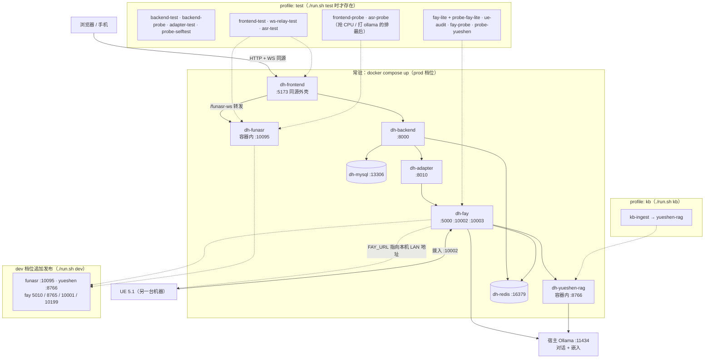
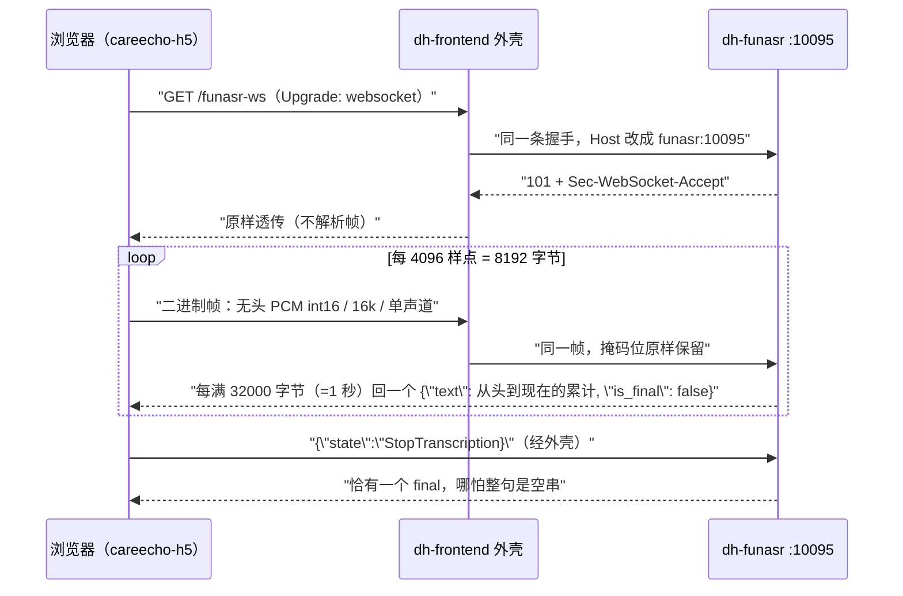

# containerd —— DigitalHuman 容器集成层

这一层把散在几个仓库里的东西拢到一个 `docker compose` 里跑起来，**不改动 `fay` /
`service` / `ue` / `frontend` 任何一个仓库的代码**：四个目录的 `git status` 始终干净、
`main`（前端是 `master`）始终 == `origin/main`（`./run.sh audit` 会把这件事打成输出，
而不是留成一句承诺）。

> **2026-09-21 撤掉了 `origin_fay` 参照实例。** 它曾经是「上游直出的第二个 Fay」，用来回答
> 「fork 相对上游改了什么」。fork 换成 `chuan918/Fay` 之后它成了上游的**直接后代**、Python
> 源码逐字节相同，这个对照就不再有内容 —— 两份镜像的唯一差别只剩 config，而 config 差异
> 早就是 `overlay/` 里可读的文件。于是那个服务、它的镜像、`overlay/origin_fay/`、
> `probe-origin-fay` 测试组一起删了；上游本身改为**只当 `fay` 里的一个 remote** 留着
> （见下「跟上上游」）。下文凡是以 `origin-fay` 为主语的实测数字都按原样保留 ——
> 那是它还在的时候量的，属于历史。

```
containerd/
├── docker-compose.yml          常驻 8 个服务：mysql / redis / fay / yueshen-rag
│                               / adapter / backend / frontend / funasr；另有 profiles:["test"]
│                               的 fay-lite（测试用轻模型 Fay）+ 13 个一次性测试件，
│                               和 profiles:["kb"] 的 kb-ingest（外部语料入库，见下）
├── docker-compose.dev.yml      ★ dev 档位叠加层：放开应用面端口 + DEBUG=true + FAY_URL
│                               （只在 ./run.sh dev 时被叠上，见「dev / prod 档位」）
├── run.sh                      up · dev · build · test · smoke · audit · upstream · logs
│                               · kbslice · kb · asr-seed · ps · down · reset
├── .env.example                模板；run.sh 首次执行会复制成 .env 并填随机密钥（DH_ENV 也在里面）
├── images/
│   ├── fay.Dockerfile          Fay 镜像（唯一一份 Fay 源码 ../fay；原先靠 ARG FAY_SRC
│   │                           多构建一个上游参照镜像，那三个 ARG 随实例一起删了）
│   ├── yueshen_rag.Dockerfile  唯一带 chromadb 的 MCP 服务器，单独镜像（不并进 Fay，见「yueshen 知识库」）
│   ├── service.Dockerfile      原样 COPY service/，依赖读它自己的 pyproject.toml
│   ├── frontend.Dockerfile     两阶段：node 里 npm ci + vite build 出 dist-h5，
│   │                           产物拷进 python-slim 与外壳一起跑（见「CareEcho H5 前端」）
│   └── funasr.Dockerfile       torch(cpu) + funasr，运行时代码是本层的 asr/server.py（见「FunASR」）
├── overlay/                    ★ 覆盖层：不改源码的配置手段
│   ├── {fay,fay-lite}/system.conf      仓库里不存在，容器里必须有（见下）
│   ├── {fay,fay-lite}/config.json      关麦克风、关本地播放、换 edge_tts 音色
│   ├── {fay,fay-lite}/mcp_servers.json  把 id=4 yueshen 从 stdio 换成 sse 指向容器（每实例一份、可写）
│   ├── 依赖清单只有一份：
│   │   overlay/fay/requirements-docker.txt     fay 与 fay-lite 同一镜像、同一份清单
│   └── {service,yueshen_rag,funasr}/requirements-docker.txt  其余镜像各自的依赖清单（冲突处理见下）
├── patches/                    ★ 补丁层：构建期 patch -p1 盖到镜像里的 /app
├── seed/                       ★ 种子层：service 的参考语料不在仓库里，这里给一份能自测的
│                               ├── kb_corpus/  外部科普语料的切片产物（`tools/slice_kb_corpus.py`
│                               │               生成，bind-mount 进 yueshen-rag；不进 git，见「外部语料」）
├── probes/                     测试件本体：fay_probe.py · adapter_test.py · ue_audit.py
│                               · ws_timing_test.py（探针自己的收工时机自测）
│                               · backend_probe.py（后端活体探针：路由/迁移/schema/鉴权/写路径/调度器）
│                               · yueshen_probe.py（chromadb 那条链路：嵌入出口/清单/入库/检索/stats 一致性）
│                               · kb_ingest.py（外部语料入库 + 12 问真实问法抽测，`./run.sh kb`）
│                               · frontend_test.py（前端外壳契约：假后端 + 19 条判据 + 负面自检）
│                               · frontend_probe.py（真栈：从外壳那一口穿到 backend→adapter→Fay→ollama）
│                               · ws_relay_test.py（外壳的 WS 转发契约：手造掩码帧 + 假上游）
│                               · wsutil.py（RFC 6455 握手与帧的最小构造器，上面那组与 asr_* 共用）
│                               · asr_test.py（FunASR 协议自测：假模型、不加载 torch）
│                               · asr_probe.py（真模型链路：把仓库里的真语音按浏览器节奏推进去）
├── tools/                      reset_test_db.py（跑 pytest 前重建测试库）· tts_negative_control.py
│                               · make_yueshen_corpus.py（构建期造 yueshen 语料，见「yueshen 知识库」）
│                               · slice_kb_corpus.py（把项目方给的 .docx 按原序摊平成可检索的切片）
│                               · check_mermaid.py（两份 README 里 mermaid 块的离线结构自查，见「服务拓扑」末）
├── adapter/server.py           自己写的第一份代码：后端 /api/chat ↔ Fay /api/send+get-msg
├── frontend/carecho_web.py     自己写的第二份代码：CareEcho H5 的同源外壳（静态 + /api + WS 转发）
├── asr/server.py               自己写的第三份代码：FunASR 流式识别服务（H5 麦克风的真后端）
├── sql/init/00-create-database.sql
└── _audit/                     ue-audit 的 JSON 报告落这里（README 的数字对着它复核）
```

## 服务拓扑



`-.-` 是「按档位/按测试才发生」的关系，实线是常驻路径。`mysql` / `redis` 恒绑
`127.0.0.1`，**不跟档位放开**（原因见「dev / prod 档位与跨机流量」）。

改这两张图（还有根 README 那一张）之后跑一句 `python3 tools/check_mermaid.py ../README.md
README.md`，它离线扫所有 ```` ```mermaid ```` 块并给出结论。为什么要有这么个东西：mermaid
标签里的 `()` 不加引号会把解析器直接搞坏，而外部渲染器（kroki 之类）一旦开始回
`400/500/000`，你分不清是图写坏了还是它自己不舒服 —— 这种检查必须能在断网时给出结论。
它只做结构自查（引号成对、括号平衡、`subgraph`/`loop` 与 `end` 数量对得上、裸括号、边标签
竖线数），不宣称能代替渲染。

## 快速开始

```bash
cd containerd      # 本目录（仓库里唯一有可执行入口的地方）
./run.sh up        # 构建 + 起栈（首次约 3~6 分钟，pip 走阿里云镜像、npm 走 npmmirror）
./run.sh dev       # 同一套东西，但叠上 docker-compose.dev.yml：应用面端口放开、DEBUG=true
./run.sh smoke     # 端到端：后端 → adapter → Fay → Ollama → 落库
./run.sh test      # 十三组测试件：backend-test · backend-probe · adapter-test · probe-selftest
                   #            · frontend-test · ws-relay-test · asr-test · probe-fay-lite
                   #            · ue-audit · fay-probe · probe-yueshen · frontend-probe · asr-probe
./run.sh test fay-probe   # 只跑其中一组（改探针时不用等全套）
./run.sh audit     # 核账：四个上游仓库是否仍然零改动、与上游不分叉（非零退出即可当断言）
./run.sh upstream  # 跟上上游：fetch xszyou/Fay，报落后几条，并把每份 fay 补丁对 upstream/main 干跑预检
./run.sh kbslice   # 把 uploads/ 里那包 .docx 切片到 seed/kb_corpus/（换语料时才需要跑）
./run.sh kb        # 切片入库 + 12 问真实问法抽测（要求每问在 top3 命中自己的出处）
./run.sh asr-seed  # 本机若已有别处下好的 FunASR 模型缓存卷，拷进本栈的卷（省 1.3GB 下载）
./run.sh logs fay  # 单独看某个服务（fay/backend/adapter/frontend/funasr/mysql/redis）
```

入口：

| 地址 | 是什么 |
|---|---|
| `http://127.0.0.1:5173/` | CareEcho H5 前端（伙伴方仓库构建产物 + 本层的外壳，见「CareEcho H5 前端」一节） |
| `http://127.0.0.1:5000/` | Fay 的 Web 管理台 |
| `http://127.0.0.1:8000/docs` | 后端 OpenAPI（`/openapi.json` 实测 64 个 path / 81 个 operation）；健康检查在 `/api/v1/health` |
| `ws://127.0.0.1:10002` | 数字人 WS（`Topic:"human"` 协议，留给未来前端；`:10012` 曾是指向上游那份的映射，随参照实例一起撤了） |
| `ws://127.0.0.1:10003` | Fay 浏览器面板 WS（同上，`:10013` 已撤） |
| `http://127.0.0.1:8010/api/chat` | adapter，给后端用的同步问答口 |
| `ws://127.0.0.1:5173/funasr-ws` | H5 麦克风那条：页面同源的 WS，由外壳按常量表转发进 `dh-funasr`（生产唯一的入口） |
| `ws://127.0.0.1:10095/` | **dev 档位才有**（`./run.sh dev`）—— FunASR 直口，给探针和手工调试用；prod 不发布 |
| `http://127.0.0.1:8766/` | **dev 档位才有** —— yueshen-rag 的 chromadb HTTP 口；prod 只在 compose 内网 |

Fay 自己的 HTTP 面（`gui/flask_server.py`）：问答是异步的
`POST /api/send` + `POST /api/get-msg`；另有一组管理口
（`/api/get-member-list`、`/api/get-system-status` …）和一对 **OpenAI 兼容 façade**
`GET /v1/models` / `POST /v1/chat/completions`（:746 / :775）。façade 是"如果不想写
adapter"的备选路线，但后端 `fay_gateway.py` 期待的是 `/api/chat`，所以本栈仍走 adapter。
就绪探针用 `GET /api/get-system-status` —— **别用 `/panel/page1`，这个路由返回 404**
（面板是 10003 上的 WS，不是 HTTP 页面路径）。

但这条探针只证明 **flask 活着**，不证明 **Fay 能对话**：`main.py` 先起 HTTP 服务，
之后还要预热 embedding、才 `创建代理实例`。中间那段窗口里 `POST /api/send` 会**在 0.01s 内
抛 500**（不是超时），也就是"端口就绪 ≠ 可以问话"。实测：2026-09-21 22:18 那次
`docker compose restart fay` 之后 `:5000` 立刻可问，紧跟着那一问就是 502；到第 10s
同样的 `/api/send` 返回 `{"result":"successful"}`。所以 `./run.sh smoke` 在 restart 之后
等的不是端口，而是 `fay_booter.py:478`（`start()` 最后一行）那句「服务启动完成!」
（`run.sh` 的 `wait_fay_agent`，`--since` 取容器本次启动时刻，不会把上一辈子的同一句读成"好了"）。
compose 的健康判据没跟着改成这条：它在容器里跑，读不到自己的日志流，而那段时间里
`/api/get-system-status` 本来就答得上 —— 于是 `healthy` 的含义是"HTTP 面可用"，
不含"能对话"。真要在产品里避开这个窗口（embedding 要换入时它会拉长到分钟级），
得在 adapter 侧对 500 做一次重试，本轮没做。

容器内实测已监听的端口：5000 / 10002 / 10003 / 10001(远程音频 TCP) / 9001(音频桥)
/ 5010(MCP 管理) / 8765(MCP SSE)。**5001(genagents 决策面谈) 不在常态清单里 —— 它是按需拉起的**：
`POST :5000/api/start-genagents` 才起、`POST :5001/api/shutdown` 就关，
这条起落两向 run #24 起已是探针里的判据（见「决策面谈 `:5001`」一节）。
compose 只把前三个
（5000 / 10002 / 10003）发布到宿主机，其余留在容器网络里。

默认只绑 `127.0.0.1`。要给别的机器（手机、跑 UE 的那台 Windows）连，用的是
**`./run.sh dev`**，不是手改 `BIND_ADDR` —— 后者在 prod 档位下会被直接拒掉，
理由见下一节。

## dev / prod 档位与跨机流量

档位只有一个变量：`.env` 里的 `DH_ENV`（缺省 `prod`）。它只决定两件事：

1. `run.sh` 里那串 `$COMPOSE` 叠不叠 `docker-compose.dev.yml`
   （所有子命令都用同一个变量，所以各处不用改）；
2. `dev` 下 `BIND_ADDR` 落到**探测出来的局域网地址**（`ip route get 1.1.1.1` 的源地址），
   而不是 `0.0.0.0`。

### prod 的硬闸

```
$ DH_ENV=prod BIND_ADDR=0.0.0.0 ./run.sh up
[run] DH_ENV=prod 不接受 BIND_ADDR=0.0.0.0 —— 那会把管理台与无鉴权接口发布到外部。
      要给别的机器连就用 ./run.sh dev（它绑到探测出的局域网 IP，不是 0.0.0.0）。
$ echo $?
1
```

不做「提醒之后继续」而直接退出，是因为这类暴露最常见的成因就是有人临时改过一次 `.env`
然后忘了改回来 —— 而 `:5000` 一离开 loopback，同时出去的是 **Fay 的 Web 管理台**和它的
**无鉴权 OpenAI 兼容 façade**（`POST /v1/chat/completions`，见 `fay/gui/flask_server.py:775`）。
闸在 `use_profile` 里，跑在任何 docker 命令之前。

### dev 追加什么

`docker-compose.dev.yml` 只放开**应用面**：`frontend` 5173、`backend` 8000、`adapter` 8010、
`fay` 5000/10002/10003 + 内网口 5010/8765/10001 + 音频桥 `${FAY_BRIDGE_PORT:-10199}:9001`、
`yueshen-rag` 8766、`funasr` 10095，并给后端 `DEBUG: "true"`、给 Fay
`FAY_URL: http://${DH_LAN_IP}:5000`。

- **`mysql` / `redis` 即使在 dev 也恒 `127.0.0.1`**。它们没有任何外部消费者，
  而「只靠一个口令的数据库/可写 KV 进局域网」是这类栈最常见的泄漏面。
  这一条写在**基础文件**里而不是覆盖文件里 —— compose 的 `ports:` 是按
  `host_ip` + `target` 合并的，覆盖层换个 `host_ip` 只会**多加一条**而不是改掉那条，
  想收紧只能在源头写死。这是本轮踩实的一条合并语义。

  两档的渲染结果（`docker compose ... config`，把 `BIND_ADDR` 设成本机局域网 IP 192.168.0.2 问的，
  不是运行期截图 —— 它测的是 compose 的合并语义，与栈起没起无关）：

  | 服务 | prod（基础文件） | dev（叠 `docker-compose.dev.yml`） |
  |---|---|---|
  | `frontend` / `backend` / `adapter` | `192.168.0.2:5173/8000/8010`（各一条） | 同左，端口不变 |
  | `fay` | 5000 / 10002 / 10003 | 追加 5010 / 8765 / 10001 / `10199->9001` |
  | `funasr` | **`(no published ports)`** | `192.168.0.2:10095` |
  | `yueshen-rag` | **`(no published ports)`** | `192.168.0.2:8766` |
  | `mysql` / `redis` | `127.0.0.1:13306` / `127.0.0.1:16379` | **与 prod 一字不差** |

  值得看的是两件事：dev 每个服务仍然**只有一条**（没有因为 `host_ip` 变了就多出一条 loopback，
  这正是"每个被碰的服务重写完整 `ports:` 清单"买来的结果），以及 prod 那一列里 `BIND_ADDR`
  一旦被改成局域网地址，应用面端口就真的跟着出去了 —— 所以闸必须存在，见上面那条。
- **`DEBUG` 不是 `DH_ENV` 的隐式含义，而是 dev 显式写出来的一个值**，因为后端只在
  `DEBUG=true` 时挂载 `POST /api/v1/auth/dev-login`，而 H5 前端**根本没有登录这一步**
  （身份由外壳替设备铸）。`DEBUG=false` 起 dev 档位的现象是：页面打得开、每一发问答都 502，
  气泡上写着「后端 POST /auth/dev-login → HTTP 404」。这条耦合现在由
  `probes/frontend_test.py` 判据 18 钉着，不用靠人记得这段文字。
- 每个被 dev 碰到的服务都**重写完整的 `ports:` 清单**，这样「同标识覆盖」和「异标识追加」
  两种合并语义下结果一样 —— 不必去猜 compose 实现到底按哪种处理。

### 跨机：UE 在另一台电脑上

真正影响正确性的只有两件：**进得来** 和 **取到可达的音频地址**。

- 进得来 → 端口绑到局域网地址（上面那条），UE 里填 `ws://<本机 LAN IP>:10002`。
- 音频地址 → Fay 回给 UE 的音频 URL 是拼 `fay_url` 得来的，而 `overlay/fay/system.conf:58`
  钉的是 `http://127.0.0.1:5000` —— 换台机器 UE 就取不到文件。
  `patches/fay/0007-fay-url-env-overridable-CRLF-source.patch` 把这一行放开成
  `fay_url = os.environ.get('FAY_URL') or fay_url`（源文件是 CRLF，补丁按现有那批的写法逐行 `\r\n`）。
  实测两向都对：不设 `FAY_URL` 时容器里读回 `http://127.0.0.1:5000`（完全等于上游原行为），
  设了就等于设的值 —— 所以这个补丁对没跨机需求的人是隐形的。
  复核命令：`docker exec dh-fay python -c "from utils import config_util as c;c.load_config();print(c.fay_url)"`。
- 名字 → `docker-compose.yml` 的 `x-host-gateway` 锚点里一并给出
  `extra_hosts: dh-host:${DH_LAN_IP:-127.0.0.1}` 与 `ue-host:${UE_LAN_IP:-127.0.0.1}`。
  注意这两条写在**容器内**的 `/etc/hosts`，所以它们服务的是栈内将来需要外拨 UE 的地方，
  **管不到 UE 那台 Windows 机器自己的解析**：那边想用 `ws://dh-host:10002` 这种写法，
  得自己在 `C:\Windows\System32\drivers\etc\hosts` 加一行 `<本机 LAN IP>  dh-host`；
  嫌麻烦就填 IP，效果一样。**这组映射只是便利**，不是任何判据的前提。

`./run.sh dev` 起来后会把这三行直接打印出来（含本机实际 LAN 地址与容器里生效的 `fay_url`），
免得每次都回来查文档。

上面那张表是**渲染出来的**（compose 会怎么写）。两档真正跑起来之后 `ss -ltn` 各看过一次，
数字对得上，而且 prod 那一列有个容易看错的细节：

```
prod（./run.sh up）  127.0.0.1:5173 8000 8010 5000 10002 10003 13306 16379 —— 共 8 条，全在 loopback
                     10095 / 8766 / 5010 / 10001 / 10199 一条都没有（`docker ps` 里它们只是
                     `8765/tcp` 这种"未发布"形态）
dev （./run.sh dev） 应用面那六个口改绑 192.168.0.2（`mysql`/`redis` 那两条仍留在 loopback，
                     见上面第一条），另加 10095 / 8766 / 5010 / 8765 / 10001 / 10199。
                     `ss -ltn` 里真看过的是 `192.168.0.2:5173` 与 `:10095` 这两条（其余按
                     上面那张渲染表算，别把"compose 会这么写"当成"实测过"）；
                     从宿主真打 ws://192.168.0.2:10095/ 与经外壳的 ws://192.168.0.2:5173/funasr-ws
                     各识别出同一句 final（1.5s / 1.2s，见「FunASR：麦克风这条链」末）
```

宿主上另有一个 `127.0.0.1:8765` 在听，那是**别人的进程**（`docker ps` 里没有任何容器发布 8765），
所以核对 prod 姿态要按"我们发布的端口"数，别把宿主机上恰好占着的同号端口算成自己的泄漏面 ——
反过来说，dev 档位选 10199 而不是 9001 给音频桥，也是同一种"先看宿主占了什么"的动作。

### 一条与档位有关的产品边界

`getUserMedia`（也就是 H5 那个麦克风按钮）只在 **https 或 localhost** 算安全上下文。
从手机用 `http://192.168.x.x:5173` 打开页面时，文字问答照常、**语音一定点不动** ——
浏览器的规则，不是本栈的缺陷。要么走 https（伙伴方那个小程序壳还额外要求备案域名），
要么用 `adb reverse` / USB 调试把 5173 转成 localhost。

## 为什么 AI 走宿主机 Ollama

`overlay/fay/system.conf` 把小模型、大模型、embedding 三组配置全部指向
`http://host.docker.internal:11434/v1`（compose 里 `extra_hosts: host-gateway`）。
不填任何云端 API key，也不依赖那个已经不可达的远程配置中心。
后端侧不需要接 LLM：`app/services/tier_engine_service.py:94` 的分级分类是
读库里的规则表做的，纯 SQL，所以整条链路上只有 Fay 一个 AI 消费者。

当前选定的模型（改完 `docker compose restart fay` 即生效，不用重新 build）：

| 角色 | 模型 | 说明 |
|---|---|---|
| 小模型（日常对话） | `qwen3.5:9b` | 权重 6.6GB。**标称 16GB 显存装得下，但这台机器装不下** —— `nvidia-smi` 有 15.2GB 被本机其他常驻服务占走，实测只有 6.3% 权重进了显存（下一节全部数字都是这个前提）。换 27b 更糟：`qwen3.8:27b` 要 17.7GB 权重，还会溢出到内存/CPU；留空则 Fay 自动降级为单模型 |
| 大模型（复杂推理） | `qwen3.5:9b` | 故意与小模型同名，避免一次问答在两个模型间换入换出 |
| Embedding（记忆检索） | `qwen3-embedding:0.6b` | 609MB，走 `/v1/embeddings`；启动时预热实测 dim=1024。它一加载就会把对话模型挤出显存，所以每轮问答要 8 次 embedding 的链路在这台机器上特别贵 |

模型名除了写死在 `overlay/fay/system.conf` 里，还可以用环境变量盖：
`FAY_GPT_MODEL_ENGINE` / `FAY_BIG_MODEL_ENGINE`（补丁 `patches/fay/0006`，
不打补丁 = 原行为）。compose 里的 `fay-lite` 就靠它跑 `qwen2.5:1.5b`，
不用为测试再造一份 system.conf。

`yueshen-rag` 的嵌入模型（`YUESHEN_EMBED_MODEL`）**故意指向上表同一个
`qwen3-embedding:0.6b`**，不是第二个嵌入器：这台机器一次只装得下一个模型，
多一个型号就多一次换入换出。

## 真实瓶颈是显存，不是代码（为此打的补丁）

探针有一阵子反复出现同一类失败：HTTP 问答 90s 拿不到一个字、`:10002` 收不到
`Data.Key=text`、`/v1/chat/completions` 精确地在 **180.0s** 返回空 `content`。
查下来根因在这台机器的显存上，与容器封装无关：

| 测到的事实 | 数字 |
|---|---|
| GPU | RTX 4080 SUPER 16GB，`nvidia-smi` 显示 **15.2GB 已被本机其他常驻服务占走** |
| `ollama ps` | `qwen3.5:9b` 标着 `94%/6% CPU/GPU` —— 实际是 CPU 在推 |
| `ollama /api/ps` 的字节账 | `size_vram=387029401` / `size=6149206178` = **只有 6.3% 权重进了显存** |
| 直连 Ollama 一发 | 只生成 8 个 token 用了 **51.4s**（另一轮实测 39.1s） |
| Fay 容器日志 | `请求超时 (尝试 N/3): ...port=11434... Read timed out. (read timeout=60)` 成串 |
| 一轮问答触发的 embedding 请求 | **8 次**（日志 `发送 embedding 请求` 计数） |

同一个模型、同一份 `system.conf`，两个实例的表现却不一样 —— 这是把「容器封装坏了」
排除掉的关键一条对照：

| 实例 | 模型 | 一句话问答 |
|---|---|---|
| `origin-fay`（上游 v4.8.1） | qwen3.5:9b | 出真回复，**172.1s / 301.2s** |
| `fay`（fork） | qwen3.5:9b | **>600s** 仍拿不到字，最后落进管线兜底语 |

差额是 fork 自己加的那层规划器（`llm/nlp_cognitive_stream.py:3059` 的
`_call_planner_llm`，走同一张图但多几发 LLM）。在显存够用的机器上是产品力的差别，
在这台显存被占满的机器上是「一个数量级的墙钟时间」，与容器无关。

> 这一行对照属于**旧基线**：那时的 `fay/` 是 `45b44e9` 那份源码导入，规划器那层是它自己加的。
> 2026-09-21 起 fork 换成 `chuan918/Fay`（v4.8.1 的直接后代），Python 源码与上游逐字节相同，
> 这张表量不出现在了 —— 现在两个实例的差别只有 config，不再有代码档。保留它是为了说明
> 「墙钟时间可以差一个数量级而两处都不是容器的问题」这条判据的来历。

放大链路写死在上游几个数字里 —— `utils/api_embedding_service.py:110` 是
`timeout=60` + `max_retries=2`，`llm/execution_manager.py:203` 是小模型 `timeout=60`。
显存不够 → 加载 609MB 的 embedding 模型就得把 6.6GB 的对话模型挤出去，下一轮再换回来 →
一发 embedding 必然 >60s → 超时 → **整条请求重发 3 遍 = 180s** →
正好撞上 `gui/flask_server.py:51` 的 `_STREAM_READ_IDLE_TIMEOUT = 180`，
非流式问答于是「180s 内一个字都没等到」，按兜底分支返回空串。
看起来像 Fay 坏了，实际是重试把时间预算吃光，而 180s 的空闲上限又小于
LLM 自己的超时 —— 两条时间线本来就没对齐（实测 `/v1/chat/completions`
精确地在 180.0s 返回，而同一发请求在 origin-fay 身上 172.1s 就出字了）。

修复仍然不进 Fay 仓库：`containerd/patches/` 把这四个数字开成环境变量，
compose 的 `x-llm-timeouts` 锚点给 `fay` / `fay-lite` 两个服务注入 ——

| 环境变量 | 容器里的值 | 作用 | 补丁 |
|---|---|---|---|
| `LLM_REQUEST_TIMEOUT` / `LLM_REQUEST_MAX_RETRIES` | `420` / `0` | 真正的回答给足时间，且不再重发（重发只会让回答更晚） | `fay/0001` |
| `EMBEDDING_TIMEOUT` / `EMBEDDING_MAX_RETRIES` | `90` / `1` | 仿生记忆检索那发 embedding 的预算。**这里吃过一次教训**：起初按「容器里不要死等」压成 `20` / `0`，run #7 否证了它 —— ollama 换入模型实测要 72.9s，20s 必然超时，除了静默落回 `simulation_engine/gpt_structure.py:294` 的模拟向量，还把开机线程堵在一串重试后面，`:8765` 拖到第 61 秒才 bind（见下面「就绪判据」）。90s 按实测最坏值给，换入完成后一发 embedding 只要 0.06s | `fay/0002` |
| `STREAM_REPLY_IDLE_TIMEOUT` | `480` | 回复空闲上限必须 ≥ 上面那条 LLM 超时，否则「模型正在慢慢想」被判成「Fay 卡住」 | `fay/0003` |
| `FAY_GPT_MODEL_ENGINE` / `FAY_BIG_MODEL_ENGINE` | 缺省不注入 | 换掉 `system.conf` 里的模型名，给显存不够的机器留一条「换个吃得下的小模型」的路（`fay-lite` 用这个跑 qwen2.5:1.5b） | `fay/0006` |

补丁里未设置环境变量时的默认值与上游逐字一致（不打补丁 = 原行为）。
显存被挤走时问答侧仍会慢到分钟级，那是环境而不是配置问题，探针按下面的三态处理。

### 就绪判据：五个契约端口全监听，不是「`:5000` 能连就算起」

两个 Fay 实例（`fay` / `fay-lite`）共用一份镜像，也共用 compose 里
`x-fay-healthcheck` 这一个锚点：`5000`（Flask）、`5010`（MCP 管理面）、`8765`（MCP SSE）、
`10002` / `10003`（两条 WS）全 bind 才算 healthy。原先那份只看 `:5000`，实测开机
`:5000/:5010/:10002/:10003` 第 6 秒就全在听，`:8765` 要等到第 24~61 秒 ——
`--wait` 于是提前放行，探针打进一个只起了一半的实例，run #7 的
`MCP SSE 握手 ConnectionRefused`、`OpenAI 兼容层 超时`、`/api/send 空回复` 三条 FAIL
全是这一个原因（同一轮里 WS 侧的问答、audio 帧、wav 取回反倒全绿，因为那几个口先起）。
探针侧另加一道 `wait_port()`：握手前先等 `:8765` 监听，等不到才判 FAIL，
详情里带上「等了几秒」—— 晚起是事实，不是故障，但不该由测试替它圆场。

`x-fay-healthcheck` 的**实现方式**也改过一版，原因是它自己在污染容器日志。旧写法对
五个口各做一遍 `socket.create_connection` 半开握手，而 `:10002`/`:10003` 是
`websockets` 的 legacy server：一次只连不发的 TCP 探测会让它在 `websockets/legacy/server.py:230`
打一对 `connection failed (400 Bad Request)` + `connection closed`。健康检查 `interval: 10s`
× 每轮两条 WS 口 = 每个空闲实例每小时约 720 对这种纯自己制造的噪音，把基于日志取证的其他判据
一起淹了。换成读 `/proc/net/tcp`+`/proc/net/tcp6` 的 LISTEN 表（`st == '0A'`，端口取本地地址
hex 段），零字节打到业务端口就能判定五口全听；`:8765` 是 uvicorn、裸连不打日志，但为一致性
一并走这张表。run #7 那条「`:8765` 到第 24~61 秒才起」的经验仍然守住 —— 五口全 LISTEN 才 healthy。
换完实测：一个空闲实例 60s 内新增 `connection failed` 行为 `0`（此前是每 10s 一对）。

这条判据在 **restart 场景**下被独立验证过一次（比开机更能说明问题）：
`docker compose restart fay-lite` 5.9s 就返回，容器里 `:5000/:5010/:10002/:10003`
立刻可连，而 `:8765` 与 `:10001` 在 **140s 之后仍未监听**（当时宿主被两组 9b 压满）。
健康检查因此一直保持 `starting`，`--wait` 不肯放行 —— 这正是把它纳入判据的意义：
宁可慢放行，也不放行一个半启动的实例去制造假红。同一轮里也顺手量到了另一件事：
重启前后 `/api/get-msg` 都能读回同一条 `id=83` 的消息行，说明记忆确实落在
`fay-memory` 具名卷里而不是容器的可写层（这条后来固化成 `./run.sh smoke` 的第 5 步，
故意排在最后那次问答**之前**：它不依赖 LLM，就不该被显存不够连累）。

还有一处 60s 是**故意不碰**的：`simulation_engine/gpt_structure.py:21` 那个
`httpx.Timeout(60.0) + max_retries=1` 的 openai 客户端只服务 `ask_gpt` /
`gpt4_vision`（写死 `model="gpt-4o"`），全仓 grep 不到问答链路上的调用方，
`llm/nlp_cognitive_stream.py:50` 从这里只 import `get_text_embedding`，
而那个函数走的是已开成环境变量的 `utils/api_embedding_service`。

### 探针怎么判：PASS / FAIL / SKIP 三态 + 一条不依赖显存的功能路

光把超时放宽会变成「等到天荒地老然后报个红」，测试就失去意义了。`probes/fay_probe.py`
因此定了六条规矩（前四条管判定语义，第五条管时机，第六条管覆盖面）：

**1) 兜底语不算回复。** run #2 里有一条被记成
`PASS HTTP 问答链路 … 243.3s, 22 字: 抱歉，我的大脑暂时开了小差，请稍后再试一下。`
——那是管线自己承认失败的兜底串（fork 里 `nlp_cognitive_stream.py:2258/2871/2945/3066`
四处之一），不是回答。现在 `reply_verdict()` 先按 `PIPELINE_FALLBACKS` 三串过滤。

**2) 环境不够就降级成 SKIP，但必须带客观证据。** `check_llm_host()` 先绕过 Fay
直连 LLM 出口量一发下限耗时，并从 `ollama /api/ps` 读 `size_vram/size`；
驻留不足 50% 或单发 >30s 才置 `DEGRADED_LLM_HOST`（阈值来自实测分布：1.5b 全权重
进显存时暖态 0.2s，9b 6% 驻留时 39~240s）。此后耗时类判据走 `latency_verdict()`，
真不过 = FAIL，只有拿着这条证据才允许 SKIP，退出码只数 FAIL。
问答预算也不再一路抬到 `--max-timeout`：显存不足时按 `--timeout` 快速判掉
（run #3 就是每条问答都撞满 600s 客户端超时，白烧墙钟时间）。**直连探测自己超时**
也算证据而不是故障：run #5 的 origin-fay 那组，同一条日志里 `frac_txt` 已经写了
「驻留显存 6%（387/6149MB）」，判据却报 FAIL —— 自相矛盾，现在这类超时进 SKIP 分支，
只有连不上 / 4xx（= LLM 出口配错）才留 FAIL。

**3) 下游判据不重复计账。** `audio` 帧的存在性、以及按 `HttpValue` 去 HTTP 取文件，
都以「这轮真有了回复」为前提。run #5 里这两条被记成
`FAIL …（Keys=['log','question']）`—— 一个字都没播，音频自然没有，它是同一条 LLM
依赖的下游，不是独立的容器故障，所以走 `latency_verdict()`。反方向仍然硬失败：
客户端声明 `Output=false` 却收到 audio 帧，那是服务端漏推，与模型无关。

同一组判据还有第三种错法：**收工收早了**。run #10 里 `Output=true` 那条被判成
FAIL（`Keys=['log','question','text']`，text 明明到了），而同一份代码在 run #9 是
PASS —— 差别只在 audio 帧并不和 text 同时到（#10 里 text 到了、之后 6s 静默内什么都没来；
#9/#11 里它在稍后被收到），而 `check_ws()` 收到 text 之后只等 6s 静默就收工。它的下游
是「整句合成完才推」，这个节奏不是 6s 能盖住的。现在窗口按「这个会话还欠不欠 audio」
分两档（`AUDIO_GRACE_SECONDS=45` / 6s），服务端中途关连接也不再丢弃已收到的帧。
run #12 给了这条修复最想要的对照：lite 与 origin-fay 两个实例的 `Output=true` 会话
都等到了 audio 帧并取回 wav（264642 / 563110 字节），而 `fay` 那一轮的会话根本没等到
文字，于是它按 `--timeout` 就收工、没有多花那 45s —— 窗口只放宽给「确实还欠一帧」的会话，
不给死掉的宿主。
**判据自己也会写错**这件事不该只靠再跑 20 分钟全套去发现，所以它有一份不打 LLM、
不看显存的时机自测：`probes/ws_timing_test.py`（七种时机各量一次，其中一条把窗口
退回 6s 并断言"必须收不到"，防止这条判据变成摆设；另有三条量收尾那行的统计口径）。

**4) 没执行到的判据不能算 PASS。** MCP 那组的 `ping` 在 `origin_fay` 上能不能调到，
取决于它 `test/mcp_stdio_example.py` 的 `autostart=false` 之后那条「现场连接离线服务器
tools」有没有成功 —— 在线的原本只有知识库。run #4 却把这条印成
`PASS … —— 该实例在线的服务器里没有暴露 ping`。
假绿比红更糟，改成 SKIP 并把原因写进详情。判据是「没执行到就 SKIP」，不是「环境不配合
就默认通过」，所以它在 run #10 记 SKIP、在 run #12 记 PASS 都是这套语义的正常结果。

**5) 量之前先确认「它真的起完了」。** 端口 bind ≠ 服务可用，这条是 run #7/#8 用两次
误报换来的：`compose --wait` 只看健康检查，健康检查原先只摸 `:5000`，而 `:8765`
（MCP SSE）要晚 5~40 秒、MCP 的「开机自连」又要再晚 1.6 秒。探针打早了就会得到
`ConnectionRefused`（SSE 还没监听）和 `在线 无`（自连还没跑完）这种看着像故障的红。
现在分两层堵：compose 侧健康检查要求五个契约端口全监听（`x-fay-healthcheck`），
探针侧 `wait_port()` 等 `:8765`、`check_mcp_tools()` 先等 `autostart=true` 那几台
在线再取快照（上限 90s，等不到才 FAIL）。等待本身算进详情，方便下次判断是不是又起慢了。

**6) 只管得着容器化的判据也要有。** `check_console()` 取 `:5000` 根页面，再把页面里
引用的每个 `/static/*` 逐个 GET，要求 200 且非空。三个 Fay 实例实测各 **22 个资源全过**。
这条与上游功能无关（少拷一层目录、`.dockerignore` 排掉静态资源、镜像里 `web` 路径不对
都会红），而问答链路对它完全无感 —— 容器化改坏的东西，得有一条判据专门盯着容器化。

**测试件的顺序**也被这条链路咬过：ollama 是单条队列，而且**同一时刻只保留装得下的
模型**。9b 占着 6GB 时，1.5b 第一次请求要先换出 9b 再换入自己 —— 实测 72.9s，
换入后同一发请求 14.9s。更要命的是「探针客户端超时」不等于「服务端停止生成」，
前面那两组 9b 的残留生成会一直堵着队列，于是 run #5 里 `probe-fay-lite` 的直连探测
被挤到 180s 超时，唯一能给出正面证据的一组反而降级了。现在 `./run.sh test` 的默认
顺序把不打 LLM 的四组排在前面、lite 排在两个 9b 实例之前（`backend-test →
backend-probe → adapter-test → probe-selftest → probe-fay-lite → ue-audit →
fay-probe → probe-yueshen`）。

SKIP 只说明「这台机器判不了这一条」，所以问答链路的**真实功能**由 compose 里第三个
Fay 实例 `fay-lite` 兜住：同一个镜像、同一套补丁、同一份 `system.conf`，只是模型换成
装得进剩余显存的 `qwen2.5:1.5b`（`FAY_LITE_MODEL_ENGINE` 可改），不开宿主端口、
有自己的一套 memory/cache/logs 卷和一份可写的 `overlay/fay-lite/config.json`
（config.json 是人设可写状态，两个容器不能共用同一份）。它 43 条判据里 **41 PASS /
2 SKIP / 0 FAIL**（run #21 首次 36/39，run #24 加上决策面谈那三条后 39/42，run #27 再因
连上的 yueshen 加一条 `MCP 工具清单 server_id=4`、`yueshen rag` 退出白名单 SKIP 变两条 PASS，
成 41/43），
包含 `Data.Key=audio` 出帧、`HttpValue`
真的取回 wav（#21 469970 字节 / #23 385298 字节 / #24 544058 字节 / #27 328146 字节），
以及 MCP 那一整组不打 LLM 的确定性判据（含 prestart 那三档；剩下 2 条 SKIP 是无头白名单里的
`window capture` 与本机没起的 FunASR，`yueshen rag` 这一轮已经是两条正面 PASS，见规矩 4）。

一个一直咬人的坑：v4.8.1 这份源码里 `utils/api_embedding_service.py`、
`gui/flask_server.py`、`fay_booter.py`、`utils/config_util.py`、`main.py`（还带 BOM）都是
**CRLF** 行尾，补丁必须在字节层对得上 —— GNU patch 2.8 没有 `--strip-trailing-cr`，
`-l/--ignore-whitespace` 也不认 CR，用 LF 上下文生成的补丁一份都贴不上去（旧基线上那 5 份
就是这么作废的）。补丁生成器因此必须按 **bytes** 捕获 `diff` 的输出，`text=True` 会走
universal newlines 把 `\r` 吞掉，生成出的补丁再也贴不回 CRLF 仓库。
另外 `max_tokens` 在这条链路上是有害的：qwen3.5 带思考段，实测 `max_tokens=16`
时 68.8s 后 `content` 仍是空（直连 ollama 也一样，`eval_count=8` 全花在 reasoning）。


## 依赖层为什么不能直接用 fay/requirements.txt

镜像里的依赖清单是 `overlay/fay/requirements-docker.txt`（约 1.1GB 镜像），
按启动链模块级 import 收窄，其中五处是**必须显式处理**的版本冲突：

| 处理 | 原因 |
|---|---|
| 不装 `langchain` 伞包，只装 `langchain-core` + `langchain-openai` | 伞包会把 langgraph 解析到最新，而 `langgraph>=1.2.11` 依赖 `langgraph-sdk>=0.4.2`，后者才要求 `websockets>=14` —— 与上游 `websockets~=10.4` 冲突（`core/wsa_server.py:7` 用 `websockets.legacy`，`core/socket_bridge_service.py:44` 是两参数 handler） |
| ~~`langgraph>=1.2,<1.2.11` + `langgraph-sdk<0.4`~~（**2026-09-21 起不装**） | 旧基线（`45b44e9` 那份导入）里 `llm/nlp_cognitive_stream.py:2556` 有一道 fork 自己加的门禁：不装 langgraph 就把 `tool_registry` 清空、日志 "workflow tools are disabled and the app will use direct LLM mode"，MCP 工具整条路是死的 —— 当时确实按上面那两行钉版本装上了（实测 `langgraph 1.2.2 + sdk 0.3.15`，`websockets` 保持 10.4）。换成 `chuan918/Fay` 之后全仓只剩 `requirements.txt:28` 那一行提到 langgraph、没有任何 `.py` import 它（`_LANGGRAPH_AVAILABLE` 也 grep 不到），门禁随旧代码一起没了，所以共用的一份清单里不再装 | 
| 钉 `uvicorn<0.35` | `mcp` 带进来的 uvicorn 0.53 在 `protocols/websockets/auto.py` 直接 import `websockets.server.ServerProtocol`（10.4 没有），MCP SSE 8765 起不来；0.34.3 实测正常 |
| 钉 `mcp>=1.2,<2`（两个 Fay 都钉，实测解析 1.30.0） | 上游 `requirements.txt:31` 是裸 `mcp`，如今解析到 2.2.0，而 2.x 把 `mcp.server.Server` 换成了高层 `MCPServer`，低层那套 `@server.list_tools()` / `@server.call_tool()` 注册装饰器没有了。两个仓库各有 6 个文件按 1.x 低层 API 写：`faymcp/mcp_server.py:26` + `mcp_servers/{logseq,schedule_manager,window_capture,yueshen_rag}/server.py` + `test/mcp_stdio_example.py`，2.x 下全是 `AttributeError: 'Server' object has no attribute 'list_tools'`。最后一台是 `faymcp/data/mcp_servers.json` 里 `autostart: true` 的「tools」，于是每次开机都白记一条「tools 连接失败」。钉回 1.x 后开机 `tools 已连接`、`/api/mcp/servers/1/tools` 出 5 个工具、`ping` 真回 `pong`。另一条佐证：这台机器开发者自己的 `fay/.venv` 装的就是 `mcp-1.6.0.dist-info` |
| 补 `aliyun-python-sdk-core` | `main.py:86` 无条件 `from asr import ali_nls` → `asr/ali_nls.py:9` 需要 `aliyunsdkcore`，即使完全不用阿里云 ASR |

不装 torch / sentence-transformers / chromadb / opencv / PyQt5 / pygame：
它们在文字问答启动链上都不出现，装了镜像要涨数 GB。
（chromadb 后来确有去处，但不是这份镜像 —— 见 `images/yueshen_rag.Dockerfile` 与
下面「yueshen 知识库」那节，理由是它会把 `uvicorn[standard]` 的上界冲开。）

构建上下文本身也要收窄（根目录 `.dockerignore`），但**排除必须按"到底哪一部分大"来切，
不能整目录一刀切**：`fay/test/` 289MB 里 289MB 全是 `ovr_lipsync`（一个 Meta 的
UE 唇形插件源码），那几个 `.py` 加起来才 300KB —— 而其中 `test/mcp_stdio_example.py`
正是 `faymcp/data/mcp_servers.json` 里 `autostart: true` 那台 stdio 示例服务器要跑的
文件。整个目录排掉，等于每次开机少一个 MCP 服务器 + 白记一条失败日志（这条排查了
两轮才定位到，因为报错在容器里长得像"上游代码的问题"）。
而且 `.dockerignore` 的语义是**目录一旦排除，就没法再按文件放回来**（`!fay/test/x.py`
不生效），所以只能写成 `fay/test/ovr_lipsync` 这种精确路径。

## 不改上游代码的三种手段

**1) 覆盖层（bind mount，改配置）** —— 镜像里是上游代码的一份 COPY，需要不同的地方
用 bind mount 精确盖住单个文件：

```yaml
volumes:
  - ./overlay/fay/system.conf:/app/system.conf:ro   # 仓库里根本没有这个文件
  - ./overlay/fay/config.json:/app/config.json      # 可写：Fay 会回写配置
```

改 `overlay/` 下的文件 → `docker compose restart fay`，**不需要重新 build**。
只有当上游源码本身更新（`git pull`）时才需要 `./run.sh build`。

必须提供 `system.conf` 的原因：上游从 v4.8.1 起就没提交过 `system.conf`（只留
`system.conf.bak` 模板），fork 的 `ce900d8` 又把它加进了 `.gitignore`，而上游默认启动流程走的远程配置中心
`http://1.12.69.110:5500` 现已不可达 —— 所以本地既没有配置文件、也拿不到远程配置，
Fay 原本处于无法启动的状态。另外 `CMD` 里刻意**不传 `-config_center`**：
`utils/config_util.py:336` 见到该参数就强制走远程，会绕过本地文件。

**2) 补丁层（build 时 `patch -p1`，改代码）** —— `containerd/patches/<repo>/*.patch`
在 `COPY <repo>/ /app/` 之后打一次，仓库工作树始终零改动：

```dockerfile
COPY containerd/patches/service/ /tmp/patches/
RUN for p in /tmp/patches/*.patch; do patch -p1 -d /app --silent < "$p"; done
```

补丁用 `diff -ruN a b` 生成（`--- a/... +++ b/...`），所以 `-p1` 正好落到 `/app`。
目前 10 份：fay 6 + service 2 + yueshen_rag 2。

> **2026-09-21 基线变更**：Fay 侧仍是 6 份，但这 6 份的内容整套换掉了 —— `fay/` 子模块的远端从
> `chuan114514/-Helpful-Listener-Fay-AI-`（把源码整份导入、与上游无共同历史，导入点 `45b44e9`）
> 换成 `chuan918/Fay`（`f702528`，上游 `xszyou/Fay` v4.8.1 的直接后代，只多 `.gitignore` /
> `config.json` / `explain.md` 三处非代码改动）。旧基线上那 5 份 `patches/fay/*` 对新树
> **一份都贴不上去**（源码不同，且新树这些文件是 CRLF），全部作废；现在这套 fay 补丁直接取
> 自原来 `patches/origin_fay/` 那 5 份（它们本来就是照 v4.8.1 的字节写的）再加一份 0006。
> 于是 **fay 与 origin_fay 共用同一套补丁和同一份依赖清单**（两个镜像的 Python 源码逐字节相同，
> `patches/origin_fay/` 与 `overlay/origin_fay/requirements-docker.txt` 已删）。
> 下文 Fay 侧标了 `run #N` 或日期的实测数字，凡是在**旧 fork 那份代码**上量的都按原样保留、
> 不重新解释（它们记录的是当时那个镜像的行为，不再描述现在的 `dh-fay`）；在 `origin-fay` 上
> 量的那批本来就打在 v4.8.1 上，换基线后仍然是现状。两实例的对照从此量的不再是「fork 改了
> 什么代码」，而是同一份代码在两份 config 下的差别 —— 想恢复代码档的对照，得回到 `45b44e9`。
> **同一天稍后又把 origin_fay 参照实例整个撤了**（服务、镜像、`overlay/origin_fay/`、
> `probe-origin-fay` 组），上游从此只以 `fay` 仓库里的 `upstream` remote 形式存在，合并不再
> 需要一个并排跑的实例 —— 见下面「跟上上游」。

| 补丁 | 治什么 |
|---|---|
| `patches/service/0001-admin-consultation-events-via-chat-flow.patch` | 上游 `tests/test_admin_ops.py::test_admin_consultation_events` 调 `POST /elder/consultation/classify` 后期望在后台看到留痕，但该端点是**无状态判定**（`app/schemas/consultation.py` 里 `consultation_event_id` 的注释写明"聊天接口中返回"；`log_consultation_event` 只被 `chat_service.py:80` 调用）。补丁把它改走真正产生留痕的聊天链路，语义不变、断言变对 |
| `patches/service/0002-medication-missed-scan-clock-frozen.patch` | 上游 `tests/test_medication_reminder.py::test_medication_missed_scan` 用 `now - 2h` 造"过去的提醒时刻"，但 `notification_service.slot_local_datetime` 把 `"HH:MM"` 钉到今天、`run_medication_missed_scan` 又跳过相对 `local_now + grace` 仍在未来的时刻 —— 容器本地钟走到 00:00~01:59 时该用例必红（run #25 在 02:0x 撞上）。补丁只在用例里 `monkeypatch` 冻结扫描钟 `_local_now` 到今天 12:00，语义与真实挂钟解耦，`TZ=Asia/Dhaka` 下打完 `1 passed`、原始文件同一 TZ `1 failed`（见「实测通过的链路」的 pytest 段）|
| `patches/fay/0001-llm-timeouts-env-configurable.patch` | `llm/execution_manager.py` 里写死的 LLM 请求超时/重试开成环境变量，默认值与上游一致（不设变量 = 原行为）。超时链那一节的前提就是这条 |
| `patches/fay/0002-embedding-timeouts-env-configurable-CRLF-source.patch` | 同一件事的 embedding 半边（上游把 LLM 与 embedding 拆在不同文件，所以是两份补丁）：`api_embedding_service.py` 写死 60s + 2 次重试，本机显存不够时一发 embedding 就超 60s，三轮重试能把问答预算整个吃光。开成 `EMBEDDING_TIMEOUT` / `EMBEDDING_MAX_RETRIES`。源文件是 **CRLF**，补丁必须按字节生成 |
| `patches/fay/0003-stream-reply-idle-timeout-env-configurable-CRLF-source.patch` | `gui/flask_server.py` 里 `_STREAM_READ_IDLE_TIMEOUT = 180` 开成 `STREAM_REPLY_IDLE_TIMEOUT`，让它能排到 LLM 超时之后（否则「模型正在慢慢想」被判成「Fay 卡住」，`/v1/chat/completions` 返回空 content）。同样是 CRLF 源 |
| `patches/fay/0004-remote-audio-listener-thread-race-CRLF-source.patch` | `fay_booter.py` 的远程音频监听线程：`__init__` 先 `thread.start()` 后赋 `deviceConnector`，而 `run()` 第一句就读它。`xszyou/Fay@74b49ae` 把 `except: pass`（1 秒后重试、能自愈）改成「记日志 + `__running=False`」，这个竞态于是变成「监听线程一上线就退」+「关掉刚 accept 的 socket」，客户端表现为 connect 之后立刻 ConnectionReset。补丁把赋值挪到 start 之前，见「远程音频输入」一节 |
| `patches/fay/0005-graceful-stop-no-longer-reports-as-crash-CRLF-source.patch` | `docker stop` 一个健康的 Fay 容器会拿到 **exit=1** —— 一次正常的停止被记成崩溃，`restart: on-failure` 下还会把该停的实例重新拉起。`stopAll()` 串行 join 吃光 5 秒清理预算后走 `os._exit(1)`，改成 `os._exit(0)`。见「优雅停止」一节 |
| `patches/fay/0006-model-engine-env-overridable-CRLF-source.patch` | `utils/config_util.py` 读完配置后允许 `FAY_GPT_MODEL_ENGINE` / `FAY_BIG_MODEL_ENGINE` 覆盖模型名，给 `fay-lite` 留一条换轻模型的路（不必为它单独写一份只读 system.conf）。不设变量时与上游一字不差 |
| `patches/yueshen_rag/0001-sse-transport-env-switch.patch` | 上游 `mcp_servers/yueshen_rag/server.py` 只有 stdio transport，容器里没人在 stdin 那头写、Fay 永远连不上。加一条 `YUESHEN_TRANSPORT=sse` 分支（裸 ASGI `(scope,receive,send)` 可调用对象，形状照已被容器验过的 `fay/faymcp/mcp_server.py:538`），让 Fay 用 `mcp_servers.json` 的 ip 直连 `http://<容器名>:8766/sse`；默认仍 stdio，不设变量行为一字不变（见「yueshen 知识库」一节）|
| `patches/yueshen_rag/0002-embedding-timeout-env.patch` | 上游把 embedding 请求超时写死 30s（`_call_api timeout=30`）。本机显存只够一个模型，ollama 换入嵌入模型实测 72.9s，30s 撞上的表现是 `requests.ReadTimeout` 被 `upsert_chunks` 的 except 吞掉、静默跳过该 chunk，ingest 返回 `success:true / inserted:0`。开成 `YUESHEN_EMBED_TIMEOUT`，默认仍 30 |

改了补丁之后怎么保证测的是新补丁？`compose up -d` 只看镜像**存不存在**，不看它是不是
比补丁新 —— 直接 `./run.sh test` 会静默用上一次构建的镜像，这种绿什么都没测。但反过来
无条件 `compose build` 也不行：这台机器的 BuildKit 缓存已顶到 GC 上限（45GB，只剩 13 条
活跃），buildkit 会把不常用的层淘汰，于是 `build` 经常把 `pip install` 当冷缓存重跑 ——
实测 2026-09-20 15:55 那次就纯属淘汰，构建输入一个都没改。所以 `run.sh test` 在起服务
之前做一次**按输入时间判断**的重建：拿每个可构建服务的镜像 `Created` 时间，去
`find <Dockerfile> <patches/…> <overlay/**/requirements*.txt> -newermt`，有更新的文件才建，
建失败（补丁贴不上去时 `patch` 非零退出）就地停下、绝不退回复用旧镜像。宁可偶尔多建一次
（一次 `touch` 就会触发），也不静默测旧构件。镜像名不写死，由 `image_id_of()` 现查 —— 只跟
`compose images` 拿 `REPOSITORY:TAG`，ID 交给 `docker image inspect` 按 tag 读（**不能**用
`compose images -q`：那张表第一列是 CONTAINER，旧容器还在跑时它报的是容器用的镜像，
run #29 因此把一次真实的 ID 变更印成「没变」）。overlay 那半边只点名 requirements 而不是
整个目录，理由见 run #30 那节：`system.conf`/`config.json`/`mcp_servers.json` 是运行期挂载、
Fay 自己会回写，算进输入等于每轮必空转重建一次。
这道闸量的到底是 mtime，而 mtime 会骗人：只改 `images/service.Dockerfile` 的注释也会触发
重建，可 BuildKit 全量命中缓存、镜像 ID 一字不差，内容其实什么都没变（本机 2026-09-19
之后 `backend` 每轮都在名单上，就是这么来的）。所以建完还要把镜像 ID 重读一遍，三种结果
分开报，免得把"重建过了"说成"测的是新内容"：**ID 变了** = 旧镜像里确实没有当前输入的产物，
这道闸起作用了；**ID 没变** = 只是文件被碰过，这轮测的还是原来那个镜像；**本机原本没镜像** =
现建。点名时打出「比镜像新的输入里最新的一个文件」；只有目录 mtime 变了（增删过条目，
比如删掉一个补丁）而找不到更新的文件，就照实说没有具体文件，不编一个。

**3) 种子层（`seed/`，补参考数据）** —— `service` 的参考语料**不在仓库里**：
`app/core/config.py:58` 的 `json_data_dir` 默认值是开发者本机的
`C:\Users\皎玥\Desktop\database`。缺了它，动作库/计划模板/异常规则/随访标准/分级规则
全为空表，`service` 自带的 pytest 有 6 个用例必挂。`containerd/seed/service_reference_data/`
按 `app/services/json_import_service.py` 的字段契约给出一份最小可用语料（8 动作 /
3 计划 / 5 症状规则 / 4 体征阈值 / 3 随访方案 / 6 分类规则 / 2 终止规则），以只读方式
挂到 `/app/reference_data`，后端启动时跑：

```
alembic upgrade head → scripts.import_reference_json --category all
                     → scripts.seed_crisis_hotlines → uvicorn
```

导入是 upsert，重复启动幂等；两份交叉引用校验（`recommended_action_ids`、
随访/分级规则互引）都报"通过"。生产要换正式语料时，把 `JSON_DATA_DIR`
指到真实目录即可，不必改镜像。

### 跟上上游（origin_fay 撤掉之后怎么合）

上游 `xszyou/Fay` 不再有一份并排跑的参照实例，但它作为 **remote 留在 `fay` 仓库里**，
合并照常可作：

```
fay/.git/config
  [remote "origin"]   url = https://github.com/chuan918/Fay.git     # fork，子模块记录的远端
  [remote "upstream"] url = https://github.com/xszyou/Fay.git       # 上游，只为 fetch + merge
```

两个 URL 都不含凭据（`git remote -v` 里显示成带 token 的形式是宿主机 `~/.gitconfig`
那条全局 `insteadOf` 改写，不是仓库里存的值）。`main` 只 track `origin/main`，
`upstream/main` 永远不 track —— 这样 `./run.sh audit` 的 `0/0` 仍然只回答「fork 有没有偷偷
改代码」，不被上游的领先量污染。

合并前的预检是 `./run.sh upstream`：fetch 一次，报「落后几条 / 领先几条」+ 待合提交，
然后把 `containerd/patches/fay/*.patch` 每份对 **upstream/main 的那几个文件** 跑一遍
`patch -p1 --dry-run --fuzz=0`。为这个判断建一次 worktree 要 checkout 314MB，
所以它改成按补丁头取目标文件、在 `mktemp -d` 里摆一棵只含这几个文件的小树 ——
`--fuzz=0` 是故意的：能靠容差糊过去的补丁在真实合并里通常已经贴错了位置。有贴不上的
就非零退出，可以当 CI 断言。当前状态实测（2026-09-21 23:42）：落后 1 条（`d49f476 修复websocket与uvicorn
版本不兼容问题`）、领先 3 条，**7 份补丁全部可贴**（第 7 份是本轮为跨机加的 `FAY_URL` 覆盖）。
顺带一条佐证 —— 上游那条修复加的就是
`uvicorn<0.35`，与 `overlay/fay/requirements-docker.txt` 里那条判断一字不差
（上游 `requirements.txt` 仍然留着裸 `mcp`，所以 `mcp>=1.2,<2` 那根钉还是我们的事）。

这一轮它连着三次在 TLS 层断（`curl 56 … unexpected eof` / `OpenSSL SSL_read: error:0A000126`），
第四次才通 —— 而 `https://api.github.com/repos/xszyou/Fay` 一直是 200，说明断的是
`git upload-pack` 那条长连接，不是仓库没了。**`run.sh upstream` 拉不到就非零退出是对的**：
那口气要是拿去报「落后 N 条」，用的其实是上一次 fetch 留下的旧 ref，看着像实时结论。

真要合就在 `fay` 里 `git -C ../fay merge upstream/main`，然后 `./run.sh build && ./run.sh test`。
补丁贴不上时按上面那段「一个一直咬人的坑：…都是 **CRLF** 行尾」说的字节层规矩重做，
别去改 `fay/` 源码。

## 自己写的第一份代码：adapter

`app/services/fay_gateway.py:38-52` 会 `POST {FAY_HTTP_URL}/api/chat`，但 Fay 的 Flask
没有这个路由 —— 只有异步的 `/api/send`（投递后立即返回 `{"result":"successful"}`，
不含回复文本）和 `/api/get-msg`（按用户名分页拉历史）。适配器补在中间：

1. 先拉一次 `/api/get-msg` 记下该用户当前最大消息 id 作为基线；
2. `POST /api/send`，用户名默认 `elder_<user_id>`（Fay 首次交互会自动建 member，
   `core/fay_core.py:836`，从而复用它的 `isolate_by_user` 记忆隔离）；
3. 轮询到新的 `type='fay'` 行为止。**注意 Fay 的回答会在两个维度上长**：
   一句话新增一行（`core/fay_core.py:1229`），同一流式行还会被反复覆写变长
   （`core/fay_core.py:1336-1339` 把 chunk 累加后 `content_db.update_content`）。
   所以判定"说完了"的条件是**行数与每行字符数都连续 SETTLE 秒没变**，
   只看有没有新行会拿到半截话（这一点最初踩过：回复在"…驱散孤单，"处被截断）；
4. 返回 `{"content": ..., "fay_session_ref": ...}`，正好是 `fay_gateway.py:70-71`
   宽松解析所期待的字段名。

超时链（compose 注入，必须单调递增，改一处就要顺着往上改）：

```
浏览器 axios 30s  <  外壳 CARECHO_UPSTREAM_TIMEOUT 90s  <  Fay 内 LLM 420s
                 ≤  Fay 回复空闲判定 480s  <  adapter 等回话 500s
                 <  后端 HTTP 520s         <  ./run.sh smoke 600s

麦克风那条不看 LLM、看的是"这页还开着吗"，所以它是独立的一串，不与上面比大小：
`CARECHO_WS_RELAY_IDLE=180s` 是外壳两侧连接的**空闲**上限（转发是字节泵，空闲 3 分钟才关）；
`FUNASR_MAX_SECONDS=60s` 是服务端对**单个会话累计音频**的上限（超了强制收工并发 final，
所以"按住麦克风不放"最坏也就是 60 秒后按钮自己停下来，而不是无限吃 CPU）；
服务可用性那一维则是 `dh-funasr` 的健康判据 —— ready 文件在（首次含约 1.3GB 下载，
`start_period 300s` / `retries 60`）。
```

前两个都在 compose 的 `x-llm-timeouts` 锚点里（同一份锚点还带着 embedding 的
`90`/`1`），后两个是
`ADAPTER_MAX_WAIT_SECONDS` / `FAY_FORWARD_TIMEOUT_SECONDS`，全部可用环境变量改
（后端那个是 `app/core/config.py:43` 的 pydantic `BaseSettings` 字段，不用打补丁）。
外壳那条是 `CARECHO_UPSTREAM_TIMEOUT`，它和 axios 那 30s 都**排在后端之下**，
含义很直白：在这台显存被占满的机器上（9b 一句话 172~301s），H5 一定先在后端之前
报错 —— 而后端此时仍在正常生成，只是没人等它。30s 写死在伙伴方的
`src/api/request.js:6`（axios 实例 `timeout: 30000`，`baseURL` 默认 `/api`），
我们不改它们的项目，所以这份超时是**如实记录的既定事实**，不是调参能挪动的。
`run.sh test` 的 `frontend-probe` 用 `--timeout 600` 从容器里打那一问（run #31 实测
86.5s），量的就是「这条链在浏览器之外能不能通」，不与那 30s 混为一谈。
但**那 600s 是拿不到的**：探针的请求先进外壳，外壳在 90s 就替它做了决定。run #32 里
这一条两次撞在同一处（`90.4s` / `90.3s`，msg 都是 `后端 POST /chat/sessions/N/messages 不可达：timed out`），
所以 86.5s 那次是擦着上限过的，不是"浏览器之外还有一大段余量"—— 外壳这 90s 才是真正的墙。
之所以要放到 500/520：这台机器的显存被别人占着（见上一节），9b 只有 6% 权重进显存时
一句话要 172~301s，500s 是"够等到但不至于挂死"的位置。显存充裕时同一句话是
**冷启动 39~40s、暖态 4.8s、长回复 18s**，所以这套预算在好机器上只是等得早停而已。
上游失败时 adapter 回 502，让后端的 `ok=False` 分支正常置位
`fay_error`，不会静默变成"数字人沉默"。

### adapter 自己的契约测试：`probes/adapter_test.py`

前面所有判据都要经过真实的 Fay + ollama，也就是说它们**同时**在量"代码对不对"和
"这台机器忙不忙"。adapter 是本层自己写的第一份代码（第二份是 `frontend/carecho_web.py`，
见后面「CareEcho H5 前端」一节），它自己的正确性不该被显存抖动掩盖，
所以给它一组不打 LLM 的测试：容器里起一个假 Fay（同 `/api/send` + `/api/get-msg`
协议，能按需"新增一行"或"把已有行长一段"），把 `adapter/server.py` 当子进程拉起来，
用 11 条断言钉住契约：

一问一答取回全文 · 默认用户名 `elder_<user_id>` 与 `fay_session_ref` · 多行按 id 升序拼接 ·
显式 `username` 优先于前缀 · 空 content→400 · 未知路径→404 ·
**只取基线之后的新行**（历史里已有的 fay 行不能被当成本轮回答） ·
**轮询途中 Fay 抛 500 不整体放弃** · 没有新行时按上限回 502 ·
502 文案带时长与用户名 · Fay 完全连不上时报"历史读取失败"而不是"超时"（两种失败
在后端日志里必须可区分）。

后六条钉的全是踩过的坑：基线算错会把上一轮的旧答案当成本轮回答；只看"有没有新行"
会在流式覆写中途截断；把"连不上"和"没回话"混成一条文案，排查时就会去查模型而不是查网络。

`ADAPTER_PATH` 可指向副本做变异验证 —— 跑过两次确认这组断言真的会红：把
`rid > after_id` 写成 `>=` → 第 4 条 FAIL；去掉 settle 判定 → 第 1、3 条 FAIL。
它也不依赖 compose 的任何常驻服务，所以排在 `./run.sh test` 的第二组。

### 探针自己的时机测试：`probes/ws_timing_test.py`

上面那组量 adapter，这一组量**判据本身**：`check_ws()` 里"这个会话可以收工了"那段
时间逻辑。它跑在 `dh-fay:local` 里（和被测试的探针同一份 `websockets 10.4`；宿主机那份
是 16.x，两版 API 都要过），假 Fay 按脚本出帧，不打 LLM、不出网、不碰显存，全程 ~80s：

text 之后 18s 才到的 audio 帧必须收到 · **把窗口退回旧的 6s 必须收不到**（这条不是装饰，
它证明上一条的通过来自窗口长度而不是假服务端配合）· audio 不来时按一个 grace 窗口止损
不无限等 · `Output=false` 的会话不被宽限拖慢 · text 来得晚也不会被"一静就收"漏掉 ·
服务端答完就关连接时已收到的帧仍然是证据 · **先来一帧空内容的 text 终止帧、真句子 19s
后才到，收工判定不能被那帧空的骗到**（`IsFirst=1, IsEnd=1` 而 `Value=''` 是
`fay_core.py:2946` 那个 `is_end` 守卫正常产出的结束标记，一个字都没播）。

第六条就是 run #10 那次误报的形状：当时服务端一关连接，`check_ws` 走
`except Exception` 把整段会话的帧全丢了，看起来像"一帧都没收到"。

第七条是 run #20 的那次红：`answered` 原先用 `'"text"' in json.dumps(frame)` 判断
"回答开始了没有"，而 `"text"` 这个串在帧里的 `Data.Key` 上恒真 —— 于是那帧空终止标记
一到位就把 6 秒静默窗口武装起来，会话在 21:27:44 收工，同一发回答的句子 21:28:25 才落地。
现在改看 `_has_substance()`（`panelReply` 非空，或 `Key=text` 的 `Value` 非空）。
这条判据自己也验过反证：把 `_has_substance` 换回旧规则再跑，7 条里就是这第 7 条红
（`6/7`，详情 `7.0s text帧=['']`），形状与 run #20 那次完全一致。

第八到第十条量的不是时机，是**收尾那行的口径**。旧版不管几条 SKIP 都印成
「N 项因本机 LLM 证据降级为 SKIP」，可 run #21 那三条一条都不是降级来的（两条无头
白名单、一条本机没起的 FunASR）—— 这一句话替环境揽下了没发生过的嫌疑，读日志的人会
以为这台机器还有显存问题。现在 `skip_tail()` 按详情里的 `ENV_SKIP_MARK` 把 SKIP 分成
「LLM 证据降级」和「其余，成因逐条列在下面」两类分别计数；其中一条自测不手写记录，
而是调 `latency_verdict()` 现造一条 —— 它测的是「谁负责写上这个标记」，以后改降级
文案时漏掉标记，收尾会立刻少算并红在那条自测上，而不是悄悄把一条降级算成边界。

### 测试库必须是空的：`tools/reset_test_db.py`

run #14（2026-09-20 18:55）第一次抓到 `backend-test` 红：**38 passed / 1 failed**，
红的是上游自己的 `tests/test_human_queue.py::test_human_queue_flow`（`assert False`，
断的是"我刚排的那条队，志愿者在待接单列表里能看见"）。根因不在容器集成，也不在这条
业务逻辑 —— 在**测试库跨轮存活**：

  * `service/tests/conftest.py` 全文 81 行，**一句清表都没有**（没有 `DELETE`、没有
    `TRUNCATE`、没有 `drop_all`），而每个 fixture 都用随机 openid 走 dev-login 新建用户
    （`openid = f"pytest_{uuid4().hex[:12]}"`）。也就是说这套用例隐含假设"库是新建的"，
    上游 CI 每次都是空库跑，所以它那边不会红。
  * 本栈的 MySQL 数据在 `mysql-data` 卷上，测试库 `care_echo_rehab_test` 跟着一起跨轮存活。
    攒到第 14 轮：631 个用户、50 多条 `pending` 排队行。
  * 于是 `GET /volunteer/human-queue/pending` 露馅了：应用层是
    `list_pending_queues(... limit=50)` + `ORDER BY priority DESC, enqueued_at ASC`，
    本轮这条是 `medium`（priority 低）又最新，被历轮遗留的 pending 行挤到 50 名之外，
    断言读不到自己刚写的 `id`。

这是"跑一次绿"和"每轮都绿"的区别，也正是持久卷带来的新型假红。修在 containerd 侧，
不碰上游一行测试代码：`backend-test` 的 command 现在是
`reset_test_db.py && alembic upgrade head && import_reference_json && { seed_crisis_hotlines; pytest; }`
—— 重置 → 迁移 → 灌参考语料这三步任一失败就**不跑 pytest**（跑在状态未知的库上，绿了也没
意义），只有幂等的 `seed_crisis_hotlines` 允许失败后继续，整组退出码仍由 pytest 决定。
脚本本身只干 `DROP DATABASE` + `CREATE DATABASE`（utf8mb4/`unicode_ci`，与 `sql/init` 一致），
库名不能走 SQL 参数占位符，所以用了严格白名单 `^[a-z0-9_]{1,32}_test$`：业务库
`care_echo_rehab` 不满足这个形状，脚本见到就退出 2 并说明原因（拿 `MYSQL_DB=care_echo_rehab`
试过，确实拒了）。实测一次重置报 `丢掉 38 张表 / 约 2890 行残留`（`information_schema.table_rows`
对 InnoDB 是估算值，这里只当量级看）。

顺带把 `sql/init/01-create-test-database.sql` 的注释改了 —— 它原来写着"pytest 里的 fixture
会建表/清表"，那句话不成立，留着就是下一个人踩同一个坑的理由。

### 后端活体探针：`probes/backend_probe.py`

`backend-test` 那 39 个用例跑的是上游自带的 `tests/`，它用 TestClient 在 pytest
**自己进程内**起 app、连的是独立的 `care_echo_rehab_test` 库。于是有六类故障它天生
看不见：**正在应答 HTTP 的那个进程**是不是当前镜像起来的、**业务库**的 schema 有没有
跟到 head、compose 注入的这套配置下服务起不起得来、**带鉴权的业务读路径**在活进程里
走不走得通、**业务库能不能写得进去**（那 39 条写的都是测试库，业务库一行都没被这个容器
写过）、以及**只在 cron 里跑的那半套功能**（四个定时任务）在这个镜像里到底起不起
得来。这几类又恰好是集成过程自己会弄坏的（补丁动的是导入点、seed 层补的是仓库里没有的
参考语料、迁移是在干净的 `dh-mysql` 上重跑的），所以补一组十一条判据，跑在
`dh-service:local` 自己身上（同一镜像同一批补丁），打的是 `http://backend:8000`：

活体 `/health` · openapi 可取（取不到时后面几条各自 SKIP，不被第一条的红连带掩盖）·
**路由挂载完整性**（逐个 import `app/api/v1/*.py`，把它们声明的每条 path 拿去对活服务的
openapi，少一条就是某个 router 没挂上或起的是旧镜像）· 业务库 `alembic_version` == 脚本
唯一 head（实测 9 个 revision，head `b4e2a19f8c70`）· ORM ↔ 实库（33 张表、列逐个比，
多出来的 `alembic_version` 与 4 个视图只报不判）· 34 条无参 GET 全部 <500（401/403/422
算过：这条量的是"这个端点在容器里会不会炸"，不是权限模型）·
**带鉴权把上一条重扫一遍**（登录走应用自己的三个 dev 端点，elder / volunteer / admin 各拿
一个真 token 各扫一轮：匿名那一轮 34 条里 31 条是 401，业务读路径其实一条都没走到
service 层；带 token 后 **2xx 的并集从 3 条涨到 33 条**（单角色分别是 elder 22 /
volunteer 25 / admin 28）—— 涨出来的那 30 条是真的在这个容器里读了一遍业务库，视图、
JSON 列、真实建表结果全在路径上。要三个角色是因为 `get_current_admin` /
`get_current_volunteer` 会先把非本角色挡在 403，而统计类读路径（业务库那 4 个视图）多半
在管理员侧，只用 elder 扫还是碰不到它们。判据写成"2xx 并集没比匿名多就红"，因为失效
token 的实测形状**不是**全 401：`/health` 那 3 条公开路由照样 200，只写"全 401 算红"的话
这条永远不会红）·
**活体写路径：排队→视图读回→取消后消失**（elder 拿固定 openid 登录、`POST
/elder/human-queue/join` 排一次队，换 volunteer 的 token 从 `GET /volunteer/home-summary`
读回来 —— 那个接口是直查 SQL 视图 `v_volunteer_queue_pending` 的，于是这一步同时过了应用的
INSERT、视图的 `LEFT JOIN elder_profile` 和视图自己的 `WHERE status='pending'` +
`TIMESTAMPDIFF(MINUTE, enqueued_at, NOW())`；最后取消，并断言它**从视图里消失** —— 取消不是
顺手清理，它是这条判据能红的第二个地方：视图要是把已取消的单也算成待接单，"读得回来"那一步
照样 PASS。上游 `tests/test_human_queue.py::test_human_queue_flow` 断的差不多是同一条链，所以
这条新增的不是功能覆盖，而是"同一条链换到真进程 + 业务库上再走一遍"：pytest 那侧跑在
TestClient + 测试库，run #14 已经证明它会受测试库累积影响。写这条用的 openid 是固定的、
写完必取消，业务库里不会一次比一次多攒出悬空 pending 行）·
**定时任务调度器起得来**（在探针进程里真的 `start_scheduler()` 一遍再 shutdown：查的是
镜像装没装 apscheduler、`reminder_timezone=Asia/Shanghai` 在这个镜像里解不解得开 ——
没有 tzdata 时 `ZoneInfo` 直接抛，而这条链路只有容器化才可能弄坏；实测 4 个作业
`medication/follow_up/training/queue_timeout` 全在排）· **提醒扫描真跑一次**
（`POST /dev/run-reminder-scan?scan_type=all`，吃药/漏服/随访/训练四个定时任务的本体，
平时只在 cron 里跑，容器里从没被执行过也没人知道）· 排队超时扫描同理。

实测 **11 PASS / 0 SKIP / 0 FAIL**，几秒钟，不碰 ollama（run #13 那组跑的是加调度器与
鉴权判据之前的八条版本，十条版在 18:40 单独复跑确认，写路径这条是 19:10 加的，
实测 `elder 写入 queue_id=4（priority=10）→ 志愿者从视图读回它，wait_minutes=0 由
TIMESTAMPDIFF 现算 → 取消后视图里剩 1 条、不含它`）。它也会红 —— 七次变异验证：
往 `/tmp/appcopy` 那份 `chat.py` 里加一条活服务没有的路由 → `FAIL 路由挂载完整性
80/81 命中，缺 ['chat:/chat/probe-mutation-only']`；把 `BACKEND_URL` 指到没人监听的
9999 → 第一条 FAIL、其余各自 SKIP（不是被短路成"没跑"）、退出码 1；
把探针发出的 `Authorization` 换成垃圾 token → `FAIL 带鉴权重跑 GET 扫描 —— token 都签出来
了却一条都没多走到 2xx（匿名 3 → elder 3，volunteer 3，admin 3）`；
`REMINDER_TIMEZONE=Asia/NotAZone` → `FAIL 定时任务调度器起得来 —— ZoneInfoNotFoundError`，
说明这条判据真的在解析镜像里的 tzdata，不是"调用没抛异常就算过"；`REMINDER_SCHEDULER_ENABLED=false` →
那条判据 SKIP 并写明"这台没开调度器"，不假绿；把探针看到的 `GET /volunteer/home-summary`
换成一个空列表（只骗读、不骗写）→ `FAIL 活体写路径 —— queue_id=5 写成功了，视图
v_volunteer_queue_pending 里却没有它（读到 0 条：[]）`；把第一次 `cancel` 改成 500 →
`FAIL 活体写路径 —— 读回没问题，但 POST /elder/human-queue/6/cancel → 500`，这两次变异
之后再去读真视图，`pending_count` 都回到变异前的样子，说明 `finally` 里那次兜底取消真的
跑了（悬在 pending 的行会让下一轮的 join 直接复用旧行，判据就从"我写的这条"变成"上轮遗留的
那条"，红绿都不再可信）。
`app/api/router.py` 里的 `dev` 路由是 `DEBUG` 才挂的，所以 DEBUG 关掉时最后两条按
SKIP 记，理由写"dev 路由没挂载"，不去猜。

## 实测通过的链路

`./run.sh test` **现在十三组**（run #12 时是七组，`backend-probe` 在那之后加的，它自己的
数字见下表与「后端活体探针」一节；`probe-yueshen` 是那一轮新加的第九组，见
「yueshen 知识库」一节；`probe-origin-fay` 随参照实例一起撤了；run #31 加 `frontend-test`
与 `frontend-probe` 两组、run #32 加 `ws-relay-test` / `asr-test` / `asr-probe` 三组，
见「CareEcho H5 前端」与「FunASR：麦克风这条链」两节）。下面 run #27 / #28
两张表记的都是**当时九组**的数字。旧基线上最近一次完整运行是 **run #27**（2026-09-21 02:13 起，
`[test] 全部通过`）。它是第一次把 `probe-yueshen` 组、以及 0002 补丁（服药漏扫时钟冻结）
和探针的 120s 排空重问一起放进完整一轮 —— 前两件各治一个 run #25 暴露的红，这一轮两者
都没再红，重试分支本轮也没触发（`重问` 全轮 0 次，见问答表下面那段）。
与 #21/#23 一样，这一轮环境也不给退路：
两个 9b 实例的权重都是 100% 驻留显存（`qwen3.5:9b 5490/5490MB`，直连 fay 侧 6.3s /
origin 侧 9.4s），lite 侧 `qwen2.5:1.5b 1166/1166MB`、直连 1.1s，于是 `check_llm_host()`
没有置 `DEGRADED_LLM_HOST` —— 所有耗时类判据这次都是**硬判**：过就是真过，不过就记红。
下面这一整段连同它的表，都是**换基线之前**那一版 `dh-fay` 的数字（见「2026-09-21 基线变更」）；
新基线上的第一轮完整九组是 **run #28**，撤掉参照实例之后的第一轮八组是 **run #29**，
外部语料进库之后的第一轮是 **run #30**，接上 CareEcho H5 之后（十组）是 **run #31**，
补上麦克风这条链之后（十三组）是 **run #32**（当前最新的一次完整运行，但它**不是全绿**：
两条红 + 一处按环境收工，成因写在那一节里），几节都在本节末。

| 组 | run #27 实测 |
|---|---|
| `backend-test` | **39 passed（2.76s）**（service 自带 pytest，跑在每轮重建的空测试库里，见「测试库必须是空的」） |
| `backend-probe` | **11 PASS / 0 SKIP / 0 FAIL**（十一条，见上一节） |
| `adapter-test` | **11/11**（本目录自己写的 adapter，全程假 Fay，不碰显存） |
| `probe-selftest` | **[ws-timing] 10/10**（探针自己的收工时机自测，假 Fay WS 服务端，不碰显存也不出网）。第八到第十条是 run #21 之后补的收尾口径判据 |
| `probe-fay-lite` | **41/43 通过 · 2 SKIP** —— 问答、MCP（含 yueshen rag 3 工具）、prestart、TTS、音频、决策面谈全部正面通过 |
| `ue-audit` | **2 PASS / 0 SKIP / 0 FAIL**（两条构建完整性判据，见「UE 仓库的容器侧处置」） |
| `fay-probe` | **41/43 通过 · 2 SKIP**（fork，qwen3.5:9b；本轮与 lite 同底数 43，重试分支没触发） |
| `probe-origin-fay` | **42/44 通过 · 2 SKIP**（上游那份，同一模型；多的两条见下） |
| `probe-yueshen` | **6/6**（chromadb 那条链路进容器后的独立一组：嵌入出口、工具清单、入库 `chunks=1 inserted=1`、检索带 MARKER、`stats.vectors == inserted`、配置指本栈容器，见「yueshen 知识库」一节） |
| 收尾一条 | `[test] fay-lite 优雅停止（SIGTERM）退出码 0：一次正常的 stop 没被记成崩溃`（见「优雅停止」一节） |

退出码只数 FAIL，所以九组都是绿的。三个实例的 SKIP 数相同（43/43/44 条里各 2 条），
而且**这一轮没有一条是环境降级来的**：剩下的两条 SKIP 是 `window capture`
（无头容器里连不上的服务器，README「未覆盖能力」记的边界，与显存无关）和
`远程音频的 ASR 认出了文字`（卡在本机没起的 FunASR，宿主侧 `ws://host.docker.internal:10197`）
—— 语音输入那条链上能测的两级反而是实打实的 PASS：`:10001` 连得上并注册了用户名，
`远程 PCM 跨过了服务端的 VAD` 在 12s 内收到 `['聆听中...']`。上一版记的第三条 SKIP
`yueshen rag` 这一轮已经变成两条正面 PASS（`MCP 现场连接离线服务器 yueshen rag` 连上取到
3 个工具、`MCP 工具清单 server_id=4 yueshen rag`），所以每实例的 SKIP 从 3 降到 2、
lite/fork 底数从 42 升到 43。这六条 SKIP 的收尾文案这次也是被量过的：三组印的都是
「**其余 2 项 SKIP（成因逐条列在下面，与本轮 LLM 证据无关）**」，没有再替环境揽下
「因本机 LLM 证据降级」这个没发生过的嫌疑。

问答那一档每格都是当轮实测的字数，不是兜底语：

| 实例 | 单次问答预算 | `/api/send → /api/get-msg` | :10002 `Output=false` | :10002 `Output=true` |
|---|---|---|---|---|
| `fay-lite` | 45s | 3.3s / 1 字 | 44 字 | 17 字，audio 帧 HTTP 取回 328146 字节 |
| `fay`（fork） | 90s（LLM 基线 18.0s） | 20.9s / 1 字 | 43 字 | 52 字，audio 326028 字节 |
| `origin-fay` | 90s（LLM 基线 2.5s，直连 9.4s 是换入成本） | 27.4s / 1 字 | 68 字 | 56 字，audio 266758 字节 |

三格 `Output=true` 都是第一发命中 —— run #27 的重试分支没有触发（全轮 `重问` 0 次），
所以 lite 与 fork 这轮底数同为 43。

**run #24 是重试分支第一次在真实一轮里被触发**，而且触发的正是已知会偶发吐空的那一格
（fork 的 `:10002 Output=true`）。原文照抄：

```
PASS  WS :10002 收到文字播报 (Data.Key=text)  —— 56 字: 我是您的智能助手，熟悉 Fay 大小模型协同、
      OfficeEcho 功能介绍等知｜第 1 发正文为空 [3 帧、Keys=['log', 'question', 'text']、
      text 帧 (IsFirst,IsEnd)=[(1, 1)]]，第 2 发（换用户名重问）拿到 56 字，判据按第 2 发计
```

这一发钉住了空正文的形状：**3 帧、`Keys` 里没有 `audio`、text 帧 `(IsFirst,IsEnd)=(1,1)`**
—— 服务端把这条回复当成"已经说完且说完了空话"结的尾，不是探针提前收工；探针能看到 `IsEnd=1`
却拿不到正文，正是它必须重发而不能傻等的理由。但 #24 是**换了用户名立刻重问**就撞上了第二发，
run #25 在同一格里两发都空：容器日志显示上一轮 `:10003` 那次问答被 fork 的大小模型协同判成
「闲聊判断器 finish 过长(106字)，追加核实」、转给了会独占单条 9b 约 98s 的后台工具链，紧跟着的
`:10002` 这发正好落在这条链把显存占满的窗口里，两发都空不是巧合而是没给显存留排空时间。
所以重试改成了**先排空再重问**：`probes/fay_probe.py` 里 `EMPTY_REPLY_DRAIN_SECONDS = 120.0`，
两发之间 `time.sleep` 掉这 120s 让上一轮遗留的工具链释放显存。run #26 现场印证了它：
`等 120s 让上一轮遗留的后台工具链释放显存后重问，第 2 发（换用户名）拿到 56 字，判据按第 2 发计`
→ PASS。run #27 这一格第一发就直接拿到 52 字，重试分支没再触发（全轮 `重问` 0 次），lite 与
fork 因此底数相同。重试路径触发时会多印一条 `WS :10002 … 注册并收到服务端帧`（第 1、2 发各一条），
那是它自己的记账，不影响不触发时的底数。之前 README 说"重试分支从未在真实一轮里触发过"，
判据用的 grep 是 `重试` 而探针措辞其实是 `重问`，`#21`/`#23` 里两词都是 0 次、结论碰巧成立用词不准；
本轮起按实测改写。

origin 组比 lite/fork 多的那一条判据（44 vs 43）与重试**不是同一回事**：origin 的
`tools` 服务器 `autostart=false`，开机不在线（这轮它的管理面只报 `在线 [(6, '课程知识库')]`），
于是「现场连接离线服务器 tools」本身成了一条判据；连上之后 `MCP stdio 示例工具真调用`
才有东西可调，这次它 PASS。run #10 那轮这条没执行到，
按 SKIP 记 —— 它在两次运行之间浮动的原因是现场连接的时序，不是容器集成。
没执行到不等于通过，所以宁可记 SKIP。

**后端自带 pytest 套件：39 passed**。9 个 alembic revision 在干净的 `dh-mysql` 上
跑到 head，`care_echo_rehab`（业务库）与 `care_echo_rehab_test`（pytest 独立库）
各 38 个对象（33 张 ORM 表 + `alembic_version` + 4 个视图：
`v_admin_incident_dashboard` / `v_elder_home_summary` / `v_elder_training_today` /
`v_volunteer_queue_pending`）。其中 7 个用例原本是红的，
两类原因：参考语料缺失（6 个，见「三种手段」里的 seed 层）和上游测试自身的
bug（1 个，见 `containerd/patches/service/`）。跑多之后又冒出第二处上游测试 bug：
`test_medication_missed_scan`（patch `0002-medication-missed-scan-clock-frozen.patch`）。
它是**只在午夜附近才红**的时钟相关 bug —— 用例用 `now - 2h` 造一个"过去的提醒时刻"，
而上游 `notification_service.slot_local_datetime` 把 `"HH:MM"` 钉到**今天**、
`run_medication_missed_scan` 又跳过相对 `local_now + grace` 仍在未来的时刻，于是当容器
本地钟走到 00:00~01:59 时，`now - 2h` 落到了昨天、被当成未来时刻全部跳过，`assert 0 >= 1` 必红
（run #25 就是 02:0x 撞上的）。修法不碰被测代码，只在该用例里 `monkeypatch.setattr` 冻结
扫描钟 `_local_now` 到今天 12:00，让"过去两小时"这个语义与真实挂钟解耦。验证没有等午夜、也没造假：
本应用经 `ZoneInfo("Asia/Shanghai")` 取钟而用例的 slot 用容器本地朴素时间，把容器 `TZ` 临时改成
`Asia/Dhaka`（UTC+6，真实 02:08 时容器钟 00:08）就能在 0.3s 复现——打补丁后 `1 passed`、
还原原始文件同一 `TZ` 下 `1 failed`。还有一类红是后来才出现的：**跑多了**——
run #14 上 `test_human_queue_flow` 红了，根因是上游 conftest 不清表而本栈的测试库跨轮存活，
修法是每轮 pytest 前重建测试库（`containerd/tools/reset_test_db.py`，见「测试库必须是空的」），
它不进镜像、每次跑完库都是新的，所以这 39 个用例从此与"这台机器上第几轮"无关。

**Fay 契约探针：`fay-lite` 41/43 通过 · 2 SKIP**（run #27 共 43 条；底数从上一版的 42 涨到
43 是连上的 yueshen 新增了 `MCP 工具清单 server_id=4 yueshen rag` 一条，SKIP 从 3 降到 2 是
`yueshen rag` 不再是白名单里的离线服务器）。同一份 `probes/fay_probe.py` 分别打三个实例
（`fay` = fork、`origin-fay` = 上游那份、`fay-lite` = 同镜像换 1.5b —— 前两个实例的那份
表是撤掉参照实例之前的，现在探针打的是 `fay` 与 `fay-lite`），下表仍是 run #24
（2026-09-20 23:44）那次 lite 组的逐条实际输出，作为最细颗粒的留档保留（run #27 相对它的
结构变化只有两处：`yueshen rag` 那行从 SKIP 变两条 PASS、`:10002` 文字播报第一发命中没有触发
重试；上面「实测通过的链路」那张汇总表才是 run #27 的当轮数字）：

| 检查项 | 实测 |
|---|---|
| 就绪 + Web 控制台 | `/api/get-system-status` 通；页面引用的 **22 个 `/static/*` 全 200 且非空** |
| 直连 LLM（不经 Fay） | 0.0s，`qwen2.5:1.5b` 权重驻留显存 100%（1166/1166MB） |
| MCP 管理面 `:5010` | 6 台配置，在线 `[(1,'tools'), (6,'课程知识库')]`，2 台 autostart 自连完成（等 2s） |
| MCP 现场 connect 离线服务器 | `Fay日程管理` 5 个工具、`logseq` 9 个工具，验完 disconnect；`yueshen rag` / `window capture` 在无头白名单内 → SKIP |
| MCP 工具清单 | `tools` → `['add','echo','now','ping','upper']`；知识库 → **8 个** `kb_*`；日程 5 个；logseq 9 个 |
| MCP 工具真调用 | `ping` → `text='pong'`；`kb_list_sources` → 4045 字、`count=8`；`get_schedules` → 2 条真实日程 |
| MCP SSE `:8765/sse` | `event: endpoint` + `session_id=…`（验 `uvicorn<0.35`+`websockets~=10.4` 钉法） |
| MCP 预启动（prestart）三档 | 注册进 `:5010` 且 runnable 清单看得到 → 一句普通问答后 **`:10003` 的 `panelReply` 里出现 `<prestart keep="true">` 包着的 `kb_list_sources` 真实输出** → 注销后清单回到空 |
| 远程音频输入口 TCP `:10001` | 连得上、用户名注册成功（`probe_mic_…`），随后 16k 单声道 PCM 推 12s |
| 远程 PCM 过 VAD | 通：12s 内收到 1 条 `log` 帧，内容 `['聆听中...']` —— recorder 真的判定"有人在说话" |
| 远程音频的 ASR | **SKIP**：VAD 已过、识别结果为空，ASR 后端是宿主侧 `ws://host.docker.internal:10197`（`ASR_mode=funasr`），本机没起 FunASR，与容器化无关 |
| 决策面谈 `:5001`（genagents）三条 | `POST /api/start-genagents` → HTTP 200 且 `:5001` 0.0s 内 bind；`GET :5001/` → 200、30094 字节且含那句指令；`POST :5001/api/shutdown` → monitor 线程 1.5s 内 release 端口 |
| OpenAI 兼容层 `/v1/chat/completions` | 通，0.4s |
| HTTP `/api/send` → `/api/get-msg` | 通，3.3s，1 字「好」 |
| WS :10003 面板契约 | 通，12 帧，扁平 `panelMsg/panelReply/robot`（顶层还有 `Username`） |
| WS :10002 human 契约 | 通，`{Topic:'human', Data:{Key,Value}}`；`Output=false` 会话 4 帧、`Output=true` 会话 5 帧 |
| `Data.Key=text` 文字播报 | 通，35 字 / 31 字真实中文回复（「我是ChatGPT，我能够回答各种问题、提供信息、执行任务等多种任务。」/「我不需要介绍我自己，因为我是一个用于提供学习资料和工具的工具。」，不是兜底语） |
| `Data.Key=audio` 音频帧 | **只跟客户端注册的 `Output` 走**：`Output=false` 无 audio，`Output=true` 的 `Keys=['audio','log','question','text']` |
| audio 帧的 `HttpValue` | 通，`GET http://fay-lite:5000/audio/sample-*.wav` 取回 544058 字节 |
| TTS `ms_tts_sdk.Speech.to_sample()` | 通，`edge_tts` 出网合成 188436 字节 wav |
| 仿生记忆向量真伪 | 通：**真向量 1024 维、0.0s**，与上游兜底算法逐维比对不一致（首维差 0.0285），出口 `qwen3-embedding:0.6b` |
| `Lips` 口型字段 | 三个实例都没有 —— 符合预期（上游只在 Windows 分支产出） |

与模型无关的那半张表（`/api/get-system-status`、22 个静态资源、WS 注册、:10003 面板契约、
`human` 帧形、`Output=false` 不推音频、`Lips` 缺失、TTS 出网、MCP 管理面/清单/SSE、
prestart 那三档、`远程 PCM 跨过 VAD`、日程工具真调用、**决策面谈那三条**）在两个 9b 实例上同样是 PASS ——
run #24 的 fork 组连 audio 帧都取回了 389532 字节、origin 组 577928 字节（正文 80/56 字
与 65/59 字）。容器集成部分没有回归。而 run #12 里
origin-fay 连问答前提那几条也是正面通过的（230 字回复 + audio 帧 + 563110 字节 wav
+ 1024 维真向量，耗时 55.4s），这是「`AUDIO_GRACE_SECONDS` 修的是探针自己的时机、
不是把故障糊过去」最直接的对照：同一份探针、同一条 9b 链路，#10 假红、#12 真绿。

`./run.sh smoke` 六步全绿：`/api/v1/health` → adapter `/healthz`
→ dev-login 拿 JWT → 建会话 → **重启 `fay` 后那一行还在**（卷持久化）→ 发一句话。后端返回 `fay_forwarded=true`、
`fay_error=null`、`tier=medium`，并落库为完整中文回复：

```
id  role       content                                    len
4   assistant  作为您的康养伙伴，我会提供持续的陪伴和康…   53
3   user       你好，用一句话说说你能为康复期的老人做什…   22
```

### run #28：换基线之后的第一轮完整九组（2026-09-21 下午）

`fay/` 换成 `chuan918/Fay@f702528`、补丁与依赖整套重落之后跑的。九组全绿、退出码 0，
但**不是一口气一轮跑完的**：换基线后先单跑 `probe-fay-lite`（13:4x），两组 9b 随后
14:13~14:58，其余六组 15:02~15:20（其中四组为把每组数字逐条抄全又重跑了一遍，
`39 passed` 那次就是这次记的）。

| 组 | run #28 实测 |
|---|---|
| `backend-test` | **39 passed（3.34s）** |
| `backend-probe` | **11 PASS / 0 SKIP / 0 FAIL** |
| `adapter-test` | **11/11** |
| `probe-selftest` | **[ws-timing] 10/10** |
| `probe-fay-lite` | **41/43 通过 · 2 SKIP** —— 与 run #27 同一档：问答、MCP（含 yueshen rag 3 工具）、prestart、TTS、远程 PCM 跨 VAD、决策面谈全部正面通过 |
| `ue-audit` | **2 PASS / 0 SKIP / 0 FAIL** |
| `fay-probe` | **35/45 通过 · 8 SKIP（LLM 证据降级）+ 2 SKIP（边界）** |
| `probe-origin-fay` | **38/46 通过 · 6 SKIP（降级）+ 2 SKIP（边界）**（跑完之后这个参照实例被撤掉了，见本节开头）|
| `probe-yueshen` | **6/6** |
| 收尾一条 | `[test] fay-lite 优雅停止（SIGTERM）退出码 0` |

与 run #27 最要紧的差别是**这一轮 `check_llm_host()` 置了 `DEGRADED_LLM_HOST`**：
`qwen3.5:9b` 不再 100% 驻留（同机还有别的进程占着显存），直连第一发 fay 侧 73.6s、
origin 侧 34.5s，都是"要先换入"的量级。于是探针按设计把问答耗时类判据降成 SKIP 而不是
记红 —— 两组合计 14 条降级 SKIP 全是这个成因，逐条理由印在探针输出里，没有一条是 FAIL。
能在 9b 上正面过的仍然是那批不依赖首字延迟的：MCP 清单/真调用/SSE 握手、prestart 三档、
TTS 出网、`:10003`/`:10002` WS 契约、决策面谈三条、`远程 PCM 跨过 VAD`（12s 内 `['聆听中...']`）。
QA 链的正面证据由 lite 那组给。**这不是换基线换来的回归**：run #27 之所以能全是硬判，
是因为当时显存刚好腾得下两份 9b。

两组各多出的那 2 条底数（45/46 vs run #27 的 43/44）同理 —— `fay_probe.py` 这轮只改了
一处路径字符串（`patches/origin_fay/0004` → `patches/fay/0004`），断言集没变，
是「收帧不足就重连一遍」的重试分支这轮真触发了，日志里能看到
`probe_..._ws100020_r2` 这样的二次注册判据。run #27 特意记过「`重问` 全轮 0 次」，
这次反过来证明了那条分支是可达的。

另有两条与本轮 LLM 无关的老 SKIP，两个 9b 实例都是它们：`window capture`（无头容器连不上
的桌面服务器，「未覆盖能力」记的边界）与 `远程音频的 ASR 认出了文字`（VAD 已过、
本机没起 FunASR）。容器集成部分没有回归。

`overlay/*/mcp_servers.json` 会被运行期回写这件事，本轮也留下了具体后果：跑完测试
`git status` 必脏（探针现场 `connect`/`disconnect` 与 Fay 自己写 `connection_time` 都落在这
三份 bind-mount 的可写文件上，当时还挂着 origin-fay 那一份），而 `run.sh test` 的
「构建输入是否比镜像新」又是按 mtime 判的，所以下一轮一上来就白重建一次镜像 —— 镜像 ID 没变（这三份是运行时
挂载、根本没进镜像），BuildKit 全量命中缓存，所以只是空转。**没有**为此改挂载方式：
把 `faymcp/data/` 换命名卷要动运行期注册表的落盘位置，收益不值那个风险。提交前
`git checkout -- overlay/<实例>/mcp_servers.json` 即可，纯时间戳漂移。
（**run #30 之后"下一轮白重建一次"这半句失效了**：那道闸的输入清单改成只点名
`overlay/**/requirements*.txt`，见 run #30 那节；`git status` 必脏照旧，`checkout --` 仍是正确动作。）

### run #29：撤掉参照实例之后的第一轮八组（2026-09-21 17:24~17:45）

`origin_fay` 整条撤掉（compose 服务、镜像 ARG、四个卷、overlay、探针组、文档）之后跑的，
21 分钟走完，八组全绿、退出码 0。

| 组 | run #29 实测 |
|---|---|
| `backend-test` | **39 passed（3.30s）** |
| `backend-probe` | **11 PASS / 0 SKIP / 0 FAIL** |
| `adapter-test` | **11/11** |
| `probe-selftest` | **[ws-timing] 10/10** |
| `probe-fay-lite` | **41/43 通过 · 2 SKIP（都是边界，本轮无降级）** |
| `ue-audit` | **2 PASS / 0 SKIP / 0 FAIL** |
| `fay-probe` | **39/43 通过 · 2 SKIP（LLM 证据降级）+ 2 SKIP（边界）** |
| `probe-yueshen` | **6/6** |
| 收尾一条 | `[test] fay-lite 优雅停止（SIGTERM）退出码 0` |

底数从 run #28 的 45/46 回到 43/43：多出来的那 2 条是「收帧不足就重连一遍」的重试分支
（日志里形如 `probe_..._ws100020_r2`），这轮没触发。43~46 浮动是设计内的，不是断言集变了。

显存比 run #28 还紧（`qwen3.5:9b` 权重只驻留 6%，387/6149MB，直连第一发 47.3s），
`DEGRADED_LLM_HOST` 照样置起，但**降级只剩 2 条而不是 8 条**：问答链本身这轮是拿到真回复的
（`:10002` 两轮 `Data.Key=text` 分别 60 字、43 字，音频帧也按 Output 开关各就各位），
被降级的只有「直连下限」那一条测量和 `HTTP /api/send → /api/get-msg`（90.1s 内 0 字，
按环境判 SKIP 而不是红）。同一轮 lite 侧 1.5b 满驻留（1166/1166MB、直连 3.4s），
所以那组一条降级都没有。

`fay` 镜像这轮被 mtime 判成「构建输入比镜像新」而重建了一次 —— 因为 `images/fay.Dockerfile`
真被改过（`FAY_SRC`/`PATCH_DIR`/`REQS_DIR` 三个 ARG 删掉，而它们正在 `COPY` 的指令文本里）。
日志当场把这次印成「重建后镜像 ID 没变（2738eb20c5bc）」，**那句话是错的**：`dh-fay:local`
现在指向 `0db394dea218`、`Created=17:30:35` 正落在这轮里。错因在核对 ID 那一步用
`docker compose images -q <svc>` 读 ID，而那张表第一列是 CONTAINER —— 旧容器还在跑时它报的是
「容器用的镜像」而不是 tag 指向的镜像，于是重建完 tag 已经挪走、它还在拿旧 ID 跟旧 ID 比。
run #30 起改成只跟 compose 拿 `REPOSITORY:TAG`、ID 用 `docker image inspect` 按 tag 现查
（`run.sh` 的 `image_id_of()`）。**但"内容没变"这个结论本身是对的**，只是它不该由那条日志担保：
`docker image inspect` 对两个 ID 逐层比 `.RootFS.Layers`，前 7 层（base + apt + pip）摘要一字不差，
第 8~12 层全换了摘要 —— 而 `COPY` 会把源文件的 mtime 打进 tar 头，`fay/requirements.txt`
在 17:05 被 touch 过一次（内容与 HEAD 一致，`git -C fay status` 到这一步仍是 0 dirty），
再加上那三条 `COPY` 的指令文本本身改了 cache key。重新导出的是层，不是代码。

### run #30：外部语料进库之后的第一轮八组（2026-09-21 18:03~18:25，22 分钟）

第一次把 `seed/kb_corpus/`（项目方那 14 份科普文档的切片，见「外部语料」）挂进
`yueshen-rag` 之后跑完整一轮，八组全绿、退出码 0。

| 组 | run #30 实测 |
|---|---|
| `backend-test` | **39 passed（3.64s）** |
| `backend-probe` | **11 PASS / 0 SKIP / 0 FAIL** |
| `adapter-test` | **11/11** |
| `probe-selftest` | **[ws-timing] 10/10** |
| `probe-fay-lite` | **41/43 通过 · 2 SKIP（都是边界，本轮无降级）** |
| `ue-audit` | **2 PASS / 0 SKIP / 0 FAIL** |
| `fay-probe` | **40/45 通过 · 3 条 LLM 证据降级 + 2 条边界 SKIP** |
| `probe-yueshen` | **6/6 —— 入库 `chunks=576 inserted=576 用时 5.1s`、`vectors=576`** |
| 收尾一条 | `[test] fay-lite 优雅停止（SIGTERM）退出码 0` |

**知识库那组是这一轮的主角**：向量库从 1 条涨到 576 条之后，六条判据一条没松动，MARKER
检索仍然排进 top3（回来的还是那 251 字）。唯一的物理变化是嵌入模型换入的成本 ——
`知识库嵌入出口可用` 这条单独跑时是 0.1s，这一轮 9b 正压着显存，它花了 **58.1s**；
0002 补丁把这条超时开到 180s 就是为了这种情况。`fay-probe` 侧同一轮里
`仿生记忆向量真伪` 也是 56.3s 真向量，两条对得上。

`fay-probe` 的分母是 45 而不是 43：多出来的 2 条是「收帧不足就重连一遍」的重试分支
（日志里 `probe_..._ws100020_r2` / `_ws100021_r2`）。这轮它真的触发了两次 —— 两处
`WS :10002 收到文字播报` 第 1 发都是正文为空（只回 `log` + `question` 两帧），探针按
120s 排空重问，第二发分别拿到 45 字、42 字，判据按第二发计。**这条正好是 run #27 给
「排空重问」写下的用途的第一次实际命中**。本轮环境依旧不给退路：9b 权重只驻留 6%
（387/6149MB、直连第一发 32.9s），`DEGRADED_LLM_HOST` 置起，被降级的三条是「直连下限」
那条测量、`OpenAI 兼容层 /v1/chat/completions`（TimeoutError）和 `HTTP /api/send →
/api/get-msg`（90.1s 内 0 字，按环境判 SKIP 而不是红）；lite 侧 1.5b 满驻留
（1166/1166MB、直连 3.7s），一条降级都没有。

这一轮仍然出现了一次空转重建（trigger 是 `overlay/fay/mcp_servers.json`），报的
「重建后镜像 ID 没变（0db394dea218）」这次是对的 —— 全轮结束后 `Created` 还是 17:30:35。
**这两件事在 run #30 之后都收掉了**，根因比"mtime 会骗人"具体：那道闸把 `overlay/<src>/`
整个目录当构建输入，而 Dockerfile 从 overlay 拿走的只有 requirements（`grep -n overlay
images/*.Dockerfile` 一共 4 行），`system.conf` / `config.json` / `mcp_servers.json` 全是
运行期 bind-mount —— Fay 起来就把 `connection_time` 回写进去，于是每一轮的 mtime 必然比镜像新、
每轮必空转重建一次。清单改成点名那几份 requirements 之后，复跑 `./run.sh test backend-test`
已经不再打印「先重建它」（39 passed / 2.93s）。另一个假阴性（run #29 末段那条）也修了：
核对 ID 改成 `image_id_of()`，只跟 compose 拿 `REPOSITORY:TAG`、ID 用 `docker image inspect`
按 tag 现查，不再读容器上的旧 ID。

### run #31：CareEcho H5 接进来之后的两组（2026-09-21 19:08~19:10）

这一轮**只跑了新加的两组**，不是完整十组 —— `frontend-test` 全程打假后端、
`frontend-probe` 只发一问，两组各自 1 分多钟，没必要为它们重烧那三组 9b。
集成细节见「CareEcho H5 前端」一节。

| 组 | run #31 实测 |
|---|---|
| `frontend-test` | **17/17 通过**（含负面自检：改坏 `Set-Cookie` 后判据 8 确实变红） |
| `frontend-probe` | **3/3** —— 外壳发产物 1583 字节、`/api/health` ok、真实一问 **86.5s / 47 字 / 会话 7 / cookie 有** |
| 收尾一条 | `[test] fay-lite 优雅停止（SIGTERM）退出码 0`（两组各带一次） |

86.5s 这一发比 run #30 里 9b 那三组的 172~301s 快 —— 但这一轮 ollama 那条单队列上
只有它自己（另外三组 9b 问答没跑），所以这是"没有排队"的数，不能记成"机器变快了"，
也不作为对其它轮次的基线。它证明的是：**从外壳进去的那一问，能穿过后端→adapter→Fay→
宿主机 Ollama 拿到真回复再回来**。外壳那 90s 的上限当时是**擦着过的**（86.5s / 90s），
浏览器那 30s 从一开始就不够 —— 这就是超时链一节里"H5 一定先报错"的具体数字。
（这句当时写成"90s 够用"，run #32 把它证伪了：同一条判据那一轮 90.4s 撞死，见下一节。）

### run #32：麦克风这条链接进来之后的第一轮十三组（2026-09-21 22:53:21~23:27:13，33 分 52 秒）

第一次把 `ws-relay-test` / `asr-test` / `asr-probe` 三组放进完整一轮。这一轮**没有**拿到
`[test] 全部通过`：十三组里十组全绿，`fay-probe` 与 `frontend-probe` 各红一条，
`probe-yueshen` 按环境就地收工（退出码 0，但只判了两条）。三条的成因是同一条，见本节第二段。

| 组 | run #32 实测 |
|---|---|
| `backend-test` | **39 passed（3.41s）** |
| `backend-probe` | **11 PASS / 0 SKIP / 0 FAIL** |
| `adapter-test` | **11/11** |
| `probe-selftest` | **[ws-timing] 10/10** |
| `frontend-test` | **19/19**（17、18 两条是本轮为 WS 转发与 `DEBUG` 耦合补的，19 是负面自检） |
| `ws-relay-test` | **14/14**（新组：外壳那条同源转发，含 3 条负面自检 A/B/C，见「426」那节） |
| `asr-test` | **13/13**（新组：`ASR_FAKE_MODEL=1`，不加载 torch；12 条线上协议判据 + 1 条负面自检） |
| `probe-fay-lite` | **41/43 通过 · 2 SKIP**（`window capture` + `远程音频的 ASR`，两条都是划出的边界） |
| `ue-audit` | **2 PASS / 0 SKIP / 0 FAIL** |
| `fay-probe` | **33/44 · 8 项按环境降级 SKIP · 1 FAIL**（红的是 `MCP 现场连接离线服务器 yueshen rag`） |
| `probe-yueshen` | **只判了 2 条**：第 1 条 PASS，嵌入出口那条 240.1s 超时记降级 SKIP，后面 4 条没跑 |
| `frontend-probe` | **2/3 · 1 FAIL**（那一问 90.4s 后拿到 502，`后端 POST /chat/sessions/11/messages 不可达：timed out`） |
| `asr-probe` | **9/9**（新组，全套最末） |
| 收尾一条 | `[test] fay-lite 优雅停止（SIGTERM）退出码 0：一次正常的 stop 没被记成崩溃` |

三条红/收工共用一个成因，而且**在栈外**：这轮开跑前显存就被别的进程占掉了 13.2 GiB
（`nvidia-smi` 里那台 `freetoken` 的 python，16376 MiB 总量下只剩约 1.2 GiB 给 ollama），
于是 `ollama ps` 报的是 `qwen3.5:9b 6.1 GB 94%/6% CPU/GPU` —— **94% 的权重在 CPU 上**。
宿主侧同时是 `available 6.0 GiB / swap 已用 18.7 GiB`、`si` 长期十万量级。后果按链长度依次是：
9b 问答从 60s 起（run #27 那轮 GPU 满驻留时是 6.3s）、嵌入模型换入 240s 不返回、
`frontend-probe` 那一问在 90s 处超时。`check_llm_host()` 据此置了 `DEGRADED_LLM_HOST`，
所以那 8 条问答类判据是**按环境降级**而不是硬判红 —— 这正是这套三态设计要挡住的事：
把"这台机器今天没显存"写成"这条链坏了"。

**两条红里只有一条在隔离重跑里翻绿了**（23:31 起只跑 `fay-probe probe-yueshen`，同一台机器、同一批镜像、
显存占用没变）：`fay-probe` 那组重跑是 **41/45 通过 · 2 项降级 SKIP · 2 项边界 SKIP · 0 FAIL**，
其中 run #32 里红的那条 `MCP 现场连接离线服务器 yueshen rag` 直接 PASS（"连上并取到 3 个工具，
验完断开"），`WS :10002 收到文字播报` 走到了 120s 排空重问那条分支 ——
第 1 发正文为空、第 2 发（换用户名）拿到 70 字，判据按第 2 发计；`HTTP 取到 audio 帧指向的音频文件`
也从降级里回来（`http://fay:5000/audio/sample-….wav` 362014 字节）。
同一轮里 `本地 LLM 主机就绪` 那条直连测到的是 **61.3s 且"模型未常驻(首次请求要先换入)"** ——
run #27 那个 6.3s 的数要 GPU 满驻留才拿得到，两者差的那十倍就是本节上一段说的显存被占。
底数从 44 变 45 也不是漂移：重问分支一旦触发，那次重问自己会多记一条同名判据。

`frontend-probe` 那条重跑**复现了**（23:51 单跑，仍是 `90.3s → 502`，msg 一字不差是
`后端 POST /chat/sessions/12/messages 不可达：timed out`），于是它不该被记成排队抖动：
这是**超时链的最短那一环**在起作用。外壳给后端的预算是 `CARECHO_UPSTREAM_TIMEOUT`（默认 90s），
9b 不驻显存时这一发要 172~301s（run #30 量过），所以 90s 处必然 502 ——
把它调到 300s 也只是把错误往后挪，因为**浏览器侧 axios 那 30s 是伙伴方代码里写死的**
（`request.js:6`）。也就是说这条链的真实边界是：`9b 答得比 30s 慢，H5 就已经放弃了`。
所以 run #32 的两条红一条是排队（重跑即绿，但没写进白名单：完整一轮里它就是红，
`./run.sh test` 的退出码就是 1），一条是**结构**（重跑仍红，改判据不如改部署前提：
要么让 9b 常驻显存，要么把语音/问答放到显存充裕的机器上）。

同一轮里 `probe-yueshen` 补跑回 **6/6**，代价的对比很干净：嵌入出口那一发 **57.0s**
（run #30 那轮它是几秒），576 块语料 ingest **74.8s**（run #30 记的是 **5.1s**），
检索 3 条命中 251 字、`vectors=576` 与 `inserted` 对上。同一条链、同一个模型、同一批镜像，
差的只有"嵌模型今天有没有坐在显存里"—— 这就是为什么这组的预检只给自己找降级、
不给后面的判据找通过的理由。

`probe-yueshen` 那条"只判了 2 条"顺带暴露了一个观测漏洞：嵌入出口不通时它 `return fail_count()`
= 0，退出码绿、收尾那行 tally 却整个没打，日志看上去像"这组跑完了"。已补一行收工说明
（判了几条、后面几条为什么测不了），并把 `远程音频的 ASR` 那条 SKIP 的理由改了 ——
它原文写"本机没有起 FunASR 服务"，而这一轮之后 `dh-funasr` 就在栈里跑着，那句话变成假的；
现在它点名的是真正的边界：10197 上那是 Fay 自己的另一套方言（裸文本 + `{"vad_need":…}`），
与本栈为 H5 起的 `{"text","is_final"}` 未接。

`asr-probe` 那 9/9 里有两个数值得单独记：15.26s 的真实语音（`course_package_player_intro_abin_final.wav`，
edge_tts 产出的）只认出 **0.5 字/秒**，而 2.64s 的合成句是 3.4 字/秒 —— 前者 final 是
`飞。Ai.Ai.Ai.飞。飞。Z.Hip h.Ttp.Api.现在。Exceed.Mcp.拍上来。Cp.`。这不是判据松（那条判的是
"字数与时长同量级 0.5~15 字/秒"），是 `CHUNK_BYTES=32000` 每次一发无上下文的 `generate` 的代价，
详见「一个必须写下来的质量边界」。同一条链路的耗时构成也在这一组里第一次量到：
15.9s 推流 + 0.5s 收尾 → 全组约 32s。

本轮收尾又跑了几件，都归到上面那条成因里、不另开编号（23:52~00:06）：
`./run.sh audit` 报四个上游仓库仍 `0/0` 且 `0 dirty`（containerd 侧 11 份补丁、13 个测试件、
3 份自研 python 源文件）；`./run.sh smoke` **仍红在第 6 步**，前 5 步全过 ——
`500.46s` 拿到 `HTTP 502: 等待 Fay 回答超时（500s，用户名 elder_1）`。它开跑那行自报的是
`qwen3.5:9b 驻留显存 6%（387/6149MB）`，而等它收工再 `ollama ps`，9b 已经**根本不在清单里**
（只剩嵌模型 `45%/55%`）：这发的失败连"换入"都没在 500s 内完成，与 `frontend-probe`
撞的 90s 是同一件事的两个长度 —— 一个是外壳替浏览器做的决定，一个是 adapter 替后端做的决定。
麦克风那三组在按上节那条把 `funasr-cache` 卷删了重建之后重跑是 **14/14 · 13/13 · 9/9**、
`ASR READY secs=17.8 src=local bytes=1299078750`，与卷建好那次的 19.7s 同量级：
这卷是**缓存不是状态**，删了重拷不影响任何判据，也因此才敢为消那行警告删它。

本轮改动过的那两份探针，在提交之后各复跑了一次（00:14~00:38，同一台机器、显存占用没变）。
`probe-yueshen` 这轮是**完整 6/6**：预检那发 21.5s 把嵌模型换进显存，576 块 ingest 只花 **5.5s**
—— 与 run #30 的 5.1s 同量级，而 run #32 那轮它是 74.8s。也就是说这条链本来该有多快，
是排队顺序决定的一半、显存决定另一半。
`fay-probe` 是 **36/45 通过 · 8 项 SKIP（4 项按环境降级）· 1 FAIL**，但红的那条**换了**：
run #32 里红的 `MCP 现场连接离线服务器 yueshen rag` 这次 PASS，红的改成 `TTS edge_tts 合成`
（`返回 None`），而同一条判据在 run #32 的日志里是 `PASS … sample-….wav 188436 字节`。
把它拖下来的还在栈外，而且这次连"去哪看证据"都要照判据说的做：`FAIL` 那行只写
`返回 None｜原因被 ms_tts_sdk 吞在 except 里，只打到本容器 stdout 的那一行，去看它`，
去翻那行是 `Cannot connect to host speech.platform.bing.com:443 … [Temporary failure in
name resolution]`（00:21:44）—— 这台机器的 DNS 出口到 00:2x 之后连 Bing 那条也不通了，
而 `check_tts` 是硬判、不给自己找降级，所以它红；同一轮两条 audio 判据的成因行也明写了
"这是外部依赖，不是容器化回归"。这一条同时说明这组的判据分布是活的：**同一轮里可以一条红
换一条绿**（run #32 红的那条 MCP 这次 PASS），拿"上次那几条红"当白名单就会把这次的漏
看成上次的抖动。

我给自己那处改动补了一个必做的对照：`probe-yueshen` 新加的收工 tally 只在嵌入出口不通时才走，
而上面那次是通的 —— 等于那行**没被执行过**，光"跑过 6/6"不能算它验证了。
于是用 `--timeout 0.01` 人为把预检做坏，它就打出来了：
`[probe] 2 条已判（其中按环境降级 1 条），后面 4 条（工具清单/入库/检索/stats）没有嵌入出口
就测不了，本组就地收工`，退出码 0。对比的意义就在这一行：改之前**同一条路径也是 rc=0，
但一个字都不打**，日志读起来像"这组把 6 条跑完了"。


### 「Fay 会调工具」这句话，探针只敢证到中间那一档

外部看一个数字人有工具，容易把三件不同的事混成一句「支持 MCP 工具调用」。这三档
的强度差别很大，而**探针只证到了前两档**，所以分开记：

| 档 | 含义 | 探针判据 | 结论 |
|---|---|---|---|
| ① 管理面能调 | **我们**通过 `:5010` 的 HTTP 管理接口连服务器、列工具、真调用一次 | `MCP 管理面 /api/mcp/servers`、`MCP 工具清单`、`MCP stdio 示例工具真调用`、`MCP 知识库工具真调用`、`MCP 日程工具真调用` | PASS，与模型无关（三个实例同绿） |
| ② 一轮对话顺带执行了工具 | 用户说一句自然语言，Fay **因为工具被配置成 prestart** 而在进程内执行它，结果进回答流 | `MCP 预启动工具注册与可运行清单`、`一轮对话真的执行了 MCP 工具（prestart 结果进回答流）`、`MCP 预启动工具注销后清单回到空` | PASS（run #20 首次，run #21 三个实例各现造一帧）；与模型无关，见下 |
| ③ 模型自己决定调工具 | 模型读了工具清单，**主动**规划出「该调哪一发」再执行 | —— | **未证**，见下 |

②这条判据的可信度全在「**这条执行不经 :5010**」：注册 prestart 之后，探针只发一句
普通问答，收到的是 `:10003` 上一帧 `panelReply`，里面出现 `<prestart keep="true">`
包着的 `kb_list_sources` 真实输出（`count` 字段那种）。而 in-process 那条路走的是
`faymcp/runtime_bridge.call_tool`，压根不经过 `:5010` 的 Flask 路由 —— 探针没有能力
在自己进程里造出这一帧。所以「一帧里出现工具输出」只能来自 Fay 自己的执行。

代码里这条链是通的，读得出来：`llm/nlp_cognitive_stream.py:2374` 的
`_run_prestart_tools(content)` 在**拼 prompt 之前**跑（:462 的调用点），拿清单走
`faymcp/runtime_bridge.py:53 list_runnable_prestart_tools()`，它要求服务器
`status == "online"`（`faymcp/mcp_service.py:1248` 那个注册口），执行走
`call_tool(sid, tool, params, skip_enabled_check=True)`，结果在 :2664 用
`write_sentence(prestart_stream_text, force_first=…)` 播出去。

两个 surface 对 prestart 的处理不对称，这是踩到才知道的：`core/fay_core.py:2929-2931`
在往 `:10002`（数字人）发之前把 `<prestart>` 标签剥掉了，`gui/flask_server.py:1407`
对 HTTP 回复同样剥；但 `:10003`（面板）上 `panelMsg` 会被 :2835 跳过，而 :2856
`if content_id is not None` 那条 `panelReply` 照发，文本只过
`__truncate_think_for_panel`。所以判据必须盯 `:10003` 的 `panelReply`，盯 `:10002`
会稳定假红。

③ 到现在仍然没有判据，也就仍然没证到。此前把它归给「这台机器显存不够」，run #21
把这半句证伪了：那一轮 9b 权重 100% 驻留、直连 3.0s，单发问答在 :10002 上拿到
34~42 字，显存不是卡点。真正没量的是 fork 那条决策路 ——
`llm/nlp_cognitive_stream.py:3059` 的 `_call_planner_llm`，一次问答要多发好几发 LLM，
而 run #20 观测到的自适应预算（`fay-lite` 45s→90s、直连基线 0.0s→7.0s）说明
「一次生成」和「一轮问答」不是一个数量级：预算翻倍仍然可能不够那几发排队。
判不了就是判不了，不写成 PASS，也不顺手编一条「模型自己决定调工具」的判据 ——
那条判据要能区分「模型选了工具」和「prestart 替它选了」，得先设计怎么把 ② 关掉。

### `:10002` 上的空回复：一次「同一次生成、三个落点」的排查

run #20 那条唯一的红是 `WS :10002 收到文字播报 —— 一帧 text 都没收到`。这条判据在
run #9 是绿的，代码同一份。当时先按探针自己的时机缺陷处理（见上面
`probes/ws_timing_test.py` 第七条），修完还剩一个说不通的问题：**为什么只有 :10002 空**。

嫌疑有两个，得分开量。一是 `Output` 这个开关（`core/fay_core.py:1568` / `:2212` 用
`get_client_output(username)` 决定往 :10002 推什么），二是 :10002 发送前的标签剥离
（`fay_core.py:2931-2933` 依次过 `__remove_prestart_tags` / `__remove_think_tags`，
剥完为空且不是结束标记就在 :2946 整段 `return`）。要区分它们就得**在同一次生成上比落点**：
不同轮次的观察拼不出结论，因为每一轮都是新的一次生成，模型这轮吐空、下轮不吐空，
就足以解释「同一条判据两次运行结果不同」。

于是 22:33 拿一个用户名同时注册 :10003 与 :10002（`Output=false`），只 POST 一次
`/api/send`，三个落点一起收：

| 落点 | 实测 |
|---|---|
| `:10003` 面板 | `panelReply` 两句（正文 42 字，payload 字段合计 498 字） |
| `:10002` human | **2 帧真正文，42 字**：`'我是一个人工智能助手，由蜻蜓菲菲智能科技开发，'` (IsFirst=1,IsEnd=0) + `'致力于为您提供准确、有用的信息和帮助。'` (0,1) |
| 记忆库 | 同一句 `type='fay'` 行 |

而 `Output=false` 这同一格（fork 镜像 × `qwen3.5:9b` × 这句长问题）在 22:27 那一发是
**空**：3 帧 = `log` / `question` + 一帧 `Value=''` 的 text 终止帧，探针按修好的时机
等满 240s 预算才收工。所以：

- **「`Output=false` 会掐断 :10002 的文字」被否证** —— 同一格既能空也能不空；
  换 1.5b 的 `fay-lite` 同参数给出 69 字，`只回一个字：好` 这种短问题给出「好」。
  `Output` 不是解释变量。
- **剥离路径没有吃字** —— 有正文时它正常放行，而这轮回答里本来就没有 `<prestart>` /
  `<think>` 标签可剥。
- 剩下能说的是：**这是一次概率性的生成侧吐空**。:10002 通道本身没坏（run #20 里
  origin-fay 同问题、同模型、同机器给了 64 字真回复），它跟着模型走（换 1.5b 就没再出现）。
  静态读代码读不出一个可以下补丁的点，所以这里**不打补丁** —— 没有根因的补丁就是猜测。

判据的处置是把它量出来，而不是糊过去：:10002 那两格第一发拿到空正文时，探针明确
**再开一个会话量第二发**，两发各自的形状（帧数 / `Keys` / text 帧的 `(IsFirst,IsEnd)`）
都写进同一条判据的详情里；第二发有正文才按第二发计 PASS，**两发都空仍然判红**。
代价是真发生吐空时那一格要多等一个完整预算（今天实测等满 240s —— 这正是 #35 修好之后
的必然后果：不再被空终止帧提前武装 6s 静默窗口）。三种形状都用合成帧单独验过走向：
只有空终止帧 → FAIL 且详情带形状、有正文 → PASS、一帧 text 都没有 → FAIL。
要说清的是：**run #21 与 run #23 那三组各六个 :10002 格子全部第一发命中**，所以那两轮
这条分支只有合成帧自测的凭据。这个状态在 **run #24 结束了**：fork 组的
`:10002 Output=true` 第一发拿到 3 帧、`Keys` 里没有 `audio`、text 帧
`(IsFirst,IsEnd)=(1,1)` 且正文为空，探针换用户名重问，第 2 发 8 帧 / 56 字，判据按第 2 发
计 PASS（原文与三点结论见「实测通过的链路」里那段引用）。也就是说这条分支现在既有合成帧
的三种走向，也有一次活体触发 —— 而且活体那次吐出的形状与 #35/#36 静态推断的空终止帧形状
逐字段一致。顺带纠一处用词：那段话里"`重试` 出现 0 次"的 grep 关键字是错的，探针的措辞是
`重问`；#21/#23 两个日志里两个词都是 0 次，所以结论没错、依据不稳，本轮起按 `重问` 计。

### 「外部 TTS 出口不通」和「容器 audio 推送坏了」是两件事

`:10002` 上收不到 audio 帧、或者 audio 帧的 `HttpValue` 取不回文件，红可能有两种成因，
而它们指向完全不同的地方：一是**外部依赖**（`edge_tts` 要出公网到
`speech.platform.bing.com`，容器没网/被墙/配额没了都算这条），二是**容器自己**
（`core/fay_core.py:2212` 那个 `get_client_output` 分支不推帧、或 `:5000/audio/…` 那个
静态落地路径坏了）。把前者判成后者，会让人去改本来没坏的容器代码。

分法写死在探针里：`check_tts()` 直接调 `tts/ms_tts_sdk.Speech.to_sample()`，结论除了
自己那条判据，还写进 `TTS_OK`；audio 那条判据先看会话里有没有带 `HttpValue` 的帧，
没有的话 —— `TTS_OK is False` 就记 **SKIP**（理由写"出口不通，见 check_tts 那条"），
`TTS_OK` 为真才记 **FAIL**（"会话里没有带 HttpValue 的 audio 帧"，这才该怀疑容器）。

这个口径用一次受控变异验过（23:13、23:15 第一次；把实验台收进 `tools/` 之后 23:37、23:38
两臂复跑，同一份 `probes/fay_probe.py`、同一个 `dh-fay:local` 镜像、同样的只读挂载，
唯一差别是一行 `--add-host`）：

| 臂 | `check_tts` | `TTS_OK` | 下游那条（两臂喂的是同一份「一帧 audio 都没有」的会话） |
|---|---|---|---|
| 出口正常 | PASS，1.8s（复跑 5.4s），`./samples/sample-…wav 188436 字节` | True | **FAIL** —— 会话里没有带 HttpValue 的 audio 帧 |
| `--add-host speech.platform.bing.com:127.0.0.1` | FAIL，0.5s（复跑 0.7s），`返回 None` | False | **SKIP** —— 出口不通（见 check_tts 那条）=> 没有 audio 帧，也就没有 URL 可取 |

同一份下游输入，两臂给出两种判据、且各自指对方向 —— 这就是「分清」的全部含义。
顺带量到两个事实：出口不通时 `to_sample()` **不抛异常，返回 `None`**（`ms_tts_sdk.py:116`
那个 `except Exception` 只 `util.log` 出「[x] 原因: …」，探针拿不到原因，所以现在 FAIL
的详情里直接写明去哪看），而且**失败得很快**（0.3~0.7s），不会把整组拖到超时。

复现命令（一次性容器，挂载全是 `:ro`，不碰任何在跑的实例；不打 LLM、不占显存）。
实验台本身是仓库里的一份工具，不在 `/tmp` 里，所以这条命令在别的机器上也照抄得动：

```
docker run --rm --network digitalhuman_default \
  --add-host speech.platform.bing.com:127.0.0.1 \
  -v "$PWD/probes:/probe:ro" \
  -v "$PWD/overlay/fay/system.conf:/app/system.conf:ro" \
  -v "$PWD/overlay/fay-lite/config.json:/app/config.json:ro" \
  -v "$PWD/tools:/tools:ro" -w /app dh-fay:local python /tools/tts_negative_control.py
```

（基线臂就是删掉 `--add-host` 那一行。`tools/tts_negative_control.py` 里只有三件事：
`fp.check_tts()`、`fp.check_audio_url([{一帧 log，没有 audio}], "http://fay-lite:5000")`、
把 `fp.TTS_OK` 和那条下游判据的三态打出来，两臂判据没分开时它自己非零退出。）

要说清边界：**这是诊断口径的反证，不是"外部出口真的挂过"的观察**。本栈每一次完整轮里
TTS 都是通的（run #21、#23、#24 各三个实例，九次都是 188436 字节），所以 `TTS_OK is False` 那条 SKIP 分支
至今没有在真实一轮里走过 —— 它今天是被我用 `--add-host` 造出来的。

### 决策面谈 `:5001`：一个按需拉起的子服务，起落两向都判

Fay 的 `genagents` 那条链以前只被记成"5001 没起"，等于没测。它不是常驻端口：
`gui/flask_server.py:1706` 的 `POST /api/start-genagents` 才把它拉起来，
`genagents/genagents_flask.py` 里 `:5001` 上的 `GET /` 渲染 `templates/decision_interview.html`，
`POST :5001/api/shutdown` 立一个 flag、由那条路由自己起的 monitor 线程等干净后 release 端口。
run #24 起探针把这条起落做成三条判据，三个实例上都是 PASS（fork 组示例）：

| 判据 | 实测 |
|---|---|
| 启动路由 | `POST :5000/api/start-genagents` → HTTP 200，回报 `'http://127.0.0.1:5001/'`，`:5001` 在 0.0s 内 bind |
| 页面渲染 | `GET http://<容器名>:5001/` → HTTP 200、30094 字节，且页面里带着探针传进去那句指令与 `instructionText` |
| 收尾 | `POST :5001/api/shutdown` → monitor 线程在 1.5s 内 release，`:5001` 关回不监听 |

三处口径值得单写，因为它们是读代码读出来、不是猜的：

1. **这条 POST 必须是 JSON 体**。`flask_server.py:1721` 读的是 `request.get_json()`，
   探针里那个给 `/api/send` 用的 `http_post()` 发表单，套到这条上只会得到
   400「缺少克隆要求参数」——所以新加了 `_post_json()`，别顺手复用。
2. **回报的 URL 是 `127.0.0.1` 硬编码的**（`flask_server.py:1803` 拼的是
   `http://127.0.0.1:PORT/`）。探针在**另一个容器**里，照着这个 URL 去连必然连到探针自己，
   所以判据只把回报值当字面证据打印，真正拨号用的是容器名 + 5001。这不是容器的缺陷：
   在同机浏览器里那个 URL 本来就是对的。
3. **`check_genagents_interview` 排在预算测量之前、`check_tts` 之后**，因为它只验"镜像里那套
   模板与 `genagents` 包能不能在容器里拉起一个子服务"，与显存和 LLM 无关，不该被问答预算拖着。

另外记一个**不打补丁的上游静默空转**：`gui/flask_server.py:1753-1758` 那条"清除之前的记忆"
只有 `from llm.nlp_cognitive_stream import clear_agent_memory`（函数确实存在，fork 里在
`llm/nlp_cognitive_stream.py:3193`），**导入之后没有调用**，下一行就 `util.log` 出
"已清除之前的决策分析记忆"。run #24 的容器日志正好把这条坐实了 —— 探针只发了启动与关闭，
23:48:26 那一句"已清除"照样打了出来。`origin_fay` 同一段一字不差
（`gui/flask_server.py:1754-1758`，符号在 `llm/nlp_cognitive_stream.py:2402`）。
它是功能缺失而不是容器化缺陷，探针不去调一个没接线的函数，本栈也不为此改上游 ——
与本节其它"读到但不动手"的记录同规格。

## yueshen 知识库：chromadb 那条链路怎么进容器

`fay/mcp_servers/yueshen_rag/` 是四个仓库里唯一带 chromadb 的 MCP 服务器，
`mcp_servers.json` 里的 id=4。它此前是探针那条「按边界 SKIP」的成因，现在有自己的服务了。
拦住它的两件事都不是"容器封装漏了什么"，而是上游的形状：

1. **它只有 stdio 传输**（`server.py` 的 `__main__` 直接 `asyncio.run(main())`，消息从
   stdin 喂）。容器里没有人在那头写 stdin，所以这台服务在容器里**永远连不上**，
   与镜像做得对不对无关。
2. **chromadb 不能并进 Fay 镜像**。它压过来的是 `uvicorn[standard]>=0.18.3`（无上界），
   而 Fay 那半边同时钉着 `uvicorn<0.35` + `websockets~=10.4` —— 那两道钉法是 `:8765/sse`
   判据能绿的验收条件（uvicorn>=0.35 的 websockets 协议只认 13+，Fay 用的是
   `websockets.legacy`）。`docker run --rm --entrypoint pip freeze dh-fay:local` 量到的
   现状是 `mcp 1.30.0 / starlette 1.6.0 / uvicorn 0.34.3 / websockets 10.4`，
   为一个知识库去动一个已经全绿的镜像的依赖层，风险收益不对等。

两处都不改上游仓库：传输开关是构建期 `patch -p1` 贴上去的，配置是挂载盖上去的。

- `patches/yueshen_rag/0001`：加一组 `YUESHEN_*` 环境变量，把 `__main__` 开成
  stdio / SSE 两条分支，**默认值仍是 stdio**，不设变量的部署行为一字不变。
  SSE 那个端点写成吃 `(scope, receive, send)` 的裸 ASGI 可调用对象，形状照
  `faymcp/mcp_server.py:538` —— 那份在刚才那套版本组合下已经被容器验过了。写成收
  `Request` 的视图函数会让 Starlette 再补一个 Response，把 `event: endpoint` 首帧挤掉。
- `patches/yueshen_rag/0002`：把 `EmbeddingBackend._call_api` 里写死的 `timeout=30`
  开成 `YUESHEN_EMBED_TIMEOUT`。上游那个 30s 撞上的表现很坏：本机换入嵌入模型要 70s 以上
  （见「真实瓶颈是显存」），超时会落进 `upsert_chunks` 的 `except: 跳过这条 chunk`
  （`server.py:363`），于是 `ingest_yueshen` 返回 `success: true, inserted: 0` ——
  一句错都不报。
- `overlay/{fay,fay-lite}/mcp_servers.json`：两份都只把 id=4 从
  `stdio` + `command=python` 换成 `sse` + `ip=http://yueshen-rag:8766/sse`，
  `autostart` 维持原样。必须是**可写**挂载且**每实例一份**：
  `faymcp/mcp_service.py:111-137` 的 `save_mcp_servers` 是整文件重写，
  三台实例的 fork/上游差异本来就在别的服务上，共用一份会互相盖掉。
- `images/yueshen_rag.Dockerfile` + compose 的 `yueshen-rag`：不发布宿主端口，
  Fay 在 compose 网络里按容器名打过去。`YUESHEN_AUTO_INGEST=0` —— 开机即扫描会对语料
  发一串 embedding，而那一刻宿主显存多半正压着 9b；入库由探针真调用触发。

**语料是造出来的**：`find fay -name '*.pdf' -o -name '*.docx'`（排掉 `.venv`）是 0 个，
上游 README 说的默认目录 `新知识库` 也不存在，所以「能不能真入库真检索」缺的不是代码而是一份
语料。`tools/make_yueshen_corpus.py` 在构建期用 python-docx 写一份进镜像层（顺手也验了
`CorpusLoader` 的 docx 解析路径），不落进仓库。里面的标记词与探针各写一遍、不共享常量，
是故意的：改了语料忘了改探针，判据直接判红而不是悄悄绿过去。

**依赖这层的重量是"装了但用不上"，不是"可以省"**：构建日志实测 `chromadb 1.5.9`（23.3 MB）
把 `onnxruntime 1.30.0`（23.6 MB）作为硬依赖（不是 extra）拖了进来。但 chromadb 自带的默认
嵌入器在本容器里一次都不会被调用 —— `ChromaStore` 每次 upsert/query 都显式带
`embeddings` / `query_embeddings`。同理，探针第 8 项防的那种「静默假向量」兜底在这台里
结构上不可能发生：镜像只 COPY 了 `server.py` 与 `README.md`，`from
simulation_engine.gpt_structure import get_text_embedding` 必然失败，
`_fallback_encoder` 留成 None，嵌入失败就一路 raise 到 `upsert_chunks`，被跳过的那条 chunk
让 `inserted < chunks` 暴露出来 —— 判据要的就是这个形状。

**这一节全部是 run #27 实测的**（`probe-yueshen` 6/6，且三台 Fay 实例各自把 yueshen
从白名单 SKIP 变成了两条正面 PASS）。逐条：配置 `id=4 transport=sse ip=http://yueshen-rag:8766/sse`
（overlay 挂载生效）→ 嵌入出口直连 ollama `/v1/embeddings` `1024 维 0.0s`（qwen3-embedding:0.6b，
这一步顺手把模型换进显存，下一步入库才不撞冷启动）→ 工具清单 `['ingest_yueshen','query_yueshen',
'yueshen_stats']` → 入库 `chunks=1 inserted=1 用时 0.1s`（语料 `/app/corpus`，嵌入
`http://host.docker.internal:11434/v1`）→ 检索「编号里的专项随访要求里，血压与体重要在多长时间内录回系统？」
返回 1 条命中 251 字、里面带构建期造进 docx 的 MARKER → `yueshen_stats vectors=1` 对上 ingest 的
`inserted=1`（持久化 `/app/persist`，集合 `yueshen_kb`）。容器内的 SSE 握手冒烟输出
`event: endpoint` + `session_id=…`，验的就是 0001 那份裸 ASGI 端点没把首帧挤掉。

### 外部语料：项目方给的那 14 份 .docx 怎么进库

`uploads/老年康养通用科普.zip`（27 MB，其中 22 MB 是 Word 内嵌字体）是项目方给的科普语料。
不能整包丢进 `/app/corpus` 收工 —— 上游 `CorpusLoader` 有两处行为决定了必须先切片：

- `_extract_docx` 先 `for p in doc.paragraphs` 再 `for t in doc.tables`，**表格一律追加在全部
  段落之后**，原文里「这张表在讲什么」的那级标题与表头，在解析出的文本流里已经跟数据行不相邻了；
- `split_into_chunks` 是定长 600 / overlap 120、不认标题，一组「问 → 答」可能被劈成两块，检索只回得来一半。

`tools/slice_kb_corpus.py` 改成按 `doc.element.body.iterchildren()` **原序**遍历段落与表格，
表格每行摊平成 `列名：值；列名：值`（重复的合并单元格压掉），沿标题维护一条章节路径，攒够阈值成一个
片段，然后**每个来源只写一份 .docx**、每行钉一个 `〔文件·章节〕` 前缀 —— 出处跟着内容走，检索回来的
那块能自己交代它是哪份文件的哪一节。「每来源一份」而不是「每片段一份」是量出来的：python-docx 光空
模板就 35 KB，516 个片段各一份是 21 MB，14 份是 696 KB。

产物落 `seed/kb_corpus/`，**但和源包一样不进 git**：两个仓库都是 PUBLIC，而这批内容是伙伴方的
交付物 —— 归属问题不是体积问题。进 git 的是工具（切片器、`kb_ingest.py`、compose 里那条挂载、
这一节文档），数据在任何机器上一条命令重建：`./run.sh kbslice && ./run.sh kb`。源包留在
`uploads/`（根 .gitignore，理由见那里）。**少了这两步的后果是明说的而不是隐形的**：知识库只剩
构建期那 3 段合成语料，`probe-yueshen` 照样 6/6（它只验链路），而 `./run.sh kb` 会报
`chunks=1` 并在 12 问上判红。进容器用
bind-mount 挂成 `/app/corpus/kb`，不打进镜像层，有两个原因：27 MB 源数据不该进 git；以及
`ingest_yueshen(reset:true)` 是**整目录重扫**（`server.py:209` 的 `os.walk`），切片只要不在被扫的那个
目录里，下一轮 `probe-yueshen` 的 reset 就会把它静默清掉。

**2026-09-21 实测**（`./run.sh kbslice` → `./run.sh kb` → `./run.sh test probe-yueshen`）：

| 步骤 | 结果 |
|---|---|
| `kbslice` | 14 份原文 → **516 片段 / 155,532 字** → 14 个 .docx · 696 KB。`.slice-manifest.json` 记每份的 sha256、片段数、字数；重跑幂等（先把所有来源解析完、再删上一轮的切片，中途失败不会把语料目录清空） |
| 片段→向量 | 容器内直接调 `CorpusLoader._file_to_chunks` 数：14 份切片 = **575 chunk**（516 片段里超 600 字的那些被 yueshen 又切了一刀），加构建期那份合成语料的 1 条 = **576**，与 ingest 报的数一字不差 |
| `kb` | `chunks=576 inserted=576`、`yueshen_stats vectors=576` 对上；12 问真实问法 **12/12** 在 top3 命中各自出处（清单见 `probes/kb_ingest.py --list`） |
| `probe-yueshen` | **仍是 6/6** —— 它的 MARKER 检索在库从 1 条涨到 576 条之后照样排进 top3，判据不用改；只是那条现在测的变成「大库里还捞不捞得回合成语料那一段」 |

`inserted == chunks` 这个对账是必须的，不是仪式：`upsert_chunks` 对 embedding 失败是「跳过这条、继续」
（`server.py:363`），ingest 照样返回 `success:true` —— 0002 补丁治的就是它在 30s 超时下把整批跳光而
`inserted:0`。所以 `probes/kb_ingest.py` 在入库之外还必须真问一遍；那 12 问的期望词各自只出现在该去的
那份文件里，它们同时是**切片质量**的验收：合成语料那种「段落里有个标记词」测不出表格摊平得好不好，真实问法测得出。

**BuildKit 的 pip 缓存挂载这次单独量了值，也记了为什么 Fay/service 故意不给**。给
`yueshen_rag.Dockerfile` 的 `pip install` 层加 `--mount=type=cache,target=/root/.cache/pip`
（并去掉 `PIP_NO_CACHE_DIR`）后，量到向镜像源的实际吞吐只有 ~22–170 kB/s，一次冷缓存要拉
chromadb 23.3 MB 那个 wheel 约 1067s；缓存挂载命中后同一层重放只要 **2.1s**（整轮 pip 阶段冷建
累计到 t≈3263s）。但这道挂载对**已经全绿**的 Fay/service 镜像是有害无益的：pip 层的缓存 key 是
被 COPY 进去的 requirements 文件的**内容哈希**，requirements 没变时 BuildKit 本来就整层复用、
根本不重跑 pip，加不加 cache mount 结果一样；而 cache mount 会把构建产物偷偷留在 BuildKit 那侧
（这台机器的 BuildKit 缓存已顶到 GC 上限 45GB），一旦哪天换 requirements，它会用缓存里的旧 wheel
补上，绕开「requirements 是这一层唯一输入」这个干净假设。所以只给全新、还在反复调 requirements 的
yueshen 层用，成熟镜像维持不带。另一个坑：同一 Dockerfile 并发跑两次 build 会把这条本就慢的链路
带宽对半劈、两次都更慢 —— 一次建、盯到底。

## 远程音频输入：无声卡也能测（TCP 10001）

「容器无声卡 ⇒ 语音输入测不了」这句老说明只对**麦克风那一半**成立。
`core/recorder.py:251` 的 `if not record['enabled'] and not self.is_remote(): continue`
对远程设备免检，所以 `fay_booter.py:230` 那个 `accept()` 出来的 TCP 10001 支路在无声卡
容器里照样该跑。协议在仓库自己就有一份权威客户端可以照着核：
`fay/test/test_remote_audio_socket_10001.py:62` —— 连上后先发
`<username>xxx</username>`（可选再来一帧 `<output>X<output>`），之后就是裸的
16 kHz 单声道 int16 PCM，服务端 `run()` 把这些字节塞进 `StreamCache(20MB)`，
`__record()` 从里面 `read(1024)` 做 VAD。

探针 `check_remote_audio_input()` 就按这个协议喂 4 秒满幅方波 + 1.2 秒静音，
分三条记，因为它们是三件独立的事：

| 判据 | 打补丁前 | 打补丁后 |
|---|---|---|
| TCP :10001 连得上并注册用户名 | `fay` PASS ／ `origin-fay` **FAIL** `ConnectionResetError(104)` | 两个实例都 PASS |
| 远程 PCM 跨过服务端 VAD（:10002 上出现 `Key=log, Value=聆听中...`） | 两个实例都没过（`fay` 是 0 帧，`origin-fay` 根本连不上） | 两个实例都 PASS |
| ASR 认出文字 | — | SKIP：本栈 `ASR_mode=funasr` 指向 `ws://host.docker.internal:10197`，本机没起 FunASR 服务，与容器化无关 |

**第二条是这次新加判据时第一次跑就抓出来的东西**，两条独立的缺陷：

> **基线已换，读这两条前先记一句**：下面量的是**旧** `fay/`（`45b44e9`，与上游无共同历史的
> 一份源码导入）。2026-09-21 起 `fay/` 子模块指向 `chuan918/Fay@f702528`，那是 v4.8.1 的直接
> 后代、Python 源码与上游逐字节相同 —— 于是**第 2 条那个 fd/线程泄漏在新基线上不存在**（它
> 属于旧导入版），只剩第 1 条竞态；两个实例现在共用 `patches/fay/0004` 这一份补丁。两段复测
> 数字都保留原文，因为它们是当时那两个镜像的真实测量，只是不再描述当前的 `dh-fay`。

1. **`origin_fay`（贴近上游那份）的监听线程一上线就自杀。** 上游提交
   `74b49ae`（"大小模型逻辑重构 + 单模型模式 + 多处优化"）把 `except` 从 `pass`
   改成「打日志 + `__running = False`」并在循环后 `close()` socket，但
   `DeviceInputListener.__init__` 里仍是 `self.thread.start()` 在
   `self.deviceConnector = deviceConnector` **之前** —— `run()` 第一句就读
   `self.deviceConnector`，于是新线程几乎必然抛 `AttributeError`。改之前这只是
   1 秒后重试自愈的一次静默异常；改之后它变成「线程永久退出 + 关掉刚 accept 的
   socket」，客户端表现就是 connect 后立刻 `ConnectionReset`。服务端日志是决定性
   证据，每条连接一行：
   `[系统] 远程音频设备 User 监听异常，停止监听线程: 'DeviceInputListener' object has no attribute 'deviceConnector'`
   （用户名还是默认的 `User`，说明线程在读到注册帧之前就死了。）
   → `patches/fay/0004-remote-audio-listener-thread-race-CRLF-source.patch`
   只调这两行的顺序，不动上游那套「记日志 + 退出」的语义。
2. **（旧基线）`fay`（fork 那份）每条远程音频连接泄漏一个 fd 和两个线程。** 它的
   `while self.deviceConnector:` 既不查 `__running` 也不判 `recv()` 返回空字节，
   对端优雅关闭（FIN）后线程就在这条死连接上空转，`stop()` 置的 `__running`
   也退不出内层循环。实测（`/proc/1/task` / `/proc/1/fd`，PID 1 就是 `main.py`）：
   5 次 connect/disconnect 让 `dh-fay` 从 `线程=66 fd=96` 涨到 `线程=76 fd=101`，
   再等 15 秒（keepalive 走完一轮）只回落到 `75/100`；断开完全靠 10 秒一次的心跳
   扫出来（日志里断开时刻总是落在 10s 网格上）。同一份测量在 `dh-origin-fay` 上
   是 `90→92→90` 且 fd 全程不动 —— 它不泄漏，代价是连接根本用不了。
   → `patches/fay/0004-remote-audio-listener-thread-race-CRLF-source.patch`
   把上游 `74b49ae` 的三段（`and self.__running` / `if not data: break` /
   线程退出前 `close()`）移植过来，**并且同时带上顺序修正**：只移植上游那段会把
   fork 也变成第 1 条那个死线程，等于用一个缺陷换另一个。
   打完补丁复测：fd `38→40→38`、线程 `31→36→34`，约 40 秒后回到基线 31
   （线程要等自己那一轮 `sleep(1)` 收尾，比 fd 慢是正常的），
   服务端日志出现补丁新增的 `[系统] 远程音频设备 <user> 连接已关闭，停止监听线程`。

**这条判据排在同组任何问答之前**（`main()` 里 `check_mcp_sse` 之后、
`check_llm_baseline` 之前），因为 `core/recorder.py:267` 在 `wake_word_enabled=false`
时只要 `FeiFei.speaking` 为 True 就丢弃拾音，而 `speaking` 挂在共享的 `FeiFei` 对象上
（`fay_core.py:1888` 置位，只有 `play_end()` 清），与用户名无关。
**但「一次成功的带音频回复会把后面的拾音打死」这句推论实测不成立**：在 `fay-lite` 上
先做一次 `Output=true` 的真回复（audio 帧在 +7.6s 到达），立刻喂同一段 PCM，VAD 照样
出 `聆听中...`，等 120s 再喂还是出 —— 播放模拟循环走完会调 `play_end` 把 `speaking` 清掉。
也就是说上面「打补丁前 fay 也 0 帧」这件事**没有**被这条 latch 解释掉：那个实例当时
已经跑了 4 小时、中间有大量超时中断的会话，重启之后（同时打上 0004）才变绿，两个变量
没有分离。能确定的是：竞态和泄漏都是代码里读得出来、并且补丁后测量值真的变了的；
不能确定的是那次 0 帧的成因，所以这里不下结论。排在问答前仍然是对的做法，成本为零。

## 优雅停止：一次正常的 `docker stop` 不该长得像崩溃

`./run.sh test` 收尾会 `compose stop fay-lite`。run #20 之后 `compose ps -a` 里那个实例
留着 **Exited (1)**，看起来像跑完测试跑挂了 —— 实际它是被 SIGTERM 正常停掉的。今天
（2026-09-20 22:03/22:04）拿健康的容器直接量了一次，两个实例都复现：

| | `docker stop` 墙钟 | 退出码 | 日志末行 |
|---|---|---|---|
| `fay-lite`（fork，未打 0005） | 5.27s | **1** | `清理超时，立即强制退出...` |
| `origin-fay`（上游，未打 0005） | 5.45s | **1** | 同上 |
| `fay-lite`（打 0005 后） | 3.84s | **0** | `所有线程已停止` → `程序即将强制退出...` |
| `origin-fay`（打 0005 后） | 3.88s | **0** | 同上 |

退出码由应用自己决定，跟容器运行时没关系，所以这条只能改代码，而两边代码是同一份：
`fay/scheduler/thread_manager.py` 与 `origin_fay/` 那份**字节相同**（`diff` 为空），
上游 `main.py` 的 `signal_handler` 也在同样的行号上。所以这是上游缺陷，不是 fork 回归。

机制是两处叠加，缺一不可：

1. `main.py:155` 给清理线程的预算是 `join(timeout=5.0)`，而 `thread_manager.stopAll()`
   的第二个循环是**每个线程各排 2 秒**的 `join(timeout=2.0)`。向线程 `raise_exception()`
   之后只能等它自己回到解释器才收得到 `SystemExit`，卡在 C 层 `recv()` 上的连接线程收不到，
   于是每个都要满额 2 秒。两个这样的线程（`Thread-1/2 (__connect)`）就 4 秒，加上前面
   关服务约 0.5 秒和 `cleanup_and_exit` 里那句 `time.sleep(1.0)` —— 5 秒预算正好被吃光，
   而超时的分支是 `os._exit(1)`。
2. 走到那个分支并不代表停止失败：它只说明**有几个非守护线程不肯退**，而这正是 `os._exit`
   存在的理由（服务侧清理在此之前已经全部打完日志完成）。把 SIGTERM 的收尾报成非零，
   在 `restart: on-failure` 下会把一台本该停下的实例重新拉起来。

补丁做两件事：`stopAll()` 的等待改成**共享一个 2.0s 截止时刻**（`raise_exception()` 早已
全部发完，剩下的只是等，逐个等满没有意义），`signal_handler` 超时分支改 `os._exit(0)`。
为什么线程数才是关键：打补丁那次 lite 实际有 8 个线程没能在截止时刻前退干净
（`__connect`×2、`run`×2、`memory_scheduler_thread`、`__record`、
`accept_audio_device_output_connect`、`device_socket_keep_alive`），旧写法按 2 秒一个
摊开是 16 秒 —— 那已经越过 docker 默认的 `stop_grace_period=10s`，dockerd 会直接 SIGKILL。
**这一步是算术，不是实测**：上表 before 那一行只打出 2 行超时，是因为预算在第 3 个 join
刚开始时就到期了，"2" 是它来得及处理的个数，不是线程总数。

判据接在 `run.sh test` 的收尾：那里本来就要 `stop fay-lite`，顺手读 `State.ExitCode`
即可，零额外成本、也不碰显存。只在「停止前它确实在跑」时才判 —— 单独跑某一组
（`./run.sh test ue-audit`）时 lite 可能早就停着，那时 inspect 读到的是上次留下的旧码，
拿它判等于伪造证据，这种情况明确打一行「本轮没有证据可取（不算通过）」。这条判据的反证：
把 cid 指向一个 `ExitCode=1` 的容器，分支如实报红并把整轮 `rc` 置 1。

## 已清理的本地改动

按「bundle + 文件备份后清理」执行，四个仓库现在都是 `main` == `origin/main`、
工作树干净、无任何未推送提交。当初清理掉的是**不属于上游的本地分支与提交**（用户指示），
备份当时的归档物包括：`fay` 全分支 bundle（含本地分支 `kb-embedding-test`）、移出的
`新知识库/` 语料、`chromadb_yueshen/` 向量库、`faymcp-data/` 改过的 MCP 配置。

> **归档已移除**：本次仓库整理时，那份 `_backup/` 归档（约 155MB，含 127MB 的 bundle）经
> 确认无需回滚后已删除，工作区内不再有这些备份文件，因此上述"拷回/`git fetch <bundle>`"式
> 的恢复**在本 workspace 内已不可用**。四仓仍与 `origin/main` 一致，未受影响；`service`
> 仓库里那条 `stash@{0}: local uv.lock changes` 保留未动（不是提交，与清理无关）。
> 注：`kb-embedding-test` 等是本地专属分支、未推送上游；其唯一副本随本次删除而移除，
> 属用户在"确认无需回滚"前提下的知情决定。

## CareEcho H5 前端（伙伴方的第四个仓库）

`https://gitee.com/xie-zha-zha/carecho_final`，以 submodule 的形式落在
`../frontend`（`4493fb9`「第3次提交」，master，`run.sh audit` 现在把它和另外三个仓库
一起核：0 dirty、与 origin 不分叉）。仓库里是两个子项目：

| 子项目 | 是什么 | 进不进容器 |
|---|---|---|
| `careecho-h5/` | Vue 3 + Vite 的 H5 业务前端（数字人 + 聊天面板 + 语音） | **进** —— 构建产物由本层的外壳发出去 |
| `careecho-h5-wc/` | 微信小程序壳（WebView 容器，靠 `wxcmd` / `postMessage` 桥接原生能力） | **不进** —— 它只能在微信开发者工具里跑，上线还要 ICP 备案域名 + 业务域名白名单（见下「边界」） |

### 集成形态：一个两阶段 Dockerfile + 一个 stdlib 外壳

依旧**不改他们仓库里的任何文件**（他们的 `vite.config.js` / `package.json` /
`src/**` 一个字节都不动）。落在 `containerd/` 的只有三份代码 + 一份 compose 服务：

- `images/frontend.Dockerfile` —— 第一阶段 `node:22-alpine` 里 `npm ci`（registry 走
  npmmirror）+ `npm run build`，产物固定是 `dist-h5/`（他们 `vite.config.js` 里的
  `build.outDir`）；第二阶段 `python:3.12-slim` 只装 curl，把 `dist-h5` 拷成 `/app/dist`
  并跑外壳。整镜像 132MB、产物 136KB（JS 122.4kB + CSS 11.6kB + `index.html` 1.8kB）。
- `frontend/carecho_web.py` —— 本层自己写的**第二份**代码：纯 stdlib 的小服务器，
  同源发静态产物 + 补一个 `/api/chat/send`。为什么要有它：`npm run build` 出来的东西
  是**没有 Vite dev proxy 的**（proxy 只在 `server` 段生效），而他们的 axios
  `baseURL` 默认 `/api`（`src/api/request.js:5`）—— 也就是说产物原样发出去，每一发
  问答都会打到"发它的那个 origin"上，没人接。有了同源外壳，既不用改他们的代码，
  也不用引 nginx、不用开 CORS。
- `probes/frontend_test.py`（18 条契约判据 + 一条负面自检，合起来报 19/19）·
  `probes/frontend_probe.py`（活体链路：真的穿过后端问一句）。

compose 里的 `frontend` 是第 7 个常驻服务，默认只绑 `127.0.0.1:5173` —— 端口刻意
跟他们 README 里 `npm run dev` 的默认值一致，伙伴方原来怎么描述这个地址，现在还怎么描述。

### 先看明白他们真正调用的是什么，再决定外壳实现什么

`src/api/` 摊开了六个模块、二十来个方法，但**产物里真正活着的一次 HTTP 调用只有一个**
（对 `src/*.vue`、`src/components/*.vue` 逐个 grep 出来的，不是推测）：

- `App.vue:100` → `chatAPI.sendMessage` → **`POST /api/chat/send {content, scene}`**。
  外壳就实现这一条。
- `chat.js` 里另外的 `createSession` / `getSessionList` / `getHistory` / `controlDigitalHuman`
  / `deptChat` 和 `appointment.js` 的全部 11 个方法，**没有任何组件调用** —— 是留给
  "预约挂号"那条还没接的业务的。外壳对未知 `/api/*` 回 501 并在 `msg` 里点名路径，
  而不是假装成功。
- `fay.js` 的 `FayClient` 只被 `import`（`App.vue:48`），从未 `new` —— 死导入。所以
  前端**并不直连 `:10002`**，问答走上面那条 HTTP。
- `funasr.js` 是活的（点麦克风按钮才 `connect()`），目标 `ws://<host>/funasr-ws`。
  外壳**做**这一条 WS 转发：按常量表精确匹配路径，把升级请求原样隧道到 `dh-funasr:10095`
  （实现与判据见「FunASR：麦克风这条链」）。表外的路径一律不碰网络，`/fay-ws` 故意留在
  表外 —— `FayClient` 是死导入，而且那是另一条没接的协议。

### 身份得由外壳铸：他们前端里没有"登录"这一步

`request.js` 的拦截器会带上 `Bearer localStorage.careecho_token`，但**整个前端没有任何
一处写入过 `careecho_token`** —— 没有登录调用。也就是说：identity 必须在服务端补出来，
否则后端拿到的每个请求都是匿名的。外壳的做法：

1. 第一次见到某个客户端就铸一个 32 hex 的设备号，用 `Set-Cookie:
   carecho_device=…; HttpOnly; SameSite=Lax` 发下去；
2. 拿 `openid = h5_<设备号>` 打后端 `POST /auth/dev-login` 换 JWT
   （后端 `DEBUG=true` 才有这个口，生产得换真的 OAuth —— 见「边界」）；
3. `POST /chat/sessions` 建会话，`POST /chat/sessions/{id}/messages` 发这一问；
4. 同一个 cookie 的后续问题复用同一会话（判据 8）—— 否则每问一段新历史，
   数字人永远记不住上一句。

后端 `JWT_EXPIRE_MINUTES=720`（12 小时）短于一个长命的外壳进程，所以 401 不是错误而是
例程：**撞到 401 就丢掉缓存的 token 重登、重建会话、把这问重发一次**（判据 15）。
这条最初是真 bug —— `_api()` 收了 `extra` 却没往 `_send()` 传，`Set-Cookie` 被静默丢掉，
于是每一发都是新设备、新会话。判据 7/8 现在钉的就是它，负面自检改坏 cookie 名字之后
判据 8 确实变红（run #31 里 17/17 + 自检变红同时成立）。

### 密钥不给全，产物里连 ID 都会消失（Vite 的 DCE，不是构建坏了）

数字人形象是魔珐 Xmov SDK，三个 `VITE_XMOV_*`（APP_ID / APP_SECRET / GATEWAY）。
最初给它们留空，结果构建产物里**连那个 APP_ID 的字符串都搜不到**，一度以为
"Vite 不认 build arg"。逐条排掉三个假设（`docker run --entrypoint env` 证明 ARG/ENV
确实进去了；干净小项目里复现证明 vite 6.4.3 的 `resolveConfig().env` 会读 `process.env`；
不是 `.env.production` 抢占）之后，根因是 **rollup 的死代码消除**：
`src/api/xmov.js:79` 是

```js
if (!XMOV_APP_ID || !XMOV_APP_SECRET) { reject(…); return }
```

两个常量在打包时是字面量，只要有一个为空，这个 `if` 恒真、后面整段（包括那两个
字面量本身）被摇掉。实测对照：只给 ID → 产物 `index-C34WNEPg.js` **122.39kB、
`grep -c "nebula-agent\|XMOV\|xingyun3d"` = 0**；两个都给 → `index-CkSrAofW.js`
**126.77kB、哨兵字符串全在**。

所以本仓库默认构建的是**不含密钥**的那一份（`ARG` 留空）：两个 GitHub 仓库都是公开的，
把伙伴方的 SDK key 烤进镜像再推上去就是泄漏。要接数字人形象，得自己
`--build-arg VITE_XMOV_APP_ID=… --build-arg VITE_XMOV_APP_SECRET=…` ——
**并注意 BuildKit 会警告 `SecretsUsedInArgOrEnv`**：ARG 会留在客户端构建上下文和
`docker history` 里，这种镜像不能推公开仓库（要推就先去掉那层，或改成 BuildKit secret）。

### 外壳的判据：`probes/frontend_test.py`（不打 LLM，几十秒）

和前一份自研代码同一套路（假上游在进程内、`check(ok,name,detail)`、负面自检）：
在容器里起一个**假后端**，只实现 `auth/dev-login` / `chat/sessions` /
`chat/sessions/{id}/messages` 三条真实形状的口（含"这个 token 是过期的"和"这轮没有
回复"两种可控状态），把外壳当被测对象拉起来，19 条钉住：

产物里确实是 CareEcho · 哈希 JS 200 且 `text/javascript` · 未知路径回退 `index.html`（SPA）·
`/../etc/passwd` 这类穿越拿不到系统文件 · HTML 带 `no-cache` · 问答返回
`{code:200,data:{session_id,reply,…}}` · 首发 HttpOnly 设备 cookie · 同 cookie 不新建会话 ·
`content` 原样到后端且多带的 `scene` 不会 422（后端模型是宽松 schema）· 无 cookie 自成新设备 ·
空 `content` → 400 且**不打**后端 · 后端不可达 → 502 且 `msg` 说清是连不上 ·
后端没答 → 502 并把 `fay_error` 带进 `msg`（不让它静默成"数字人沉默"）· 未实现接口 → 501 点名路径 ·
token 过期 → 自动重登换会话并答上 · 两设备并发各进各的会话不串线 ·
`/funasr-ws` 不带升级头 → 400（**不掉进** SPA 回退，也不碰上游 —— 判据 3 已经证明任意
未知路径都回 200 `index.html`，所以这条一旦失守，浏览器只会看到「握手失败 status=200」
而日志里一个字节都没有）· 后端 `dev-login` 回 404（就是 `DEBUG=false` 那条路）→ 502 且
`msg` 点名是哪个口 · 负面自检：把 `Set-Cookie` 里的名字改坏一个字母，判据 8 必须撑不住。

`probes/frontend_probe.py` 则相反，它打的是**活栈**：真后端、真 adapter、真 Fay、
宿主机 Ollama。三条就够 —— 外壳发得出产物、`/api/health` 通、那一问真的答上
（run #31：86.5s、47 字）。连续性和降级路径不在这组里重复证明，它们已经钉死在上面
那 19 条里，而那 19 条不依赖显存。

## FunASR：麦克风这条链

上一节成文时，外壳只发静态文件和 `/api`，那条链有个前提：**H5 的麦克风按钮是哑的**
（现在不哑了，补的就是这一节）。
`frontend/careecho-h5/src/api/funasr.js` 连的是**页面同源**的 `ws://<host>/funasr-ws`，
而伙伴方那条路径能通只靠 `vite.config.js` 里的 dev proxy —— 我们发出去的是
`npm run build` 的产物，prod 里没有 Vite，所以那个地址没人接。补这一跳需要三样东西：
一个真在听的服务、外壳里一段 WS 转发、以及能证明这两件事的测试件。



### 协议是照前端逐字段抄的，不是照那份镜像抄的

`src/api/funasr.js` 与 `App.vue:138-148` 共同决定了四件事，改任何一件前端都会坏：

- 入：二进制帧 = **无 WAV 头的 PCM**，int16 / 16kHz / 单声道；`ScriptProcessor(4096,1,1)`
  所以每帧固定 8192 字节。
- 控制帧只有一条：`{"state":"StopTranscription"}`。
- 出：只有 JSON 文本帧 `{"text": str, "is_final": bool}`。
- **`App.vue` 是每帧覆盖输入框、只在 `is_final` 收工** —— 所以服务端必须回**累计文本**
  且**一定发一个 final**。这两条不是风格问题：回分片会让用户只看到最后半句，
  没识别出字就不发帧的话录音按钮永远停不下来。

### 与伙伴方那份 `server.py` 的四处差别

机器上本来就有伙伴方在跑的 `careecho-integrated-dockerd-funasr:latest`（协议完全吻合），
`docker history` 显示它**一个版本都没钉** —— 所以拿它当基线，但不拿它当决定。
本层的 `asr/server.py`（第三份代码）改了四处会真咬人的实现：

1. **推理不占事件循环**：原版每个 1 秒块直接 `model.generate(...)`（同步 CPU 推理），
   单块一旦超过 1 秒，连 `ping_interval=10` 的心跳都发不出去，浏览器就把连接判死了。
   现在走 `asyncio.to_thread`，另有 `FUNASR_MAX_INFLIGHT`（默认 2） semaphore 护内存。
2. **回累计文本**（上面那条性质的直接实现），partial 与 final 都是"从第一个字到现在"。
3. **final 必发且只发一个**，包括完全没识别出字的情况。
4. **有边界**：单会话 `FUNASR_MAX_SECONDS`（默认 60s）超了强制收工 —— 音频是按秒计价的，
   对外部输入不设上界等于把 CPU 交给一个按住麦克风不放的页面。

版本钉死在 `overlay/funasr/requirements-docker.txt`：
`funasr==1.3.14` `modelscope==1.38.1` `numpy==2.2.6` `torch==2.13.0+cpu`
`torchaudio==2.11.0+cpu` `websockets==16.1`；三个模型（paraformer-zh / fsmn-vad / ct-punc-c）
连 `REVISION=v2.0.4` 一起钉。`websockets` 14+ 的 handler 从 `(ws, path)` 变成 `(ws)`，
所以 `handle(websocket, path=None)` 两头都吃。镜像 1.57 GB（build 阶段把
`torch`/`torchaudio` 的 `--index-url` 单独分了一层，改代码不会击穿阿里云那层 pip 缓存）。

### 就绪判据：那个 ready 文件必须写在 bind **之后**

健康检查、`asr-test`、`asr-probe` 都拿 `/tmp/asr.ready` 当"可以打了"的唯一凭据。
第一次实现时它写在模型加载完、`websockets.serve(...)` 之前 —— 假模型秒起，于是测试
稳定连上一个还没人听的端口，`asr-test` 判据 1 就是这么红的。现在文件与 `ASR LISTEN`
那行日志都在 `async with serve(...)` 里面。测试侧也自己把"端口真连得上"补上了
（`wait_ready()` 除了看文件还拨一次 socket），不依赖被测实现的顺序。
`start_period: 300s` / `retries: 60` 是为首次那 1.3GB 下载留的，缓存命中时是 19.7s：

```
ASR MODEL src=local cache=/models bytes=1299078750->1299078750 fake=False
ASR READY secs=19.7 model=AutoModel chunk=32000B max=60s inflight=2
ASR LISTEN ws://0.0.0.0:10095  入=PCM16/16k/mono  出={"text","is_final"}
```

`src=hub|local` 这个字段就是"这次到底下没下载"的判据（量的是 `MODELSCOPE_CACHE` 的字节差，
不看目录名 —— paraformer-zh 是别名，缓存里落的是全名，按别名匹配必然假阴）。
`./run.sh asr-seed` 只是本机便利：检测到别的 FunASR 缓存卷就 `cp -a` 过来，新克隆正常下载。
它建卷时必须带上 compose 那两个 label（`com.docker.compose.project` + `.volume`）——
不带就没有归属权，这个卷在 compose 眼里是"外人建的"，于是需要动卷的那几条 `up` 各要警告一句
`already exists but was not created by Docker Compose`（实测 2026-09-21：asr-seed 首版就是这么建的，
那一轮 test 的日志里这行出现 **2** 次，正是其中两条要建卷的 `up`；`ps` 一次不带 ——
只有真需要建卷的命令才吭声）。带上 label 之后同一处再跑是 **0** 次。
而 label 只能在**建卷那一刻**给，`docker volume create` 对已存在的卷是**静默 no-op**
（同一天实测：修完脚本重跑 asr-seed，Labels 仍为 null、警告照旧）。所以脚本遇到"卷在但没 label"
只把删除重建那一行原样打出来，不代删 —— 那里面可能是别人下好的 1.3GB。

### 为什么不走宿主 Ollama

这是本栈第二处**不走** ollama 的 AI 依赖（第一处是浏览器里的 Xmov 云 TTS），
理由不是偏好：ollama 的 `/api/chat` 只收 `text` + `images`，**没有音频输入口**，
模型清单里也没有 paraformer。与其写一段"我们优先用本地"再悄悄绕过，不如把它写成一行事实。

### 三组测试件，各测一段

| 组 | 打谁 | 加载 torch？ | 判据 |
|---|---|---|---|
| `ws-relay-test` | 外壳的 WS 分派与隧道（假上游 + 手造掩码帧） | 不进 ASR 镜像 | 14 条，含 3 条负面自检 |
| `asr-test` | `asr/server.py` 的协议（`ASR_FAKE_MODEL=1`，假 `generate`） | 不加载 | 13 条 |
| `asr-probe` | 真模型 + 真音频 + 真推流节奏 | 加载（约 20s） | 9 条 |

`asr-probe` 排在**全套最后**：它是这一轮唯一会真的把 torch 拉起来推理的组，
而这台机器的 CPU 还要留给 ollama 那些不驻留显存的权重 —— 排序规则和 `fay-probe`
那几组同理（见「实测通过的链路」里的排法）。它的音频不来自任何运行期产物，
而来自仓库里那份 `fay/samples/course_package_player_intro_abin_final.wav`
（15.26s，16kHz 单声道 16bit —— 正好是模型要的格式，所以只重采样不转码），
理由是 `fay/main.py:181 __clear_samples()` 会在每次启动清空 `./samples`：
那个卷是**临时目录，不是语料库**，拿它当测试输入会得到一跑就空。
另有一层可选的"已知原文"验证（`to_sample` 合成一句我们知道的话再断言关键词命中），
出网不通时只 SKIP 那半条。

### 13 条判据全绿的那晚，手机仍一个字都识别不出来：426

`ws-relay-test` 第一次跑就 13/13，可同一天从宿主经外壳打真链路是：

```
dev 直口    192.168.0.2:10095/ -> 101  final='飞。Ai.Ai.'  wall=1.5s
经外壳转发  192.168.0.2:5173/funasr-ws -> HTTP/1.1 426 Upgrade Required
```

外壳自己没回这个 426（它的 `ws_dispatch` 只会回 400/404，拨号失败回 502）—— 它回的是**上游**的
426：转发在建上游请求时把客户端的 `Upgrade` 透传了一份、又在末尾统一补了一份，上游收到两条
`Upgrade`。拿同一份握手对真 ASR 直接试三种头组合：单条 `Upgrade` → 101，两条 → 426，
两条 `Connection` → 仍然 101（`Server: Python/3.10 websockets/16.1`，实测 2026-09-21 22:44）。
所以这不是"哪个上游更挑剔"的运气问题：`open_tunnel` 的剔除名单漏了一个名字。

测试为什么没抓住更值得记：假上游用 `dict` 收请求头，同名头被折叠成一条，判据 5 于是永远看不见
重复 —— **假上游比真上游宽松一寸，转发侧的 bug 就只在生产里露头**。三处一起改：

- `frontend/carecho_web.py` 的剔除名单加 `"upgrade"`（客户端那条一律不进上游，由补回的那两条统一给）；
- `probes/wsutil.py` 的 `server_handshake` 改成"照真上游的严度"：`Connection`/`Upgrade`/
  `Sec-WebSocket-Key`/`Sec-WebSocket-Version` 任一重复就回 426 并记名（所以判据 4 会红，
  detail 直接写"上游因为重复的请求头拒了握手"），头对象换成带 `.duplicates` 的 `RequestHeaders`
  —— 观测能力没变窄，但重复这件事不再是不可见的；
- 新增**负面自检 C**：把剔除名单里的 `"upgrade"` 删掉（即精确还原这次的 bug），判据必须变红。
  改完 `ws-relay-test` 是 14/14，其中 `13 … 变红=True —— 上游因为重复的请求头拒了握手：['upgrade']`。

修完再跑那次真链路，两个方向数字一致（外壳转发 wall=1.2s、直口 1.5s，同一条 final），
这才是「生产里 H5 靠同源转发拿到识别」这句话的证据 —— 在此之前它只有假上游那一半。

### 一个必须写下来的质量边界

同一轮里两段的字数/时长比差了 6 倍：

| 输入 | 结果 |
|---|---|
| 已知原文那句 2.64s | `'探针麦克。风链路自检。'`（3.4 字/秒，开头两字对上了） |
| 仓库里那段 15.26s 真实语音 | `'飞。Ai.Ai.Ai.飞。飞。Z.Hip h.Ttp.Api.现在。Exceed.Mcp.拍上来。Cp.'`（0.5 字/秒） |

短那句近乎全对、长那句近乎不可读 —— 差别不在容器，在**切块形状**：
`CHUNK_BYTES=32000` 意味着每 1 秒音频做一次**互相没有上下文**的 `generate`，
15 次拼接当然会碎。伙伴方那份 `server.py` 本来就是这个形状（前端也只把文本当输入框的回显），
所以这不是"我们把它做坏了"，但也不是可以装作没有的缺陷：**要长句质量好，得换成流式
（`AutoModel` 的 chunk 模式带 `cache`）或攒够一句再判**，那是协议层面的改动，
会牵动"partial 什么时候出"这条前端可见的行为，本轮没做（见「未覆盖能力」）。
判据 9 因此只卡一个很宽的量级区间（0.5~15 字/秒），它管的是"别在静音上编字、别把话吞掉"，
不管识别准确率 —— 准确率不是这个容器能承诺的东西。

## UE 仓库的容器侧处置

`ue/` 不进 compose，但理由不能靠印象 —— `./run.sh test` 里那个只读挂载的 `ue-audit`
容器会把结论写成可逐条否证的数字（报告落 `containerd/_audit/ue-audit.json`）：

| 事实 | 扫出来的数 |
|---|---|
| 体积 | 10.06 GiB / 17,383 文件（`Content` 3.9G + `plugins` 1.2G，其余是第三方 C 源码） |
| 引擎 | `shuziren.uproject` 写 `EngineAssociation: "5.1"`，仓库**不含**引擎本体 |
| 插件 | 11 个启用项，其中 5 个带 `MarketplaceURL`（MetaShoot / RLLiveLink / AzSpeech / VaRest / SwitchLanguage）→ 要 Epic 账号授权 |
| 平台 | `AppleARKitFaceSupport` 的 `SupportedTargetPlatforms` 只有 `IOS/Win64/Mac`，**没有 Linux** |
| 代码 | 11 个模块带 `Source/`（此前 README 写"无 Source"是错的），但**全树 0 个** `.lib/.dll/.so/.a` 预编译二进制 —— 插件必须现编，而 AzSpeech 只带了 Azure SDK 的头文件 |
| 协议 | 端点级引用 **0 处**：`ws://…10002`、`port=10002`、`Topic:'human'`、`MoveParameter` 全部为零 |

上表四条只是事实陈列，判不了红 —— 所以旧版 `ue-audit` 的退出码恒为 0，"rc=0"没有内容。
现在另加两条**不装引擎也能判对错**的构建完整性（实测 2 PASS / 0 SKIP / 0 FAIL，任一红
就 rc=1）：**工程描述符可解析**（12 个 `.uproject`/`.uplugin` 逐个 JSON 解析 —— 这条差点
写错：`plugins/XunFei`、`plugins/XunFeiTTS-main` 两个 `.uplugin` 是 **UTF-16 LE 带 BOM**
的，`read_text()` 直接抛 `UnicodeDecodeError`，按普通 UTF-8 判就会把"我不会读"报成"文件坏"；
UE 自己按 BOM 定字符集，读得懂，所以判据必须先认 BOM。实测 2/12 是这种）·
**插件模块的 Source 目录都在**（`plugins/**` 下 9 个自带 `.uplugin` 声明的 22 个
`Modules[].Name`，逐个查同级 `Source/<Name>/` 是否存在，缺一个那个模块就编不出来；
`Config/Marketplace/` 下那几份是领授权用的副本、旁边本来没有 `Source/`，所以不判 ——
把它们算进来就是假红）。顺带把过去只能人肉看的东西也变成数字：`EngineAssociation` 5.1、
声明 11 个插件里 7 个仓库自带 / 4 个（`ModelingToolsEditorMode` `LiveLinkControlRig`
`AppleARKitFaceSupport` `HairStrands`）得在引擎那边、盘上有但工程没声明的
`XunFei` 与 `XunFeiTTS`。两条判据都能红：拿一棵造出来的坏树（截断的 UTF-16 文件 +
声明了 `MissingModule` 却没有 `Source/` 的插件）跑，两条同时 FAIL 且退出码 1。

裸字符串 `10002` 确有 32 次命中，但探针把命中的整行都打出来了，全是撞名：
`Conversation_Initial_Silence_Timeout = 10002,`（AzSpeech 的枚举值）和 MetaHuman
`fitting_masks.json` 里的 mesh 顶点索引。`WebSocket` 那 39 次同理 —— 是
`plugins/XunFeiTTS-main/` 连讯飞云 TTS 自己的实现，跟 Fay 的 10002 通道无关。

所以结论是：**这个工程从来没有实现过与 Fay 的对接**，不是"我们没部署成功"。
容器化它需要 Windows + UE 5.1 + 5 个授权插件，且接进来还得先在上游写 WS 客户端。

## 未覆盖能力（明确的边界）

- **MCP：「工具能不能被调到」已证实，「模型会不会主动调」没证实。** 镜像里有
  `langgraph 1.2.2` / `langchain-core 1.6.3`，`llm/nlp_cognitive_stream.py:2556`
  那句「没有 langgraph 就清空 tool_registry」的分支根本不会触发（此前这里写的正是
  那条误判）。`tools` 服务器报「连接失败」的真因是 mcp 2.x 换了 API，钉回
  `mcp>=1.2,<2` 之后全部通了：管理面 6 台配置可见、`ping`→`pong`、
  `kb_list_sources` 返回 `count=8`、日程 `get_schedules` 返回真实日程、`:8765/sse`
  握手拿到 `session_id`。探针还会把 `autostart=false` 的离线服务器现场 `connect`
  再 `disconnect`，不依赖别人在 UI 上点过的开关状态。
  **没证的是**让 9b 在一次问答里自己决定调用工具。原因不是显存（run #21 那一轮 9b
  权重 100% 驻留、直连 3.0s，单发问答照出 34~42 字），而是 fork 的决策路
  `_call_planner_llm` 一次问答要多发好几发 LLM，预算按「一次生成」标定撑不到
  「一轮问答」—— 分档判据和这条边界怎么设计的，见上面「『Fay 会调工具』这句话，探针只敢证到中间那一档」。
- **桌面侧的 MCP 服务器连不上，但探针只对「白名单内的失败」给 SKIP。**
  `mcp_servers.json` 六台里 id=5 `window capture` 要桌面窗口 —— 无头容器里注定连不上，
  写进 `fay_probe.HEADLESS_UNAVAILABLE`。语义是**允许失败的白名单**，不是断言不能用的黑名单：
  名单内连不上 → SKIP，名单外连不上 → FAIL（防止配置漂移被静默吞掉），
  连上了 → PASS。实测把 `logseq`(id=3) 也放进了名单，但它 stdio 起得来、
  9 个工具全列得出来并记成 PASS —— 只有真去调用那些工具才需要 Logseq 客户端在跑，
  这条边界是「工具能不能被列出来」与「工具背后有没有 App」的分界，不是我们修坏了什么。
  id=4 `yueshen rag` 从这个名单里摘掉了：它有了自己的服务，连不上就是真故障（见上一条）。
  探针现场 `connect` / `disconnect` 只回写挂载进来的那份 `faymcp/data/mcp_servers.json`
  （compose 里挂的是 `overlay/<实例>/`，不是 `fay/`），宿主机上的 `fay/` 仓库不会被改动
  （`./run.sh audit` 盯的就是这条）。代价是**脏的是 containerd 自己**：那三份是 git 跟踪的
  bind-mount 可写文件，每跑一轮测试 `connection_time` 就变一次，提交前要 `git checkout --`
  掉，别把运行期漂移混进基线提交（成因与为什么不换挂载方式，见「run #28」末段）。
- **语音输入的麦克风那一半**：容器无声卡，`record.enabled=false`，`RecorderListener`
  这条路不会被触发。准确地说它停在哪一步：`fay_booter.py:416-417` 无条件起了这个线程，
  但 `RecorderListener.get_stream()` 第一件事是每 0.1s 轮询 `record.enabled`，
  所以它永远停在轮询上，连 `pyaudio.PyAudio()` 都不会执行 ——
  容器日志里找不到那句 `请检查设备是否有误`（实测两份 Fay 都没有），因为那是
  `get_stream()` 返回之后才会走到的分支。要真用麦克风得给容器加 `--device /dev/snd`。
  **但同一行代码也否证了「所以语音输入整条测不了」**：`core/recorder.py:251` 的
  `if not record['enabled'] and not self.is_remote(): continue` 对远程设备免检，
  所以 TCP 10001 那条音频输入路在无声卡容器里照样能跑 —— 判据、实测数字和为此打的
  两个补丁见上面「远程音频输入：无声卡也能测」。
  与输出侧正好相反：输入是**服务端自己**决定采不采集（麦克风）或**服务端收字节**（10001）；
  输出是**客户端声明** `Output:true` 就有的（见下一条）。
- **Fay 自己那条 ASR 方言（10095 之外的 10197）没接，这是选择不是遗漏。**
  `overlay/fay/system.conf` 里 `local_asr_ip/local_asr_port` 指的是
  `host.docker.internal:10197`，那套协议是「裸文本回复 + `{"vad_need":…}`」，
  与 H5 要的 `{"text","is_final"}` 不兼容 —— 所以 `dh-funasr` 只服务前端那一跳。
  把 `fay_probe.py` 里 `远程音频的 ASR 认出了文字` 那条 SKIP 翻成 PASS 只差约 20 行
  （同一个 `asr/server.py` 再监听一个口、按那条方言回，并把 `config.json` 的麦克风打开），
  但它会改动 `dh-fay` 的运行期行为，代价是全部 Fay 那几组的稳定性，本轮明确不做。
- **H5 麦克风在局域网 http 下必失败**：`getUserMedia` 只在 https 或 localhost 算安全上下文，
  所以 `./run.sh dev` 之后从手机用 `http://<LAN IP>:5173` 打开页面，语音那颗按钮点不动是
  浏览器的规则。链路与判据本身都在（见「FunASR：麦克风这条链」），差的是证书。
- **长句识别质量没有承诺**：`CHUNK_BYTES=32000` 是每 1 秒一次互相没有上下文的 `generate`，
  实测 2.64s 的短句近乎全对、15.26s 的真实语音近乎不可读（数字与原因在那一节里）。
  要长句质量得换成带 `cache` 的流式识别或攒句再判，那会改动"partial 什么时候出"这条
  前端可见的行为，属于协议层改动。
- **语音输出**：**合成与推送都已实测通过**（此前这里写的是"TTS 尚未实测"，探针
  把它否证了）。链路上有三段：`tts/ms_tts_sdk.py` 的 `edge_tts` 真的能出网合成
  188KB wav；`core/fay_core.py:2212` 只要看到该用户名有 `Output:true` 的 WS 连接就
  推 `Key:'audio'` 帧（:1568 同理，这个条件本身就足以触发 TTS 支路，与容器有没有
  声卡无关）；帧里的 `HttpValue` 指向 `/audio/<file>.wav`，探针按这个 URL 真取回了
  两百多 KB。唯一没验的是**容器本机扬声器播放**（`__play_sound`）—— 因为
  `playSound=false`、`automatic_player_status=false` 且容器无声卡，这本来就不是
  服务端容器的职责。注意 `to_sample()` 的返回契约是**文件路径字符串**，不是字节。
  run #16 抓到这条链路的第一次真实失败，原因不在容器：本机 DNS 解析
  `speech.platform.bing.com` 瞬断，容器日志 `[x] 原因: Cannot connect to host
  speech.platform.bing.com:443 ... [Temporary failure in name resolution]`，
  `to_sample()` 只能返回 None（`tts/ms_tts_sdk.py:116` 那个 except），于是数字人会话里
  一帧 audio 都没有 —— 而**服务端对客户端完全不报这次失败**（只有 stdout 那两行，
  日志里是「合成音频完成. 耗时: 8018 ms 文件:None」+「digital human audio end queued」，
  对照 8 分钟前成功那次的「文件:./samples/xxx.wav」+「digital human audio sent」），
  这是上游一处可观测性缺口。探针的处理：`check_tts()` 挪到 WS 会话之前并把结论记进
  `TTS_OK`，同一轮出口确实不通 => audio 帧那两条降为 SKIP 并写明是外部依赖；
  同一轮出口是通的却没音频 => 仍然 FAIL。不给上游加重试补丁：为一次 DNS 抖动
  静默重试只会把这类问题埋得更深。
  换阿里云/火山音色就改 `overlay/fay/system.conf` 的 `tts_module` 与对应 key。
- **口型（Lips）**：Fay 侧的唇形生成被写在 `core/fay_core.py:2273`
  的 `if platform.system()=="Windows"` 分支里。探针在 Linux 容器里连 `Output=true`
  并且真收到 `audio` 帧的那次会话里，帧序列仍然零个 `Lips` 字段 —— 实测确认。
  接数字人前端的唇形驱动得换 Windows 侧跑 Fay，或改上游那段分支。
- **知识库**：两条都通了，但它们是两次不同的容器化，别混。
  `mcp_servers/fay_player_knowledge/`（「课程知识库」，`mcp_servers.json` 里 id=6、
  `autostart: true`）**本来就装得进 Fay 镜像** —— 只用标准库，开机日志
  `MCP Resources 已缓存: server_id=6, count=9`，探针也从 `:5010` 数到它的 8 个 `kb_*` 工具；
  语料 `fay/fay_player_knowledge`（13MB）没有被 `.dockerignore` 排掉。
  另一条 `mcp_servers/yueshen_rag/`（id=4）此前记的是「不在本 compose 的能力范围内」，
  理由是它的 `requirements.txt` 要 chromadb 而依赖层按启动链收窄时刻意不装
  （见「依赖层为什么不能直接用 fay/requirements.txt」）。**这条现在改成了单开一个服务**：
  `images/yueshen_rag.Dockerfile` + compose 里的 `yueshen-rag`，chromadb 装在那一边、
  Fay 这半边的 `uvicorn<0.35` + `websockets~=10.4` 一道也不动。要让 Fay 连得过去还差两处，
  都不在上游仓库里：`patches/yueshen_rag/0001` 把只有 stdin 的 stdio transport 开成
  可按环境变量选的 SSE，`overlay/{fay,fay-lite}/mcp_servers.json` 把 id=4 从
  stdio 换成 `sse` + `http://yueshen-rag:8766/sse`。语料有两份来源：构建期自己造的验证
  语料（`tools/make_yueshen_corpus.py`，仓库里原本一份 pdf/docx 都没有），和项目方给的
  14 份科普文档切出来的 `seed/kb_corpus/`（`tools/slice_kb_corpus.py` + bind-mount，
  见上面「外部语料」）。判据同样两处：链路在 `probes/yueshen_probe.py`
  （`./run.sh test probe-yueshen`），这批数据本身在 `probes/kb_ingest.py`（`./run.sh kb`）。
- **UE5**：不进 compose。判据、数字和"零处引用"到底是怎么否证掉裸 `10002` 命中的，
  见上面「UE 仓库的容器侧处置」。

## 与既有宿主服务的隔离

宿主机已经跑着 `mysql`（占 0.0.0.0:3306）和 `redis` 两个容器。本栈新建的是**自己的**
`dh-mysql` / `dh-redis`，宿主端口用 13306 / 16379，内部走 compose 网络，互不影响；
数据在 `mysql-data` / `redis-data` 卷里，`./run.sh reset` 会连卷一起删。

`dh-redis` 是**跟着上游的依赖声明建的，不是被测出来的**：`service/app/core/config.py:28`
有 `redis_url` 字段、`pyproject.toml:17` 依赖 `redis>=8.0.1`，但全仓 grep 不到任何一处
使用 —— 上游自己的 `.env.example:13` 和 `README.md:20` 都写着「预留，当前核心流程未强依赖」。
所以「redis 健康」不是后端功能正常的证据，反过来说，后端把 Redis 停掉也不会有任何测试变红；
等它真被用上（缓存/任务队列）时，这条得补进测试件。

工程根目录里那份 `compose/docker-compose.yml`（2026-08-16）**不是本栈的前身或备用配置，
而是一张便条**：它的全部 `services:` 都被注释掉了，注释里写的是「当前环境已有
Docker MySQL + Redis 运行，数据库 `care_echo_rehab` 已创建」—— 也就是原作者当年直接
复用了宿主上别人的容器。本栈不复用、也不改它：依赖自建、端口另开，才谈得上可复现。
它旁边那份 `compose/.env`（2026-08-16）同理**只属于那张便条**：那份 yml 去掉注释行后
只剩三个空行（一个能跑的 service 都没有），自然也没有任何生效的 `env_file:` 指向它；
本栈的密钥由 `run.sh` 从 `.env.example` 复制并随机填充成 `containerd/.env`
（被 `containerd/.gitignore` 排除）。两份的键名有重叠
（`MYSQL_*` / `JWT_*` / `REDIS_*`）但值互不相同，且那份还带着 `WECHAT_APP_SECRET` 等第三方
凭据 —— 本栈既不读它、也不把它复制进任何镜像层或 `.env`；**没删它**，那属于上游作者的本地文件。
四个上游仓库的容器化覆盖情况：`fay/`、`service/`（+ 新增的 `adapter/`）、`frontend/`
进 compose 并被测试件覆盖，`ue/` 的边界与判据见上面「UE 仓库的容器侧处置」。

还有一处端口撞车值得记下来：dev 档位给 Fay 音频桥选的宿主端口是 **10199 而不是 9001**，
因为这台机器的 9001 已经被别人的 nextcloud 占着。本栈不复用、也不重启宿主上任何
既有容器 —— 需要端口时让 `FAY_BRIDGE_PORT` 可以让它落在别处。

### ⚠️ 宿主机遗留：git 的 insteadOf 里躺着明文 token

这一条不属于本栈，但会影响每一个照本 README 操作的人，所以记在这里而不是塞进根 README 的门面：

本机 `~/.gitconfig` 里有一条全局改写
`url."https://<用户>:gho_…@github.com/".insteadOf = "https://github.com/"`，
把 `gh auth` 的 OAuth token 以明文写死，并让**所有** GitHub remote 在 `git remote -v`
里显示成带 token 的形式 —— 包括 `fay/` 里那个 `upstream` remote。实际上四个上游仓库各自的
`.git/config` 存的都是干净 URL，token 只在克隆/拉取时由这条改写注入。

建议的处理：删掉这条 insteadOf，改用已装好的 `git credential helper`（`gh auth git-credential`）；
主机若共享，还应**轮换该 token**，因为删配置不会让它从未出现在进程列表和 `git remote -v` 的历史里。
这是宿主机全局 git 配置，本仓库不代为修改，也不把它当成集成问题来"修"。
